# Start Design Studio #

## Prerequisites ##

To be able to use T24 cloud environment, you need to have access to:

 - Design Studio
 - Temenos Sandbox
 - Tortoise Git  - download from [here](https://tortoisegit.org/download/ "Tortoise")
 - GitLab Platform

# Create New Project #

The package delivered by Temenos MarketPlace contains the following:

- Design Studio
- T24 libraries
- TAFJ environment

Design Studio will be delivered pre-configured in order to be able to introspect T24 applications hosted in MarketPlace Could Infrastructure

**- Start Design Studio application:**

Go into DesignStudioT24 folder and double click on **StartDesignStudio.bat**

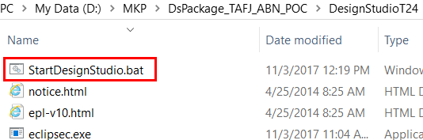

**- Choose a workspace:**

When it opens, browse for the **Workspace** folder which is in the DesignStudioT24 folder.

**- Create project:**

On the menu bar, click **File** > **New** > **Project** 

**Result**: the New Project dialog box is displayed.

- Select **Design Studio** > **Design Studio Template Project** and click **Next**:

**Result**: the New Design Template Projects dialog box is displayed.

Select from the drop down list the template accorded to your T24 installation:  **t24-packager-tafj**

 - **Set Template parameters values** (mandatory fields as notified in previous image)

> [!Note]
> In Value field, change the **project-name** from the defaulted one to “*something at your choice*” (here we've named it 'sample'). **Use small letters**

> [!Note]
> In Value field, change **component-name** from the defaulted one to “*something at your choice*”. **Start words with capital letters**

> [!Tip]
> Value fields above need to be changed in order to avoid overriding an existing jar, which already appears in the environment 

- Click **Finish** to create the project.

**Result**: Four projects are created by the template. By default, ft-modelbank is the prefix of these projects: 

> [!Note]
> Instead of default '*ft-sample*' it will appear '*the name*' you provided

   -  ft-sample-**data-code**: holding basic and data files.

  -  ft-sample-**models**: holding Design Studio models that can be imported and amended thanks to dedicated editors.

  -  ft-sample-**models-gen**: holding files Design Studio generates from the *ft-modelbank*-modelsproject.

  -  ft-sample-**packager**: **is the packager project itself** from where you can launch the final artifact creation.

 - On servers tab, click right and **Add New T24 Server**

 - A new screen is open. Give a **project name** and click **Next**

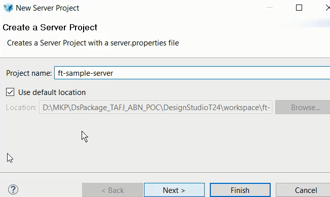

 - Choose connection type as **T24 Server-Web service** and click **Finish**

 - Check your configuration (username, authorizer, Hostname address and Port):

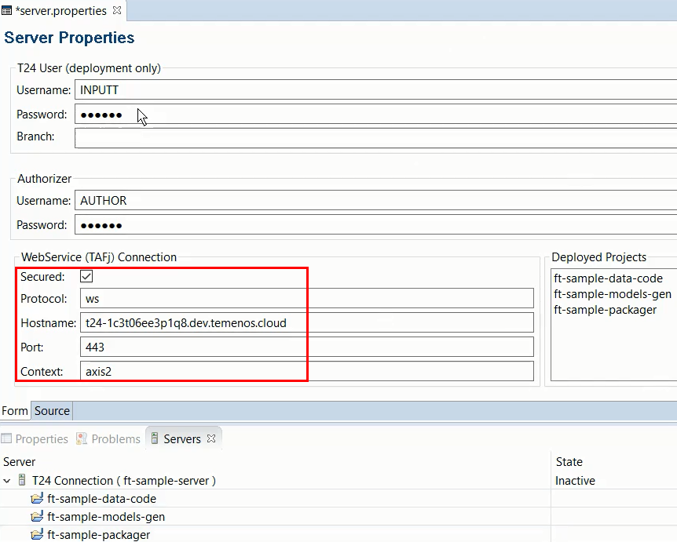

**Secured box** needs to be checked.

**Protocol** should remain "ws".

**Hostname** should be the DNS hostname of T24 endpoint.

**Port** should be changed to 443.

**Context** should remain axis2.

 - Change server state into **active**:

 - If you go to **Servers tab**, state should be active: 

Make sure T24 Connection is active. (If not, click on Start/Restart)

**Expand** ft-modelbank-data-code:

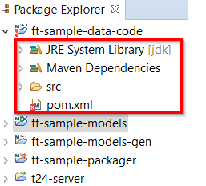

-  **Click on** ft sample-models. **Click right** – **select Maven** – **update Project** 

 - **Select all, then OK**

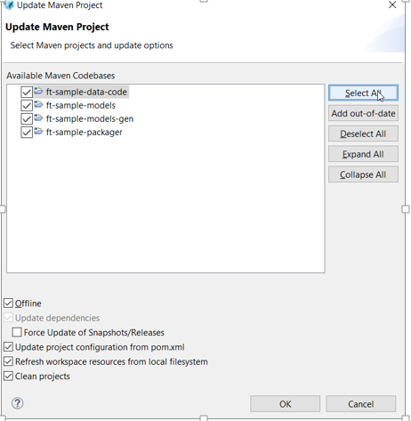

 - Expand ft-sample-packager, click right on **Launch T24 packager** > **Run as > Launch T24 Packager (TAFJ)**

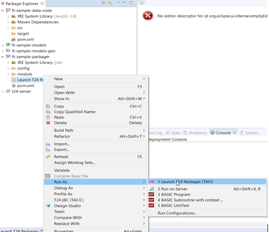

 - Wait for the workspace to be built.

 - A successful packager build is shown in the console

# Adding subroutines #

In order to add a routine, follow below steps:

 - Give a **name** for the routine you want to create:

 - **Result**: the routine is created:

> [!Note]
> After writing the routine, in case the compilation will throw an error related to “$PACKAGE is mandatory”, make sure you put on “Dunce Cap” as below:
> 
>

# Import T24 Applications #

 - Go to your models project. Right click on **Applications** and choose **Import**:

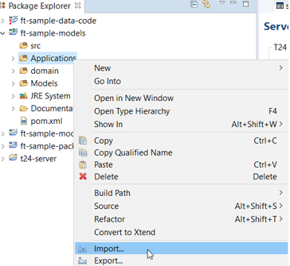

 - Select **Design Studio** and choose **Import T24 Applications**, click on **next** button and wait until it loads

 - Click on **Select All** button and check **Import to subfolders based on Product name**:

 - Click on **Next** button and choose the **location** where to be imported the applications:

 - Click on **Finish** button and wait until the operation is completed (this might take longer):

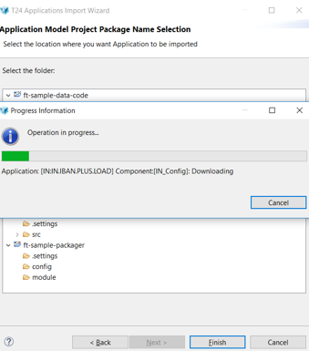

 - A **successful** message will be displayed at the end and your application will be imported in your area.

# Enquiries and Versions #

## Import Enquiries ##

 -  Go to **Models**, click right and choose **Import**:

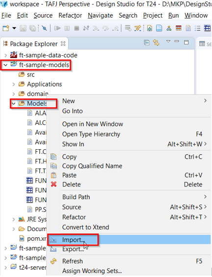

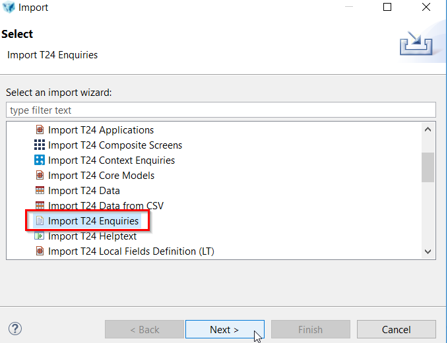

 - Select all or just enquiries that you are interested in

 - **Example** of a single enquiry import:

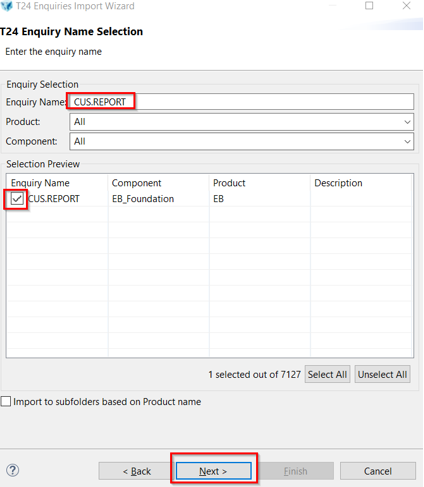

 - Click on **Next** button and chose the location:

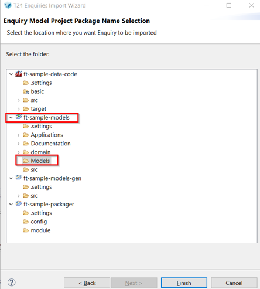

 - A **success message** is displayed:

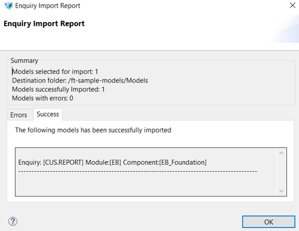

## Import Versions ##

 -  Go to **Models**, click right and choose **Import**:

 - **Select** all or the versions of interest:

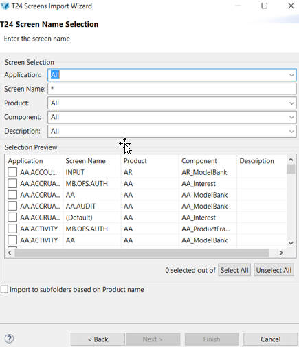

 - See below **example**:

 - Click on **Next** button and chose the location:

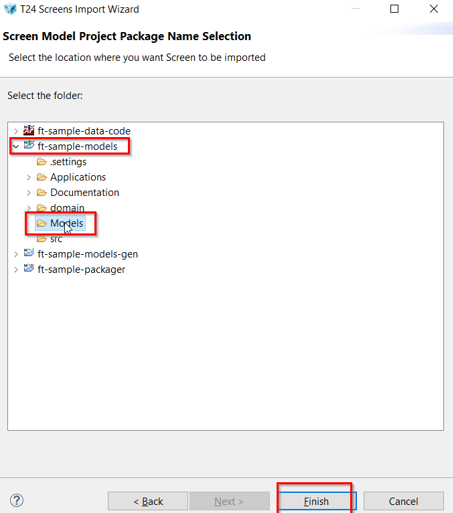

 - A **success message** is displayed:

# Build the project #

 - Go to: **ft-sample-packager** > **Launch T24 Packager (TAFJ).launch** > **Run As** > **Launch T24 Packager (TAFJ)**

 - **Wait** for workspace to be built:

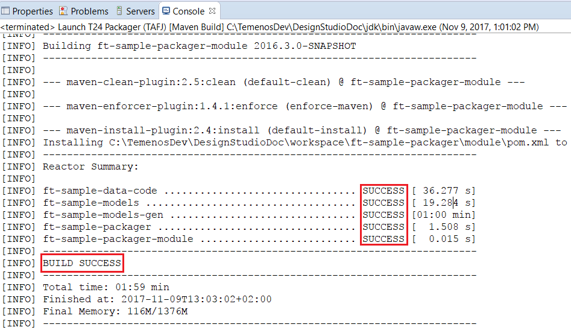

 - You can also check **build’s success** here:

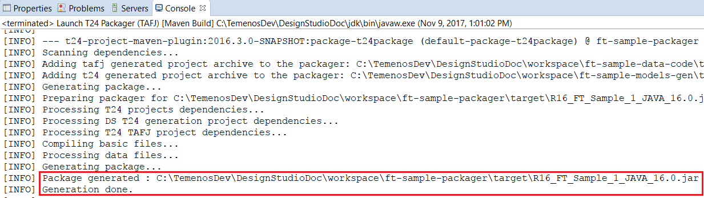

# Clone GitLab Repository #

- Make sure you have installed TortoiseGit. 
- Make sure you have received the **ppk** private key to open ssh
- Create a folder somewhere in your local machine. In current example, it was used  a folder named 'GitLab' 
- Inside the created folder, click right and choose **Git Clone**

Insert as follows:

**URL**: git@gitlab.temenos.cloud:1c3pg74t41czk/corebanking.git
**Directory**: D:\MKP\gitlab   *(path of your folder)*
**Check Load Putty Key**: browse for you ppk key

 - Following alert message is displayed. Click **yes**

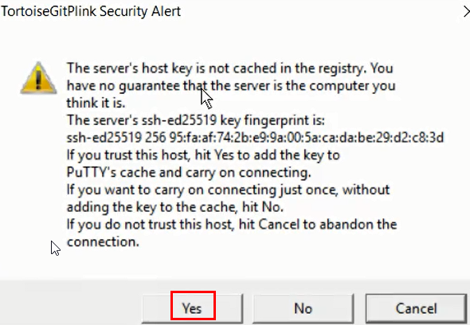

 - Repository was cloned:

# Deploy the Jar #

In order to find the jar's location, check properties in ft-sample-packager.

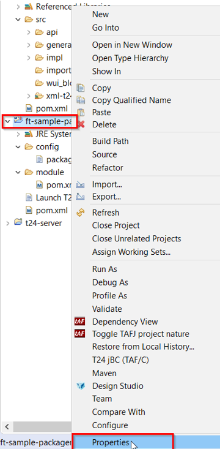

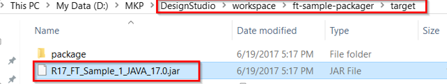

 - Copy/ drag the **jar** into the **packages** folder:

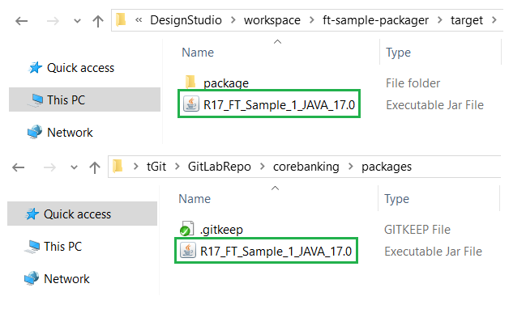

- **Add** and **commit** the jar to the repository by using Tortoise Git:

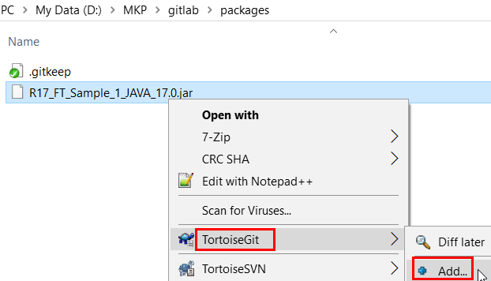

A screen will appear saying the file was added. Press **commit**:

A new screen will appear. Insert a comment in the upper window and then choose **Commit and Push**

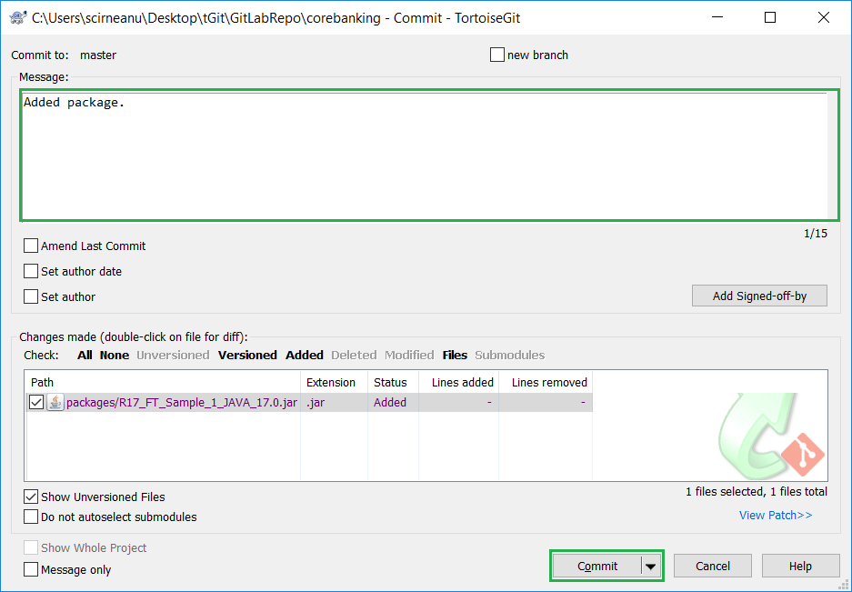

A success message should be displayed.

> [!Note]
> For any change, you can add, rename, delete, push, pull etc as per Tortoise commands:
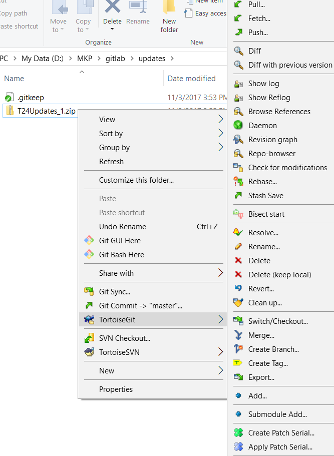
