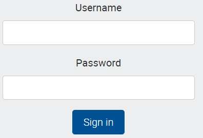
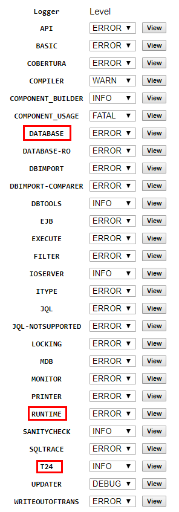

# General Troubleshooting #

This user guide shows the options to verify the errors in case of failure when deploying the following:

- DS Packages
- Plugins (war files)
- Updates

By following this you can identify why a package didn't install or you can check why a jenkins build failed.

## 1.Use WinSCP ##

 - Go to your organization PaaS link 

   - example: [http://51.141.24.193:4200/organisations/1c484wyz0lslc/environments](http://51.141.24.193:4200/organisations/1c484wyz0lslc/environments "Environment")
   

 - Login with your **user** and **password**

 - **Click** on New ABN Env

- **Click on Export Environment** and wait for a few moments

 -  **Click** on **copy** button and you'll **copy sftp.dev.temenos.cloud**

 - From Programs list, open **WinSCP**
 - Insert **Host Name** (use the link copied above: sftp.dev.temenos.cloud, insert **your user** and press **Advanced**

 - Go to **Authentication** and then add **private key file** and click **OK**

- Previous screen is displayed. Click **Login**

- Next warning message is displayed. Click **Yes**

- Next screen is open. You can check here the archives containing the logs with all required information

## 2.Use TAFJEE ##

 - Go back to main portal page and click to **Monitor Application**:

 -  Following screen is open. Click on **Log Files**

- From the list of **Logs**, below are highlighted some which could be useful in case of an issue:

