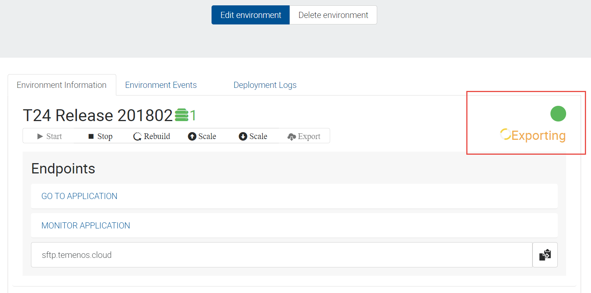
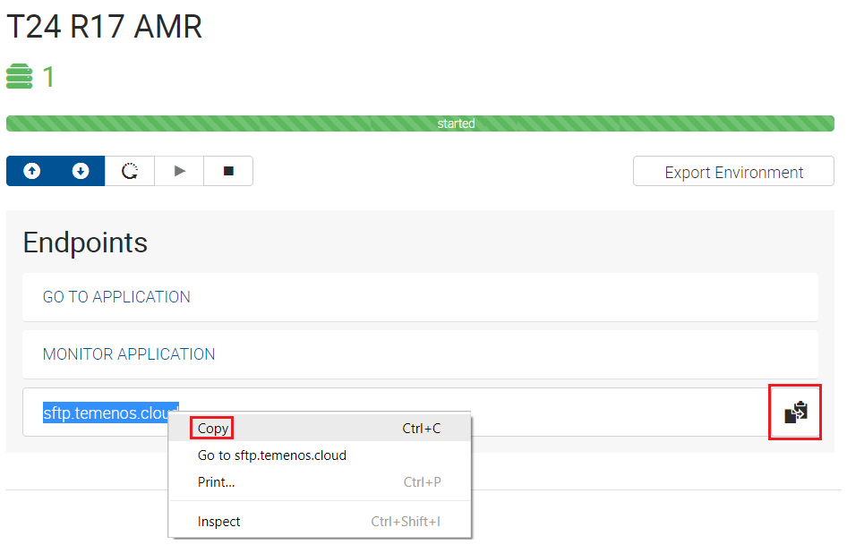
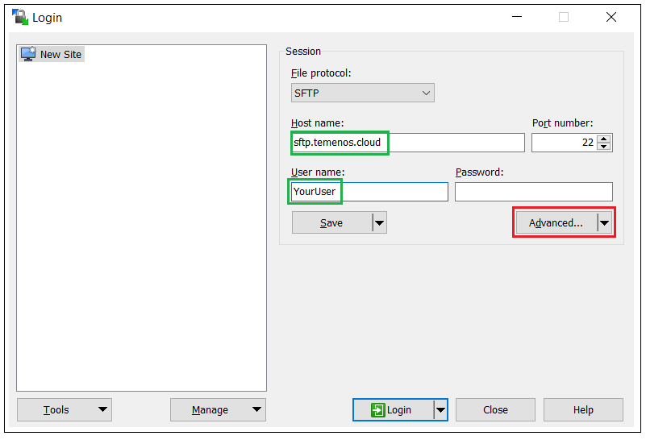
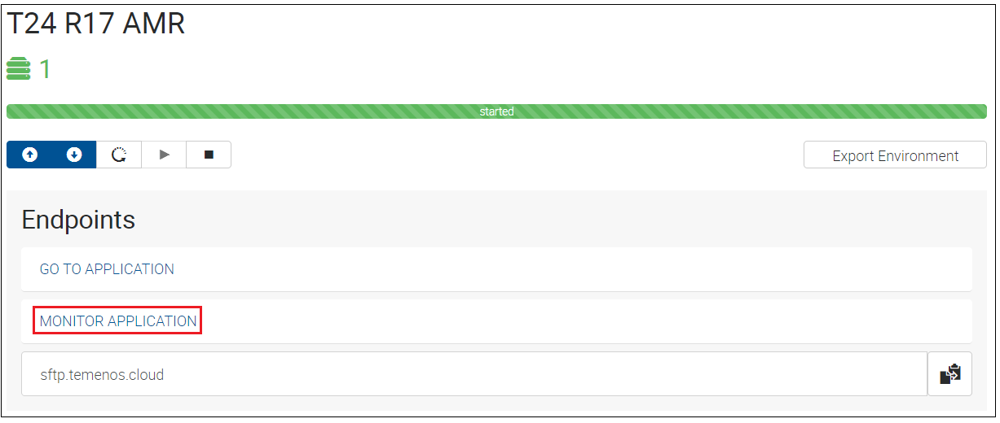

# General Troubleshooting #
 
This user guide shows different ways of accessing details related to your sandbox when deploying the following:  

- Design Studio Packages
- Plugins
- Updates
- WAR files

## 1. Export Environment Details ##

The Export Environment Details functionality gives you access to different information related to your sandbox like:  
-> the _T24 UD (default)_ folder from your T24 sandbox  
-> the _jars_ deployed in your T24 sandbox  
-> the _war_ files deployed(with success or not) in your T24 sandbox  
-> the jboss _server.log_ from your T24 sandbox.  

The environment details are exported in a SFTP server to which you have to connect in order to download the related files in your local machine. For this purpose, make sure you [download](https://winscp.net/download/WinSCP-5.11.2-Setup.exe) and install WinSCP SFTP client.  

The Export Environment Details functionality can be triggered from PaaS Portal following the bellow steps:

* Log-in to your organisation in PaaS Portal, go to your enviroment page and click on the **Export Environment** button for the T24 application.

* After click, the **Export Environment** button will become disabled(as per bellow picture), meaning that the export was triggered.

> [!Note]
> The Export Environment action is finished when the Export Environment button becomes enabled.

* In order to download the exported files of your environment from the SFTP server to your local machine: 

 * In PaaS Portal for your organisation, go to your environment page and Right click and copy the _sftp.temenos.cloud_ Endpoint or click the copy to clipboard icon from the right: 

 

 * Open **WinSCP** SFTP client and create a new site that will allow you to connect to the SFTP server. Make sure you put _sftp.temenos.cloud_ Endpoint as Host name, your _PaaS user_ as User name and instead of password, the SSH key related to your PaaS user must be used.
 
 * In order to attach the SSH key, press **Advanced** button, go to **Authentification** menu and select the **private key** related to your PaaS user. 
 
 * After attaching your SSH key, save your site with any name for future use.
 
 * Click **Login** to connect to the SFTP server.  
 If connection is successful, you will have 2 sections in WinSCP:  
 -> the left section(highlighted in black) represents the location from your local machine where the environment details will be downloaded.  
 -> the right section(highlighted in yellow) represents the location of the exported environment details in the SFTP server; the environment details are saved in the SFTP server in /organisationID/environmentID folder structure.
   
 * Go inside your environmentID folder and you will see a zip file that contains the Environment Details. In order to download the zip, select it and press F5.  
   
 * After downloading the zip file to your local machine, unzip it and you will have the bellow folder structure:  
   
 Based on the above folder structure, you can check the following:  
 -> If you deployed any update in your sandbox, check if jar/jars related to the update are changed in the jar list from _modules/com/temenos/t24/main_ folder.  
 -> If you deployed any package in your sandbox, check if the jar related to the package is present in _modules/com/temenos/t24/main/localjars_ folder.  
 -> If you deployed any war file in your sandbox, check if the war was deployed with success(a file named war_name.deployed should be present in _standalone\deployments_ folder). The war deployment will be failed if a file named war_name.failed is present in _standalone\deployments_ folder and this file must be checked for details.

## 2. Use TAFJEE tool ##

 - Log-in to your organisation in PaaS Portal, go to your enviroment page and click on the **Monitor Application** Endpoint for the T24 application.  

 -  The bellow page is opened. From this page, you can use:  
 -> **tShow** to check for any T24 routine from your sandbox details like the compilation date or the jar that contains the class of this routine.  
 -> **Log Files** from which you can check logs like DATABASE, RUNTIME or T24.  

