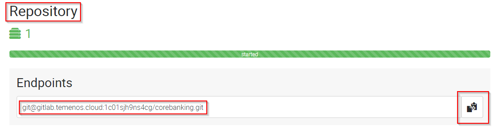
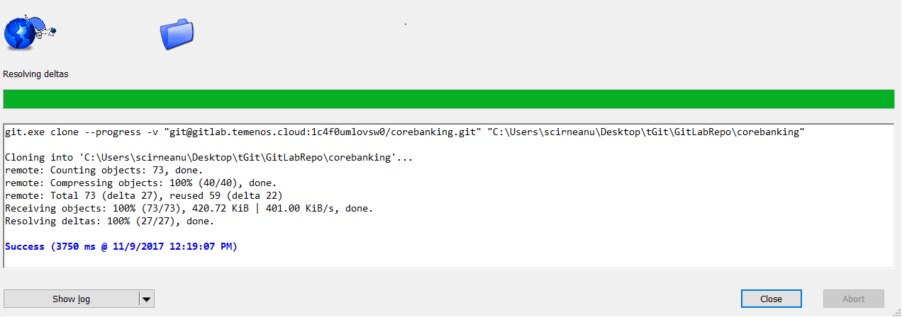
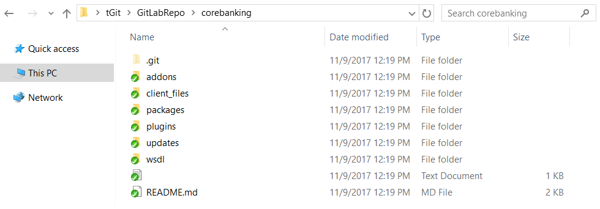

# How to use GitLab Repository for MarketPlace Sandbox

### Audience ###
This document can be used by technical staff who need to use GitLab repository to update files on the Temenos Sandbox provisioned through MarketPlace. Each Sandbox created has an associated GitLab Repository for uploading files, plugins, add-ons to the cloud environment (called Sandbox). The platform will perform the scripts and steps needed for the files to be deployed successfully as background activities. Before proceeding you need to know the associated GitLab repository and to have users with ssh keys created in the portal. 

# Clone the GitLab Repository of your sandbox to your local computer #

Before proceeding, please login to your organisation, select your environment and locate the Endpoint of **Repository** Application. Right click the endpoint and copy the link address or click the **copy to clipboard icon** from the right:

- Make sure you have installed TortoiseGit. Otherwise, install it from [here](https://tortoisegit.org/download/ "Tortoise").
- Make sure you have created your public and private keys and your public key was attached in PaaS Portal to your user.

•	Create a folder somewhere in your local machine. In the current example, a folder name GitLabRepo is used.

•	Go to the GitLabRepo folder. Right click inside the folder and choose **Git Clone**.

•	Paste the Endpoint of **Repository** Application of your sandbox in URL textbox and make sure that the Directory textbox is set to your GitLab repo folder(GitLabRepo folder in our example) and that you load your private key.

•	Content is downloaded from the GitLab Repository of your sandbox to your computer.

# GitLab Repository folder structure and description #

•	The GitLab repository structure on your computer should look like this:

| **Folder Name**  				| Description	|
|-					|-		|
|addons				|	This folder is designated for AppDynamics. Upload files as ZIP. |
|client_files\h2db		|	Local H2 database that will be uploaded to the cloud Sandbox. Database username must be t24 and password t24 (case sensitive). Database name is mandatory to be “TAFJDB.h2.db” (case sensitive) and must be archived as a ZIP with name TAFJDB.zip (case sensitive). If the above conditions are not satisfied, the database will not be uploaded to the cloud Sandbox. This procedure will **replace** the existing database in the cloud with this one. The **old database** will be **lost**, including any records loaded manually.|
|client_files\localjars				|	Upload here any local jars (not released by T24 Core). There can be any simple Jars used by T24 or other parties. All files will be copied to the module folder inside Jboss and the module.xml file will be updated automatically every time a new commit is triggered in this folder. If a Jar file is corrupted or there are missing dependencies, Jboss will fail to start and the Sandbox can’t be used. Fixing the issue, will trigger a new rebuild and Jboss restart. |
|packages				|	One or more T24 DS (Design Studio) packages can be uploaded into this folder. All packages will be deployed automatically inside T24. |
|plugins				|	WAR files can be uploaded in this folder. The files will be deployed inside Jboss EAP. |
|updates				|	The updates files downloaded from the portal in zip format. The files will be copied to the update folder and the T24 Update procedure is triggered. |
|wsdl				|	WSDL files and folders that are required by plug-ins (war file) need to be uploaded here. |

