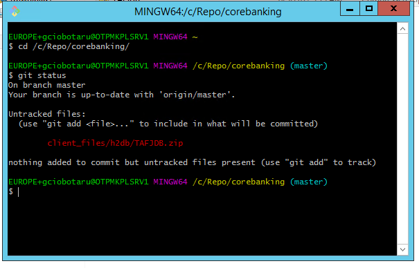
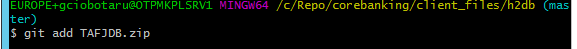
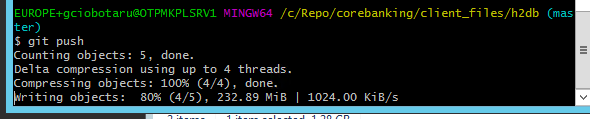

# How to use GitLab Repository for MarketPlace Sandbox

## Quick Start Guide ##

### Audience ###
This document can be used by technical staff who need to use GitLab repository to update files on the Temenos Sandbox provisioned through MarketPlace. Each Sandbox created has an associated GitLab Repository for uploading files, plugins, add-ons to the cloud environment (called Sandbox). The platform will perform the scripts and steps needed for the files to be deployed successfully as background activities. Before proceeding you need to know the associated GitLab repository and to have users with ssh keys created in the portal. 

# Clone the Repository to your local computer #

Before proceeding, please login to your organisation, find your environment then locate the **Repository** Application and Endpoint. Right click the endpoint and copy the link address or click the **copy to clipboard icon** from the right:

•	Create a folder where do you want to store the repository files. Let’s call it “repo”.

•	Go to Git Bash window. Change directory to the new created folder (“repo”). Type “cd /c/repo”, as below:

•	Clone the Sandbox repository using the “git clone <url>” command, where <url> is the link copied above:

- Content is downloaded from the GitLab Repository to your computer:

# Push files to Sandbox #

The steps below will describe the way we can use the Git client to push files to the repository. This will be done using an example, but the same process can be applied to any file what we want to push in any folder from the Repository.

This example will show how to import a local database file to the Sandbox (Cloud Environment). For the H2 database to be imported correctly in the Cloud Environment, there are some conventions that need to be applied:

-	User is t24 and password is t24 for the h2 database
-	Database file name needs to be “TAFJDB.h2.db” – case sensitive.
-	File needs to be uploaded as a ZIP file, with the name “TAFJDB.ZIP” (case sensitive).
-	If all the above conditions are satisfied, we just copy the TAFJDB.ZIP file to the database import location: “\corebanking\client_files\h2db”. Copy the file using explorer into this location. In this example is “C:\Repo\corebanking\client_files\h2db”:

-	Open the Git Bash window. Change directory to the cloned Repo folder (/c/Repo/Corebanking). Type command “git status”. One file added or modified will be displayed:

-	We need to add the file to the commit list. This is done using the command “git add <files>”. Type “git add  client_files/h2db/TAFJDB.zip”:

-	We need to commit the changes and push to Repository. The command is “git commit -m <message text>”:

-	Push the changes and type “git push”:

-	Changes were uploaded to the Repository. An automatic script is starting in background to update the Sandbox.

# Repository folder structure and description #

| **Folder Name**  				| Description	|
|-					|-		|
|addons				|	This folder is designated for AppDynamics. Upload files as ZIP. |
|client_files\h2db		|	Local H2 database that will be uploaded to the cloud Sandbox. Database username must be t24 and password t24 (case sensitive). Database name is mandatory to be “TAFJDB.h2.db” (case sensitive) and must be archived as a ZIP with name TAFJDB.zip (case sensitive). If the above conditions are not satisfied, the database will not be uploaded to the cloud Sandbox. This procedure will **replace** the existing database in the cloud with this one. The **old database** will be **lost**, including any records loaded manually.|
|client_files\localjars				|	Upload here any local jars (not released by T24 Core). There can be any simple Jars used by T24 or other parties. All files will be copied to the module folder inside Jboss and the module.xml file will be updated automatically every time a new commit is triggered in this folder. If a Jar file is corrupted or there are missing dependencies, Jboss will fail to start and the Sandbox can’t be used. Fixing the issue, will trigger a new rebuild and Jboss restart. |
|packages				|	One or more T24 DS (Design Studio) packages can be uploaded into this folder. All packages will be deployed automatically inside T24. |
|plugins				|	WAR files can be uploaded in this folder. The files will be deployed inside Jboss EAP. |
|updates				|	The updates files downloaded from the portal in zip format. The files will be copied to the update folder and the T24 Update procedure is triggered. |
|wsdl				|	WSDL files and folders that are required by plug-ins (war file) need to be uploaded here. |

