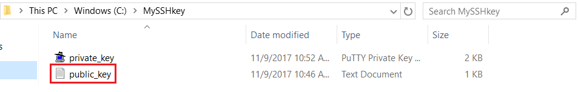

# How to create Users in PaaS

## Quick Start Guide ##

### Audience ###
This document can be used by technical staff who need to create Users in PaaS Portal and associate to each user a ssh key.

# Use PuTTY ssh client for ssh key generation.

You can use any other ssh key generator client.

> [!Note]
> If you already have installed a ssh key generator client, you can skip this step.

•	Download the installer from [http://www.putty.org/](http://www.putty.org/ "http://www.putty.org/")

•	Run the installer and click **Next** on each screen, without changing anything in configurations. Click **Finish** once completed.

# Create SSH keys (pair public and private keys) #

•	Open PuTTYgen and click Generate button:

•	This creates a new ssh key by moving the mouse in the blank area(highlighted in red), as per bellow picture.

•	After Puttygen finished key generation, you can save your public key/private key in any location from your local machine.

> [!Note]
> In order to have a valid ssh key that can be recognized by PaaS Infrastructure, do not use the Save pulic key button from Puttygen and just select the whole public key from the PuTTYgen screen and save it in your local machine.

•	From PuTTYgen screen, you must also save the private key. Press the Save private key button, choose Yes on the next prompt (save the key without a passphrase to protect it) and indicate a name and location for the private key.

•	The public/private key location on your local machine should look like this:

# Add users in portal with SSH key #

•	Login to your organisation portal using the link and the credentials provided.

•	Click User menu and then New user button, as below:

This will create a new user in your organisation. This new user will be automatically assigned to all GitLab Repositories from within all environments. If you have already a user created, you can click on the user and update the SSH key box with the one created above.

•	Public SSH key needs to be pasted in SSH Key text box. Open Windows Explorer and locate your public key generated using PuTTY Key Generator. 

• Right click and open it with notepad. Select all and copy to clipboard.

•	Paste the copied text into the SSH Key text box and click Create user button.

- Your username will be created in Gitlab server and public SSH key provided will be added to your account being accessible from all the environments created in your organisation.

- For further details or issues related to Gitlab SSH keys usage, or other operating systems (MAC, Linux), please consult this link:  [https://help.github.com/articles/generating-a-new-ssh-key-and-adding-it-to-the-ssh-agent/](https://help.github.com/articles/generating-a-new-ssh-key-and-adding-it-to-the-ssh-agent/)

