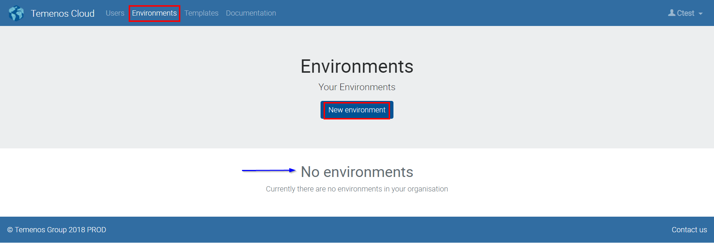

# **Temenos Cloud Development Platform**

## **DevX** 

----------

### What is Temenos PaaS?

Temenos PaaS is a type of cloud service offered by Temenos Cloud; it is a *Platform as a Service (PaaS)* that provides individuals and teams with the ability to manage and configure their own instances of Temenos applications and approved 3rd party Plug & Play applications from the Temenos ecosystem.

### What is DevX?

“DevX” is a cloud based infrastructure for use during development, test, implementation, and ongoing change with configurable and scalable Temenos Suites on-demand. DevX enables you to create Environments, i.e. Temenos Suites on-demand, for non-production use in the cloud.  Environments can be requested and provisioned within minutes rather than weeks helping you accelerate your projects. Retail Suite is readily available, with all other Temenos Suites (Corporate, Wealth, Micro-Finance and Islamic Banking) available on request and allow you to develop and test your proof of concept, share development environments across dispersed teams, replicate production environments or use them for training. The speed, reliability, and agility of these environments will instantly add value to your implementation and scale your project delivery capacity.

## **Features**

----------

### What are the features of DevX?

- Request and Provision identical environments within minutes 
- Chose the application you wish from a predefined list of Temenos Suites
- Deployment of change is fully automated; All types of change, configuration, updates and data are managed through a software configuration management repository
- Stay in  control with metered usage and full reporting
- You decide and manage your data loading
- You can export your data at any point
- You decide and manage scalability according your demands (Scale up / down)
- Online access to live log data
- Full access and control of your CoB and all job services.
- You are in control of backup/rebuild of databases, at any point in time.
- Decide and select updates for your OS.

## Temenos Cloud Management of Organisations, Users and Environments 

----------

- **Organisation ID**

The Temenos Development Platform support multitenancy and Organisations are designed to be distinctive accounts.  

Upon subscription you'll receive a **unique** Organisation Id as a URL link such as: 

`http://portal.staging.temenos.cloud:4200/organisations/1cg74hgepdevio/login`

The confirmation of your Organisation activation will contain the link and access instructions to your designated Organisation administrator. The administrator is the first and only user.

 

- **Environments**

The Development platform has the capability to provision environments in a variety of different configurations. Users can initiate a new environment and select from a predefined list of templates the application, the release and stack they wish to provision. Each month we host a new template with the latest release of Temenos suite. 

The environments are customisable in terms of Name and brief description to explain their purpose. The templates follow the official Temenos configuration stack but it can be customised for Releases 2016 onwards.   

Create your own environment:

 

 - Fill Name and Description fields
 - Select one of the available templates from dropdown list, based on your requirements
 - Click **Create environment**

 

- **Templates**

Check the list with all available templates. These are latest Retail Suites versions:

## **Data and Security Considerations**

----------

The most important consideration with respect to data on the Temenos PaaS platform is that it for **non-production use only**.  For clarification, no 'personally identifiable information'; 'confidential' or 'sensitive' data may be stored on any sandbox environments.

Other considerations include:

•   Data is stored in UK datacentres

•   Data is encrypted in transit

•   Access to sandbox management facilities requires username/password and/or SSH certificates

•   Environments can be deleted immediately by the user. All client-related data will be deleted by Temenos 60 days 
after the termination of the agreement

