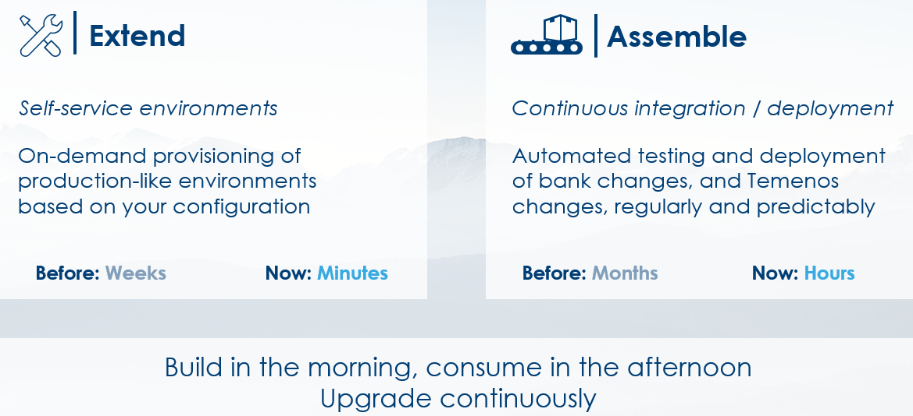
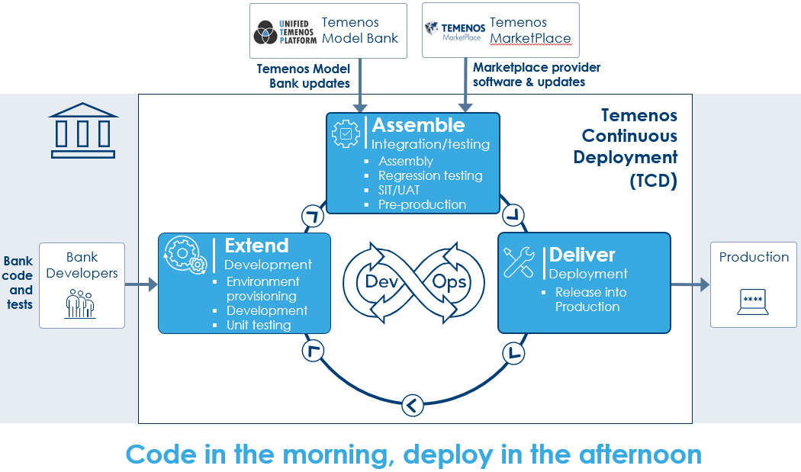

## **What is Temenos Continuous Deployment?**

Temenos Continuous Deployment is a product within the Temenos Cloud suite, and is cloud based infrastructure for use during development, test, implementation, and ongoing change with configurable and scalable Temenos Suites on-demand, unless otherwise stated. Temenos Continuous Deployment enables you to create Environments, i.e. Temenos Suites on-demand, for non-production use in the cloud. Environments can be requested and provisioned within minutes rather than weeks helping you accelerate your projects. Retail Suite is readily available, with all other Temenos Suites (Corporate, Wealth, Micro-Finance and Islamic Banking) available on request and allows you to develop and test your proof of concept, share development environments across dispersed teams, replicate production environments or use them for training. The speed, reliability, and agility of these environments will instantly add value to your implementation and scale your project delivery capacity.

What is Temenos Continuous Deployment?
Temenos Continuous Deployment is an offering from Temenos Cloud that provides client individuals and teams with the ability to manage, configure and assemble client licensed Temenos Software – either fully deployed and supported by Temenos Cloud or utilising the client’s own cloud infrastructure.

## **The Temenos Cloud Offering**

## **Temenos Continuous Deployment**

## **What is the “Assemble” service pack of the Temenos Continuous Deployment?**

“Assemble” service pack provides a DevOps solution to perform continuous integration and delivery of Temenos Products and customisation, thereby enabling faster time to market for features.

The Assemble service pack of Temenos Continuous Deployment is used during the continuous integration (“CI”) and continuous delivery (“CD”) of Temenos solutions. The Assemble service pack can accelerate the pace of change and increase confidence in the software deliveries by managing the Assemble of Components (updates, main release, and Level 3 developments), the provisioning into testing Environments, the execution of tests scripts, and providing detailed dashboards of the results. This Assemble service pack further allows the Client to configure Products and Releases which match their own specific needs. The main objective being to streamline ongoing change and accelerate implementation / upgrade projects.

## **Features**

----------

**Self-service environment provisioning**

- An authenticated user, e.g. a developer or tester, has the ability to request an environment from the catalogue of [templates](./temenos-cloud-templates.md); this template will be materialised into compute, storage, and networks on the Temenos Cloud. See [architecture](./architecture.md). The  administrator, e.g. the project manager, is in  control of number of the users and maximum number of running environments, thus having total control of the platform and its usage.

**Secure configuration and environment management**

- A developer, is able to configure a personal SSH Key on their user profile and use this key to securely push changes over SSH.  Deployment of change into the environment is fully automated for configuration, updates, plugins, add-ons and data.  These changes can be stored in a software configuration management repository and deployed to the environment via a Continuous Integration / Continuous Deployment process.

**Controlling the environment**

- A user is able to scale up, scale down, start, stop, delete, and export data from an environment.  Furthermore, a user is able to push a database into the configuration repository and rebuild the environment, thereby refreshing the database back to that point in time and re-apply transactions and configuration as required. 

- As an example, a developer or a tester can load a database and collaborate to validate changes and test cases in a shared environment. Should these users need to delete or migrate an environment, they can export the data, create a fresh environment with the latest release, upload the data and continue working all managed through the portal.  When development activity requires additional resources, the users can easily scale up the environments and equally reduce capacity or stop it entirely.

**Monitoring the environment**

- A user can export the application log data, monitor the status of the environments (started, starting, stopped, stopping, rebuilding), and see the results of any application deployments.

**Controlling the application**

- The Temenos core banking template exposes endpoints for the user interface and TAFJEE management screens that allows a user to control COB job services.

## Managed Resources

----------

**Users**

Each user has their own profile within an Organisation.

Please check [**here**](./users.md) more details about Users.

**Environments**

An environment is an instance of an application and the platform provides the facilities to manage the application configuration.

**Organisations**

The users of the platform can provision and manage the environments within their Organisation.

Please check [**here**](./techguides/environment-creation-in-paas.md) for more details about Temenos Cloud management of Organisations and Environments.

**Templates**

Environments can be provisioned using a variety of pre-defined application, processing, storage, network, and operating system configurations. Please check [**here**](./temenos-cloud-templates.md) for more details. 

## **Data and Security Considerations**

----------

The Temenos Continuous Deployment is for **non-production use only**, unless otherwise stated.  No 'personal data'; 'confidential' or 'sensitive' data should be stored on any Environment.

•   Data is stored in UK datacentres

•   Data is encrypted in transit

•   Access to management facilities requires username/password and/or SSH certificates

•   Environments can be deleted immediately by the user. All client-related data will be deleted by Temenos 60 days 
after the termination of the agreement

