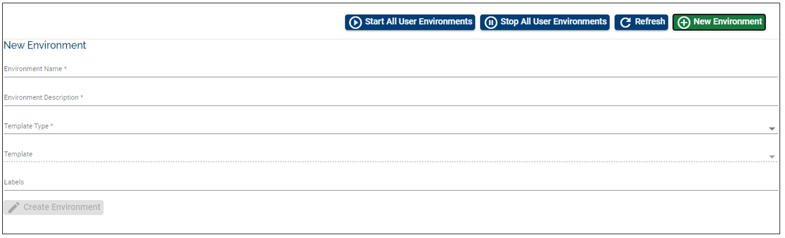
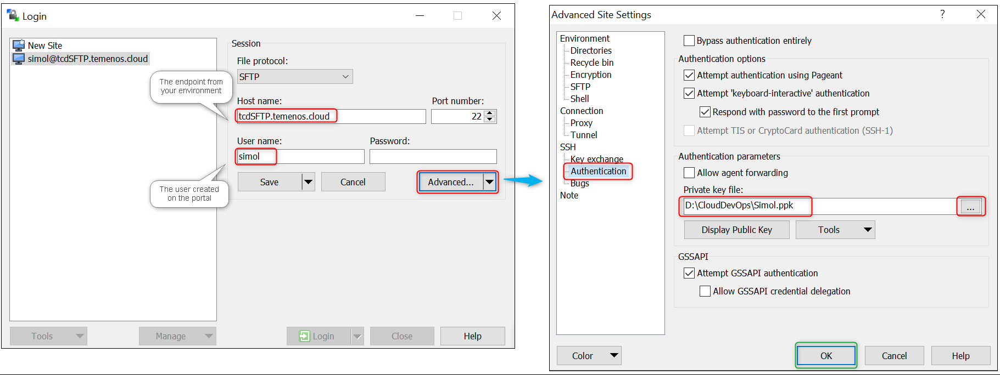

# Access T24 UD Directories

Learn how to easily access the T24 UD directories of your sandbox and make updates, without the need of exporting zip files, but using symbolic links on the SFTP server to the T24 VM machines.

> [!Note]
> Check also our <a href="https://www.youtube.com/watch?v=wqBTV76cAOQ" target="_blank">**Video tutorial**!
</a> (to be updated)

  

## Create New Environment

 - Login to the indicated Temenos Continuous Deployment Platform - either: [**https://portal.temenos.cloud/**](https://portal.temenos.cloud/) or [**https://tcd-portal.temenos.cloud/**](https://tcd-portal.temenos.cloud/).
 - Each time you login, you must accept the Privacy Notice in order to have access to the portal.
 - The first page that is displayed after login is the **Environments** page where you can fill the date to create a **New environment**
- Fill the mandatory fields:
    - **Name**   
    - **Description**
- Select an application from **Cloud native applications**
- Choose a template from **Templates** list
- *Labels field is optional*
- Click **Create environment**

> [!Note]
> It will take about 15-20 minutes for the new environment to be created

## Create a User on the Portal

This is required later when connecting to T24 through SFTP server connection, because it checks the authentication to the cloud environment with that specific user and the attached SSH key.

To see all the steps regarding how to add a new user on the portal and to attach the SSH key, please see the following user guide about how to [**Create Users**](../techguides/user-creation-in-paas.md).

## Connect via SFTP Client

 - In order to have access to the T24/ VM Cloud Application live folders, you can install an FTP client from [https://winscp.net/eng/index.php](https://winscp.net/eng/index.php)
 - Open WinSCP application and fill the mandatory fields:
   - Host name > copy it from the environment endpoint: sftp.temenos.cloud 
   - User name > input the exact name of the user added to the portal
 - Click **Advanced**
 - In the new screen, select **SSH Authentication** 
 - Upload the private key previously saved (corresponding to the public key attached to the portal user)
 - Click **OK**

 

 - Previous screen pops-up, click **Login**

## Check and Use Live Folders 

 - After logging in, on the right window, locate your envirnoment ID
 - Double click to access the live folders of the environment
 - You will be able to see and access the following T24 live folders structure:
   - **default**
   - **log_t24**
   - **standalone**

 

   - **default** - *for example, here you can push a message file into the application that you need to test*. Here you can create a folder and add some files to it, if you need them to do some specific actions. This folder is supposed to point to the **T24_HOME** location.

In order to find out the T24_HOME path:
 - Go to your environment on the portal 
 - Click on MONITOR APPLICATION
 - Then on tdiag (the path will look similar to this: https://t24-1xxxxxxxxxxxxo.dev.temenos.cloud/TAFJEE/tDiag)  the xxx part represents your environment's id
 - Scroll down a bit until you get to "TAFJ Runtime properties" section
 - Here you can see: temn.tafj.runtime.directory.current	/opt/rh/eap7/root/usr/share/wildfly/default

- If for example, you need to create a folder into the default location (/temenossftp/*yourorgid/yourenvid/yourenvid*/default) named "demo" then, in the T24 area the appropriate path will be **/opt/rh/eap7/root/usr/share/wildfly/default/demo**.

   - **log_t24**  - contains the T24.log files and also your como logs files when you run TSAs

   - como - it will load TSA logs when running different TSA services
   - T24.log -  refers to the T24 BrowserWeb processes

 

  - **standalone** - contains the jboss logs
server.log - shows the Jboss application log

 

 

To understand better how the SFTP connection works, check below schema:

 

 - To see how you can push a message to be processed by an application, check this [**FCM example**](../techguides/fcm-configuration.md#process-messages-in-the-fcm-application).

> [!Note]
> Make sure you place the files in the appropriate folder belonging to the specific application that you want to use

