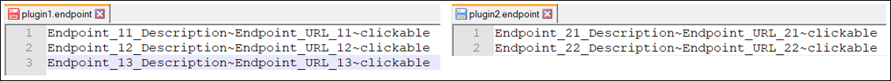
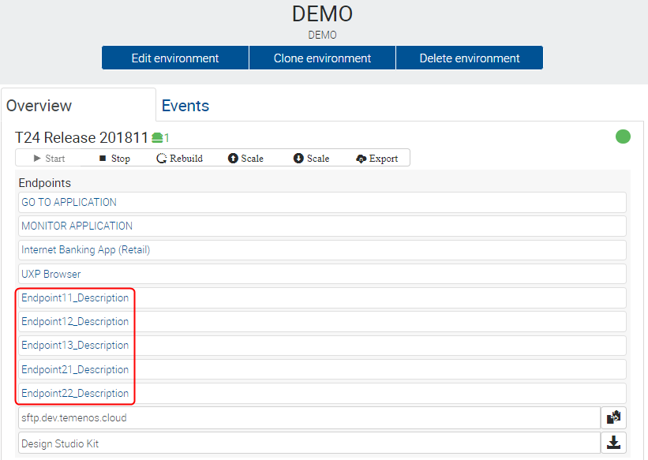

# Create new application endpoint #
This document can be used by technical staff who need to add new endpoints to the T24 application of a Dev Environment in case of deploying a plugin in the application server of the Dev Environment.

> [!Note]
> This guide presumes that a Dev Environment is already created and available. *(In this example, we have created a Dev Environment named DEMO).*
   
**Three** properties are mandatory to create a new endpoint:

| Property Name        | Property  Description	|
|-					   |-		                |
|Endpoint Description  | The Endpoint Description will be displayed in your Organisation Portal in the Endpoints section of the T24 application from your Dev Environment. |
|Endpoint URL          | The Endpoint URL will be:   * **opened** in a new tab of your browser when the Endpoint Description is clicked, if the Endpoint type is clickable.   * **copied**, if the Endpoint type is copyable.   * automatically **downloaded**, if it is a downloadable type of endpoint. |
|Endpoint Type          | In order to apply above actions, a type must be defined for each endpoint, based on how you want to be used: clickable, copyable and downloadable.  |

In order to create new endpoints for the T24 application of your Dev Environment, the next steps must be followed:
 - Clone the GitLab repository of your Dev Environment in your local machine. For more details on how to clone a repository, check this <a href="./use-gitlab-repository.md" target="_blank">**page**</a>.

 - Create a file with **.endpoint** extension inside **plugins** folder of the cloned repository as in the bellow picture. The name of the file is not important, but it should relate to the plugin for which endpoints are added.

 - Inside the **.endpoint** file, add a new line for each endpoint with the structure **Your_Endpoint_Description~Your_Endpoint_URL~Your_Endpoint_Type**, as per bellow picture:

 
 
 > [!Note]
 > "**~**" character is used as a separator between Endpoint Description, URL and Type and it must always be present in each endpoint line.
> Endpoint Description and URL are as per your choice. Type must be one of the options: **clickable**, **copyable** or **downloadable**.

 - After creating and editing the **.endpoint** file, commit the file to the GitLab repository of your Dev Environment. *(In this example we have used TortoiseGit to commit and push the endpoint file - Command: Git Commit ->"master")*
 - Go to your environment to the portal and click the **deploy** button under the Repository.   
 - Wait until the **.endpoint** file is deployed in your Dev Environment and check the Endpoints section of the T24 application where Your_Endpoint_Description Endpoint is displayed as bellow:
 - 
 

# Add multiple endpoints from a single file #
 - If a plugin has more than one endpoint, create a .endpoint file and add a separate line for each endpoint item, as bellow:
 
 - After the file is deployed, all 3 endpoints from the example are displayed in the Endpoints section of the T24 application.
 - Also note that the endpoints are displayed/ grouped by their type: clickable, copyable and downloadable.
 

# Add multiple endpoints from multiple files at the same time #
 - If you want to add endpoints for multiple plugins deployed in your Dev Environment, you can add the endpoints of all plugins in a single file or you can also create a separate .endpoint file for each plugin for a better delimitation.
 
 - After both files are deployed, the three endpoints for plugin1 and the two endpoints for plugin2 are displayed in the Endpoints section of the T24 application.
 

# Update/Remove endpoints #
 - If you want to update endpoints that were already added to an application, you just have to update the required endpoint line from the .endpoint file, commit the file to the GitLab repository of your Dev Environment and after the file is deployed, the required endpoint will be updated in the Endpoints section of your Application.
 - If you want to remove endpoints that were already added to an application, you just have to remove the required endpoint line from the .endpoint file, commit the file to the GitLab repository of your Dev Environment and after the file is deployed, only the endpoints available in the .endpoint file will be displayed in the Endpoints section of your Application.
 - Also, to remove all the endpoints from a .endpoint file do not remove/ delete the file, but remove all the endpoints lines inside the file (empty the file).

 > [!Note]
 > To summarize, the list of plugin endpoints displayed in the Endpoints section for an application is updated based on the content of **.endpoint** files available in the **plugins** folder from the GitLab repository of your Dev Environment. If no .endpoint files are available in the GitLab repository of your Dev Environment, then no plugin endpoints will be displayed.
