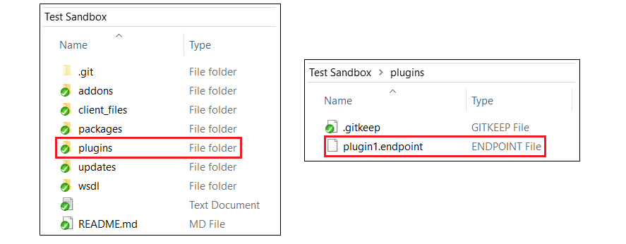
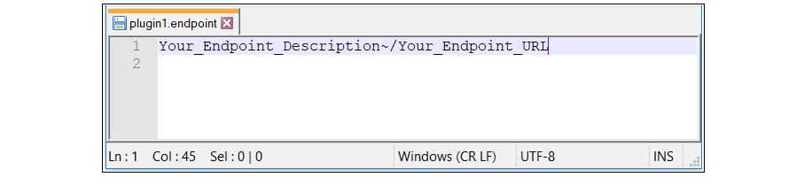
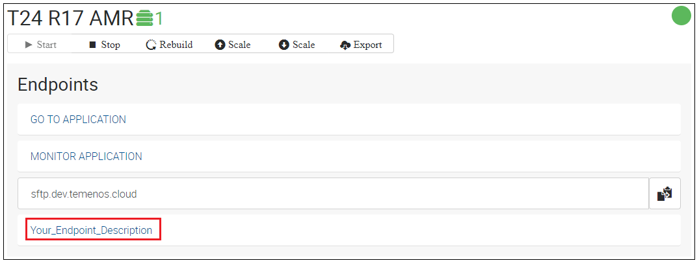
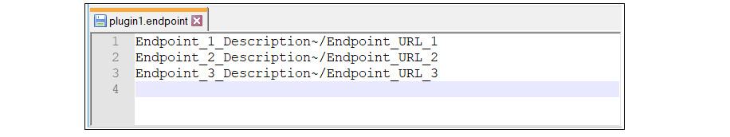
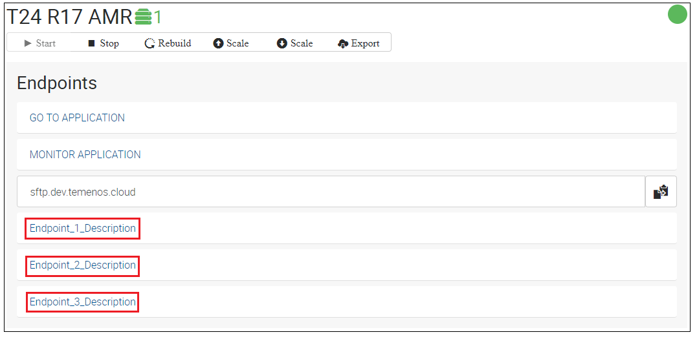
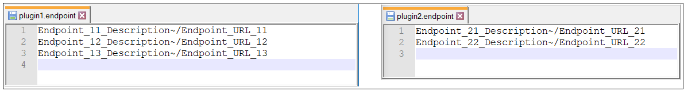
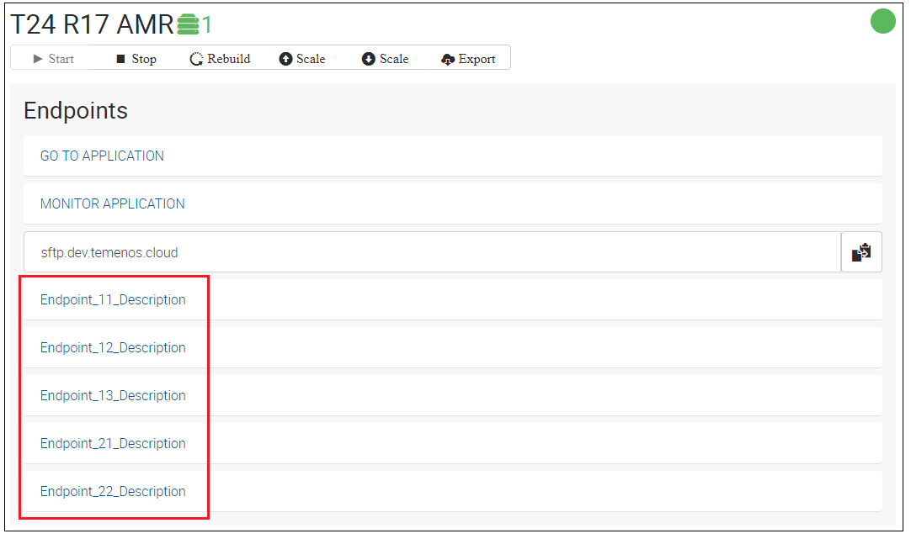

# Create new application endpoint #
This document can be used by technical staff who need to add new endpoints to the T24 application of a Sandbox in case of deploying a plugin in the application server of the Sandbox.

> [!Note]
> This guide presumes that a Sandbox is already created and available.

   Two properties are mandatory to create a new endpoint:

| Property Name        | Property  Description	|
|-					   |-		                |
|Endpoint Description  | The Endpoint Description will be displayed in the Endpoints section of the T24 application from your Sandbox. |
|Endpoint URL          | The Endpoint URL will be automatically concatenated with the Hostname of your Sandbox and opened in a new tab of your browser when the Endpoint Description is clicked. Endpoint URL must always start with **/** character. |

In order to create new endpoints for the T24 application of your Sandbox, the following steps must be followed:
 - Clone the GitLab repository of your Sandbox in your local machine.
 - Create a file with **.endpoint** extension inside **plugins** folder of the cloned repository as in the bellow picture. The name of the file is not important, but it should relate to the plugin for which endpoints are added.

 - Inside the **.endpoint** file, add a new line for each endpoint with the structure **Your_Endpoint_Description~/Your_Endpoint_URL**, as per bellow picture.
 
 
 > [!Note]
 > **~** character is used as a separator between Endpoint Description and URL properties and it must always be present in each endpoint line.

 - After creating and editing the **.endpoint** file, commit the file to the GitLab repository of your Sandbox.
 - Wait until the **.endpoint** file is deployed in your Sandbox and check the Endpoints section of the T24 application where Your_Endpoint_Description Endpoint is displayed as bellow.
 
   When the new Endpoint is clicked, the URL opened in a new tab is based on the Hostname of the Sandbox and the Endpoint URL property from the .endpoint file.
 

# Add multiple endpoints from a single file #
 - If a plugin has more than one endpoint, create a .endpoint file and add a separate line for each endpoint item, as bellow.
 
 - After the file is deployed, all 3 endpoints from the example are displayed in the Endpoints section of the T24 application.
 

# Add multiple endpoints from multiple files in the same time #
 - If you want to add endpoints for multiple plugins deployed in your Sandbox, you can add the endpoints of all plugins in a single file or you can also create a separate .endpoint file for each plugin for a better delimitation.
 
 - After both files are deployed, the 3 endpoints for plugin 1 and the 2 endpoints for plugin 2 are displayed in the Endpoints section of the T24 application.
 