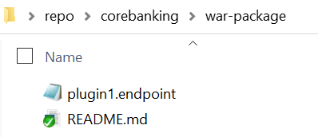
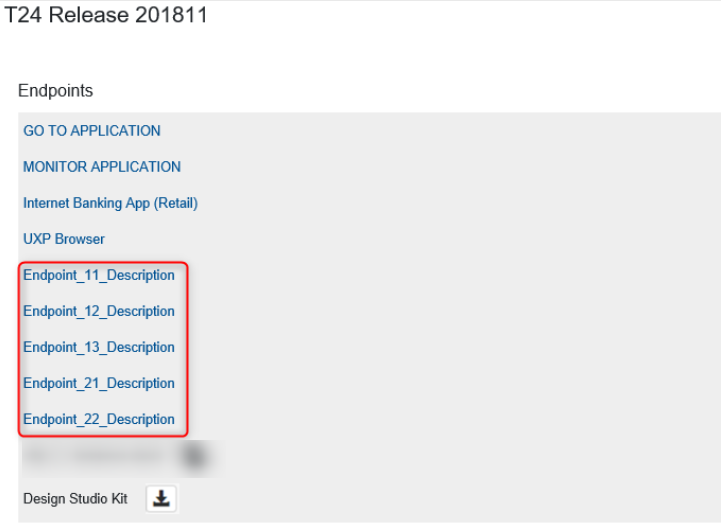

> [!Note]
>  With the 202103 release, the  TCD user guide will move to the [Temenos Customer Support Portal (TCSP)](https://tcsp.temenos.com/TCD/Modules/TemenosContinuousDeployment/Overview/Overview.htm). We recommend you to log in to TCSP and check if your credentials are available. Raise a ticket at [CloudPlatformSupport@temenos.com](CloudPlatformSupport@temenos.com) if you encounter any issues.

# Add new endpoints to an environment #
This document can be used by technical staff who need to add new endpoints to the T24 application of a Environment in case of adding any custom endpoints or deploying a plugin in the application server of the Environment.

> [!Note]
> This guide presumes that an Environment is already created and available. *(In this example, we have created a Environment named DevEnv).*

**Three** properties are mandatory to create a new endpoint:

(Please note that the user guide contains **examples** on how to use each of the properties).

| Property Name        | Property  Description	|
|-					   |-		                |
|Endpoint Description  | The Endpoint Description will be displayed in your Organisation Portal in the Endpoints section of the T24 application from your Environment. |
|Endpoint URL          | The Endpoint URL will be:   * **opened** in a new tab of your browser when the Endpoint Description is clicked, if the Endpoint type is clickable.   * **copied** if the Endpoint type is copyable.  * **downloaded**, if the Endpoint type is a downloadable. |
|Endpoint Type          | In order to apply above actions, a type must be defined for each endpoint, based on how you want to be used: clickable, copyable or downloadable.  -For **clickable** endpoints is mandatory to add another parameter, Endpoint Append, which can have two values: &nbsp; &nbsp;&nbsp; &nbsp;&nbsp; &nbsp;**true** - it indicates if the endpoint is a real URL.  &nbsp; &nbsp;&nbsp; &nbsp;&nbsp; &nbsp;**false** - it indicates if it must be appended to T24 URL. - For **copyable** endpoints is mandatory to have the same endpoint description and endpoint URL (Your_Endpoint_Description = Your_Endpoint_URL). |

 > [!Note]
 > **The URL must be of type: "https://........"**.
 > As a reference, if you want to insert an endpoint which links to your environment browser web, please check the related URL - for example: https://t24-xxxxxxxxxxxx.temenos.cloud/BrowserWeb/)

In order to create new endpoints for the Transact application of your Environment, the next steps must be followed:
 - Clone the GitLab repository of your Environment in your local machine. For more details on how to clone a repository, check this **[page](http://documentation.temenos.cloud/home/techguides/deploy-an-update-to-an-existing-environment.html)**.

 - Create a file with **.endpoint** extension inside **war-package** folder of the cloned repository as in the bellow picture. The name of the file is not important, but it should be relevant for your requirement.

 - Inside the **.endpoint** file, add a new line for each endpoint with the structure **Provider APIs~https://localhost/provider-apis/api/v1.0.0/meta/apidocs~clickable~true**, as per bellow picture:

 

 > [!Note]
 > "**~**" character is used as a separator between Endpoint Description, URL and Type and it must always be present in each endpoint line.
> Endpoint Description and URL are as per your choice. Type must be one of the options: **clickable**, **copyable** or **downloadable**.

 - After creating and editing the **.endpoint** file, commit the file to the GitLab repository of your Environment. *(In this example we have used TortoiseGit to commit and push the endpoint file - Command: Git Commit ->"master")*
 - Go to your environment to the portal and click the **deploy** button under the Repository.   
 - Wait until the **.endpoint** file is deployed in your Environment and check the Endpoints section of the T24 application as below:
 - 
 

# Add multiple endpoints from a single file #

 - If a plugin has more than one endpoint, create a .endpoint file and add a separate line for each endpoint item, as below:
 - After the file is deployed, all endpoints are displayed in the Endpoints section of the Transact application.
 - Also note that the endpoints are displayed/ grouped by their type: clickable, copyable and downloadable.

 

# Add multiple endpoints from multiple files at the same time #
 - If you want to add endpoints for multiple plugins deployed in your Environment, you can add the endpoints of all plugins in a single file or you can also create a separate .endpoint file for each plugin for a better delimitation.

 - After both files are deployed, the three endpoints for plugin1 and the two endpoints for plugin2 are displayed in the Endpoints section of the T24 application.

 

# Update/Remove endpoints #
 - If you want to update endpoints that were already added to an application, you just have to update the required endpoint line from the .endpoint file, commit the file to the GitLab repository of your Environment and after the file is deployed, the required endpoint will be updated in the Endpoints section of your Application.
 - If you want to remove endpoints that were already added to an application, you just have to remove the required endpoint line from the .endpoint file, commit the file to the GitLab repository of your Environment and after the file is deployed, only the endpoints available in the .endpoint file will be displayed in the Endpoints section of your Application.
 - Also, to remove all the endpoints from a .endpoint file **do not remove/ delete the file**, but remove all the endpoints lines inside the file (empty the file).

 > [!Note]
 > To summarize, the list of plugin endpoints displayed in the Endpoints section for an application is updated based on the content of **.endpoint** files available in the **plugins** folder from the GitLab repository of your Environment. If no .endpoint files are available in the GitLab repository of your Environment, then no plugin endpoints will be displayed.

# User Permissions Required
To be able to perform the above operations the below permissions need to be enabled for your user:

- CREATE _ ENVIRONMENT
- UPDATE _ ENVIRONMENT
- REDEPLOY _ ENVIRONMENT
- MANAGE _ ENVIRONMENTS 

To have a better understanding of the user permissions, hover the cursor over the variables and a short description will pop up or click [here](http://documentation.temenos.cloud/home/techguides/user-permissions) to read more.
