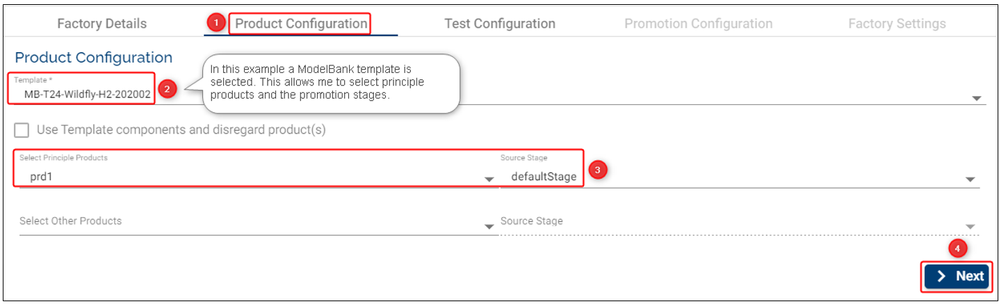
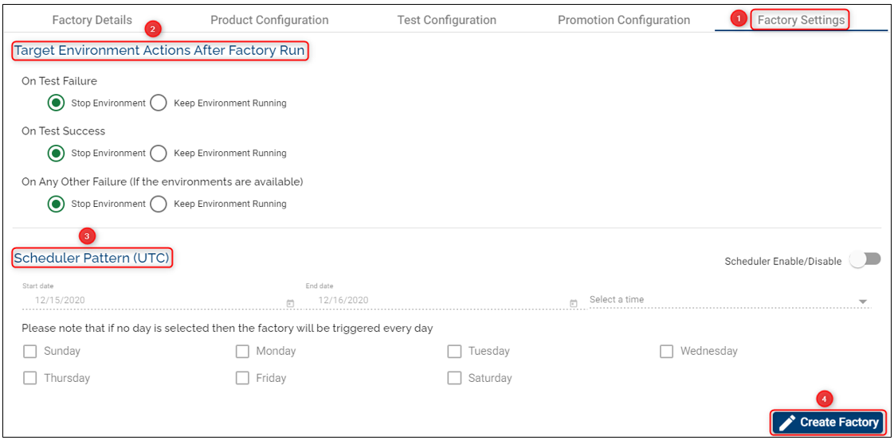
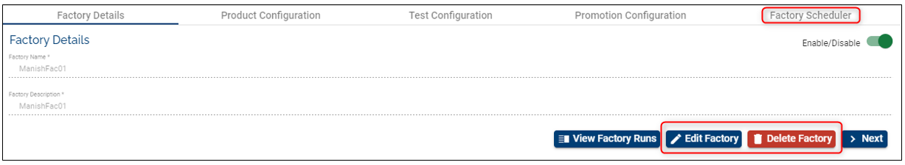

> [!Note]
>  Starting April 5th the TCD user guide will move to the [Temenos Customer Support Portal (TCSP)](https://tcsp.temenos.com/TCD/Modules/TemenosContinuousDeployment/Overview/Overview.htm). We recommend you to log in to TCSP and check if your credentials are available. Raise a ticket at [CloudPlatformSupport@temenos.com](CloudPlatformSupport@temenos.com) if you encounter any issues.

## Automated Factories ##

Factories are the core Assemble components that define how, what and when to deploy, test and promote the various components used by an organization. 

Below you will find the pre-requisites to run a Automated factory:

# Pre-requisites 
- **1 stream**

- **2 stages** within the stream you created (learn how to create streams [here](http://documentation.temenos.cloud/home/techguides/stream.html))

   a. Source Stage - the stage from which pre-tested stable components can be picked up

  b. Target Stage – the stage which will be provisioned during the factory run with the components from the **Source Stage**

- **the list of mandatory components from the environment template** (learn how to deploy the components [here](http://documentation.temenos.cloud/home/techguides/components-products.html))

- **2 products** (learn how to create a product [here](http://documentation.temenos.cloud/home/techguides/components-products.html#products--feature-description))

 a. Principle Products – Principle products simply mean the list of components that are being tested against a stable set of other pre-tested components. After successfully running the factory, the principle products are promoted to the next stage (the configured one).

 b. Other products (Base Products) – Products that are pre-tested (by other factories). These are products that don’t need to be promoted but they are required to test the Principle Products.

- **2 templates**

 a. Environment Template - holds the details of the template that is to be used to deploy the components selected by the factory

 b. Test Template – specifies the template that is required to deploy a test environment that holds the testing framework.

 

## Validations ##

1. The list of selected products cannot contain components that are not understood by the selected Environment Template. 

    a. The list of components contained in the principle and other products needs to match a bare minimum of all mandatory components specified in the template.

    b. The list of components can possibly have more than one component of the same type if the template allows more than one count of the same type.

    c. The list of components cannot contain a component type that is unknown to the Template.

2. Stages – No restriction. The factory can even choose to use the same Stage for all three stage values.

3. During the factory setup all the mandatory fields need to be filled in the current tab. Otherwise you are not able to move to the next phases and the **Next** button is disabled.

See below configurations to understand better how to configure correctly and the factory's behavior.

# Set-up/ Create a Automated Factory #

- Click on Settings button on the main menu on the left.

- Make sure you select first the **Stream** and **Stage** (this is the stage where components are promoted) where you want to create a factory and then click **New Factory** button on the top-right.

- Fill the required fields (see all definitions above and also below example):
<b>
 

## Factory Details 

1. Add a **Factory Name**: choose a meaningful name for your factory.

2. Add a **Factory Description**: insert a description that will help knowing what the factory is about.

3. Click **Next**

## Product Configuration 

This step represents the test configuration that holds the template, the products and the source stage that are pre-tested from the perspective of the current factory.

   1. Select the **Product Configuration** tab.

   2. **Template**: choose an Environment Template from the drop-down list. Based on this template  the environments will be created where you will be able to test different products.

>[!Note]
> You can set up a factory based on a custom template created from either a factory run or an Extend environment (the template is created by you via the ['Save as New Template'](http://documentation.temenos.cloud/home/techguides/save-as-new-template.html) feature). A factory created using a custom template is not associated with any product and promotion configuration, therefore in the *Select Principle Products* fields you can't select any of you products. This allows you to run the test cases on a newly created template based on upgrades.

   
   3. **Select Principle Products** and **Select Other Products**: select none, one or more products from the drop-down. The products selected at this stage are promoted to the next stage (the configured one).  You must select at least one **Principal** or **Other Product** in any of these two fields to progress with the factory creation. I.e.: in the screenshot below we selected a product only in the **Other Product**.
  
   4. **Source Stage**: add the stage with the stable version of components (the components from this stage will be promoted to the target stage during the factory run).
   
   5. Click **Next**.
    
 

## Test Configuration

The Test Configuration consists in in-build service tasks and is used to  trigger tests for a given factory-run, trigger export of application logs.

Depending on your organisation settings, you may / may not have a Default Workflow or the option to select from a list of workflows defined by the users from your organisation. During this phase, you have to fill in the **Workflow** steps - a sample which displays the steps (in that exact sequence) that are executed by the selected workflow. Assuming that you select the **Default Workflow**, you need to fill in the following fields:

   1. Select the **Test Configuration** tab 

   2. **Step 1** - fill in the below:

      - **Test template**: specifies the template that is required to deploy a test environment that holds the testing framework and test scripts. This is needed to generalize the test tools as a template.

      - **Component**: this is the component that holds the test scripts which runs against the T24 VM.

      - **No. of VMs**: number of test VM's to be created during factory run.

      - **Test Stage**: represents a stable version of components that is pre-tested from the perspective of the current factory.

      - **Optional**: tick if the workflow should stop in case of failure.

   3.  Click **Next**.

At the end of this step, when the first round of tests is completed, the test VM will be deleted, but it will not stop the T24 environment (this will be done at the end of the workflow)

 

Assuming that you select a customized workflow with COB you need to fill in additional steps, such as:

- type in the ID of the TSA.SERVICE record for which COB has to be run. The ID can be either group specific ID (eg: COB-1, COB-001) , company specific ID (eg: COB-GB0010001) or COB. Important: currently the platform can handle 20 agents at max, including the online services.

To get a better understanding of what happens when COB is triggered please refer to [THIS](http://documentation.temenos.cloud/home/techguides/trigger-cob.html) user guide.

 
 

## Promotion Configuration

The promotion configuration enables you to select all the required products to promote along with their target stage. In addition, you can select the Test Components along with the target stage if they need promotion as well. 

Following the 202011 Platform release, it is not mandatory to select any product or test at this factory creation stage.

>[!Note]
> If in the *Product Configuration*  you selected a custom template then you are not able to define the *Promotion Configuration* stage as no promotion takes place following this setup. Instead, you only  run the test cases from a newly created template. 

## Factory Scheduler

You can configure the factory scheduler to automatically run the tests and have the results available daily. This feature is optional and you can opt to set it/ don't set it during the factory creation stage.

How does the factory scheduler work?

- if the factory run  is successful you can choose to stop or keep running the Transact environment

- the same applies for a factory run failure or any other failure if the environments are available

- you can enable/ disable the factory run to follow a pattern (i.e. you can schedule to trigger the factory run in a certain time range and different days). Once enabled the **Schedule Pattern** you need to set the start and end date, the time and ideally the days when you want the factory to be run. If no day is selected then the factory will run every day.

The **Stop Environment** and **Keep Running Environment** options are aimed to be used for costs purposes.

 To see the details of a factory first select the stream and the stage from the top-right-side menu. If you have more stages, click on the stage where you created the respective factory. The list with the factories that belong to the respective stage will be displayed on the left side of the page:

>**Limitation:** The user is not able to edit existing factories with a scheduler having start date set in the past. No option to disable the factory scheduler. As a workaround set the scheduler Start & End dates to a future date in order to update the factory configuration.

## Edit a Factory ##

- Click the **Edit** button
- Any field can be changed/ edited as long as the entire Factory configuration complies with the validation rules
- Click the **Update** button

## Delete a Factory ##

- You can easily delete a factory by clicking the **delete** button
- The products, stages and streams created before can be re-used.

# User Permissions Required
To be able to perform the above operations the following permissions need to be enabled for your user:

- MANAGE _ COMPONENTS
- MANAGE _ STREAMS
- MANAGE _ STAGES
- MANAGE _ PRODUCTS
- CREATE _ FACTORY
- UPDATE _ FACTORY
- DELETE _ FACTORY

To have a better understanding of the user permissions, hover the cursor over the variables and a short description will pop up or click [here](http://documentation.temenos.cloud/home/techguides/user-permissions) to read more.
