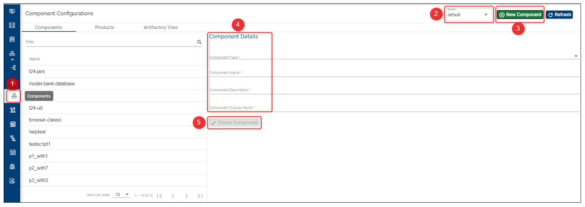
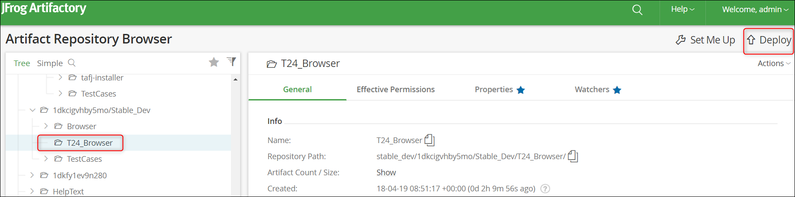
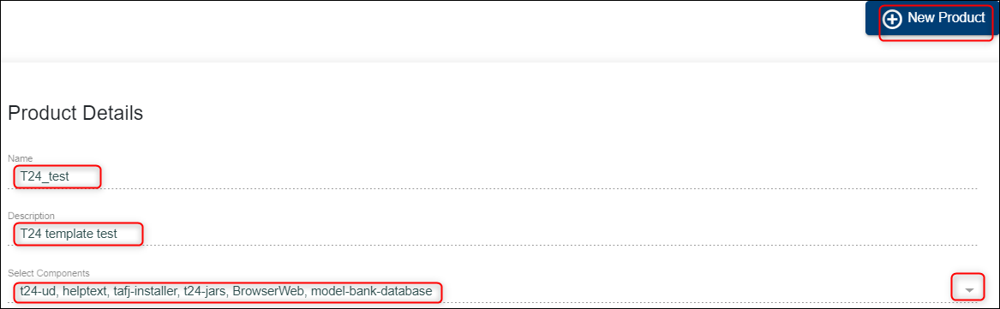

# Components – Feature Description #

Components are individually deployable units that are understood by TCP (Temenos Cloud Platform) based on the component type that each component refers to. 

Each component is associated to a component type to help TCP deploy the component. 

The **Component Type** field in the component data is the key to help the TCP Controllers deploy the right components in the right way. 
An organization can define as many components as needed but should have all mandatory components defined in the templates that are assigned to the organization.

Practically when a template is assigned to an organization, a list of component types related to that template is added for that organization.

Each component has the following fields *(all mandatory)*:

- Component Type

- Name

- Description

- Display Name

## Component Type ##

The TCP uses a convention/ protocol to deploy all parts required to run a full-fledged instance of T24 (Or any other product supported by a template). Such parts to constitute a complete system are called **components**. 

The T24 installation may have the following components (No exhaustive or inclusive):

- T24-Jars
- T24-ud
- Helptext
- Tafj-installer etc.

Each item in this list is called a **component type**. 

The names of these parts / Component Types are fixed and are not user editable. This is managed internally by the TCP admin/ development group and can only be changed or modified by this group. 

Each component type represents a deployable unit and has an ansible script associated to it. 

These components have a structure associated and work in a standardized manner across different deployment stacks (OS, App server variations, DB variations etc).

## How to Set Up/ Delete Components ##

### Set-up/ Create a Component ###

 - Login to the Temenos Continuous Deployment Platform.
 - Click on Settings button on the left menu > this will expand a menu containing buttons for: Streams, Stages, Products, Factory and General.  
 - Before creating a component, make sure you select first the stream *(top-right)* where you want to add the respective component. 
 - Click on **Products** button. (This button includes creation of the components)
 - Click on the **New Component** on the top right.
 - Select the Component Type from the dropdown list (the list displays all the components available for your Organization. This is based on the available templates).
 - Input a Name. *Take into account these conditions (also notified on the screen): Name can start only with a letter or an underscore and it can contain only letters, digits, underscores or hyphens.*
 - Fill the Description.
 - Fill the Display Name.
 - Click **Create**.

See below example:

After creating it, under Component Details you will notice a link of this type: 

**Upload URL: http://platformdevartifactory.dev.temenos.cloud:8081/artifactory/stable_dev/Dev/Stable_Dev/T24_Browse**

A folder is automatically created into the repository *(we are using JFrog Artifactory)* with the name of your component and will be always created under the default **stable_dev** stage. This is the path where the components' files should be uploaded as explained on the next steps:

*(Please note that the components' artifacts can be uploaded any time before running a factory).*

*(If the related artifacts are not uploaded, running the factory will not be possible and an error message will be thrown).*

Select single or multi depending on the number of archives you need to add, drag and drop or select the archive and then click **deploy**. 

You will see a success message and the archive under your component.

> [!Note]
> Components artifacts are delivered to clients by Temenos Distribution team.
> Also the binaries/ artifacts have to be uploaded each time a component is updated.

### Which Components to Add ###

In order to know which are the minimum required components that you need to add, you must first check the **Templates Catalog** (see button on the left menu).

From here, select the template that you want to use:

 - Make sure you select first the Template Type (FCM, T24, Tools, Wealth etc.). 
 - Then from the available Templates Catalog, select the one that you need in order to check the components.
 - Under Full Template Content, scroll until you see the **components** section.
 - **Note:** Usually there are at least two **components** sections: one related to T24 and another one refers to Model Bank Database (or other db). Depending on the template type, there could be more components, so please make sure you scroll down to check entirely the template in order to add all required components.
 - It is required to add at least all the mandatory components.
 - In addition to the mandatory components, you will need to add those components you need to test - not related to your selected template.
 - For all added components, make sure you add the related files archive into the artifactory as explained above.

### Delete a Component ###

Components fields are not editable, so you have only the options to create or to delete them.

> [!Note]
> If your component is **attached to a Product**, you will not be able to delete it. 
> 
> You need first to delete the product, then return to the component and click **Delete** button.

# Products – Feature Description #

A product is a logical grouping of several components. This is just to make it easy for users to select a list of components to deploy instead of selecting each component in a sequence. 

A product has the following fields *(all mandatory)*:

- Name

- Description

- List of constituent components - at least one component is required 

Ultimately, a product is used in a factory and will be used eventually to deploy the required components.

## How to Set Up/ Edit/ Delete Products ##

### Set-up/ Create a Product ###

- If you have created more streams, first make sure you select the stream where you want to create the respective product (see top right).
- Click on Products tab and then on New Product button on the top right.
- Input a name, description and select the mandatory components from dropdown button. This should represent the Principle Product (or one of the principle products) you will use when creating a factory.
- Click **Create** button.

See also below example. 

*For components, the selection order is not important.*

In addition to the principle product which has all template mandatory components, you will need to create other products - Base Products - that will be used to be tested.

### Edit a Product ###

You can edit:

- The product description. 
- The components field by adding or removing components.
- Just click the edit button, do the changes and then click update.

### Delete a Product ###

- Go to the Products tab and select the product you want to delete.
- Click the delete button.

> [!Note]
> If the respective product is attached to a factory, you will not be able to delete. You need to delete the factory first.