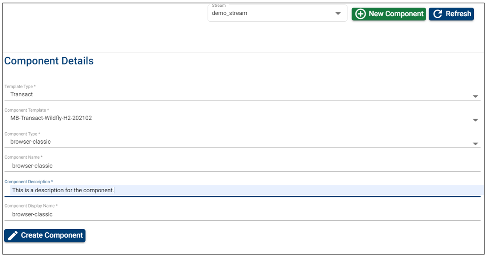

# Components – Feature Description #

Components are individually deployable units that are understood by Temenos Continuous Deployment Platform based on the component type that each component refers to. 

Each component is associated to a component type to help Temenos Continuous Deployment Platform deploy the component. 

The **Component Type** field in the component data is the key to help the Temenos Continuous Deployment Platform Controllers deploy the right components in the right way. 
An organization can define as many components as needed but should have all mandatory components defined in the templates that are assigned to the organization.

Practically when a template is assigned to an organization, a list of component types related to that template is added for that organization.

Each component has the following fields *(all mandatory)*:
 
- Component Type

- Name

- Description

- Display Name

 
 
##  Component Type ##

The TCP uses a convention/ protocol to deploy all parts required to run a full-fledged instance of T24 (Or any other product supported by a template). Such parts to constitute a complete system are called **components**. 

The T24 installation may have the following components (No exhaustive or inclusive):

- T24-Jars
- T24-ud
- Helptext
- Tafj-installer etc.

Each item in this list is called a **component type**. 

The names of these parts / Component Types are fixed and are not user editable. This is managed internally by the Temenos Continuous Deployment Platform admin/ development group and can only be changed or modified by this group. 

Each component type represents a deployable unit and has an ansible script associated to it. 

These components have a structure associated and work in a standardized manner across different deployment stacks (OS, App server variations, DB variations etc).

>
**WARNING:**
make sure to follow the naming convention as defined by the Temenos team. Any adjustments to the components' title such as adding special characters or spaces will result in a failed factory run.

>Example: downloading the same file multiple times auto-numbers the file name from 1 onwards - t24-jars-63688104355895 **(1)**.zip and adds a space as well. Please use the .zip file that has the original title - **t24-jars-63688104355895.zip**. 

 
 

# How to Set Up/ Delete Components # 

## Set-up/ Create a Component ##

 - Login to the Temenos Continuous Deployment Platform.
 - Click on Settings button on the left menu > this will expand a menu containing buttons for: Streams, Stages, Products, Factory and General.  
 - Before creating a component, make sure you select first the stream *(top-right)* where you want to add the respective component. 
 - Click on **Products** button. (This button includes creation of the components)
 - Click on the **New Component** on the top right.
 - Select the Component Type from the dropdown list (the list displays all the components available for your Organization. This is based on the available templates).
 - Input a Name. *Take into account these conditions (also notified on the screen): Name can start only with a letter or an underscore and it can contain only letters, digits, underscores or hyphens.*
 - Fill the Description.
 - Fill the Display Name.
 - Click **Create**.

See below example:

A folder is automatically created into the repository *(we are using JFrog Artifactory)* with the name of your component and will be always created under the default **stable_dev** stage. This is the path where the components' files should be uploaded as explained on the next steps.

*(Please note that the components' artifacts can be uploaded any time before running a factory).*

*(If the related artifacts are not uploaded, running the factory will not be possible and an error message will be thrown).*

 
 
# How to login to Artifactory #
Every user created in the Temenos Continuous Deployment Platform can log in with the platform’s credential on the Artifactory server as well. Follow the steps below to login to the Artifactory:

- go on the left-side menu on the portal and click on **Metadata**. 
 

- here are the metadata settings:
 

- copy the **Artifactory URL** and open it in another browser. To login use with your credentials from the Temenos Continuous Deployment Platform. This is how your Artifactory will be displayed:
 

- to see the artifactory repository, click on the Artifactory icon from the left-side menu. The repository belonging to your organisation will be displayed (to make sure you expand the right repository, always check the naming convention: repo-1dq4zcowcn75s1, where what follows after 'repo-' represents the ID of your organisation:
 
 
 
 
## How to upload binaries into the Artifactory ##

The users are enabled to download the existing artifacts or upload new artifacts that will be used for factories. This process can be done in two ways:

**A. Manually access the artifactory and upload the required binary (recommended).**

Requirements:

- **new user**: it is mandatory for the user to have assigned a role which contains CREATE  _  COMPONENT and MANAGE _ COMPONENTS permissions.
- **existing user**: if a user wants to log in to the Artifactory server, the user must change its password and have the CREATE _ COMPONENT and MANAGE  _ COMPONENTS permissions within the role that was assigned to it. To learn how to change the user roles and permissions please refer to this [link](http://documentation.temenos.cloud/home/user-creation-in-paas.html#user-roles-management).

> [!Note]
-  for an already created user that wants to have access to the Artifactory Server, the user must change its password and if its role has those 2 permissions, the user will be added in Artifactory Server
-  if the user’s role is updated afterwards , the user still needs to change its password in order to be added to the Artifactory Server
-  the user cannot delete artifacts from the Artifactory Server.

Select single or multi depending on the number of archives you need to add, drag and drop or select the archive and then click **deploy**.  

You will see a success message and the archive under your component.

> [!Note]
> Components artifacts are delivered to clients by Temenos Distribution team.
> Also the binaries/ artifacts have to be uploaded each time a component is updated.

**B. Invoke an Artifactory API that will upload the required binary into the appropriate location.**

In order to invoke that Artifactory API a CURL command must be executed (this can be run manually from a linux VM or from a bash script).

    curl -H "X-JFrog-Art-Api:<ArtifactoryKey>" -X PUT "<DestinationURL>" -T <fileToUpload>

- The **ArtifactoryKey** can be taken from the TCD portal (go to General and take the value of ARTIFACTORY_KEY record):

- **DestinationURL** represents the exact location of the file that will be uploaded in the artifactory together with the name of the binary. For this operation, you need to take the exact path of the artifactory from the TCD portal from the Upload URL field that is displayed on the screen after the component is created:

-  **fileToUpload** represents the binary that should be uploaded from your local machine and it must contain also the path where is present.

> [!Note]
> Open source doesn’t support multiple file uploads at a time, therefore you need to upload the required binaries one by one.

**Example of the curl command based on the above**: 
curl -H "X-JFrog-Art-Api:AKCp5dKYyM9WMoiacim9yedAZfG6gLwwcYugPmzZhqHkdRe6ex6pZZnRMteQqedLE9Q3qds6V" "https://1dtk4nz95tssg-artifactory.temenos.cloud/artifactory/repo-1dtk4nz95tssg/dev_stream/demo_stage/t24-jars" -T /drives/c/Users/file/t24-jars-63688104355895.zip

For demo purposes, we used MobaXterm to upload the binary into the Artifactory as displayed below:

Once the command is run, the binary is uploaded on the Artifactory:

 
 

## **Pre-requisites and best practices:** ##

- ensure that the component name also has information about its version;
- ensure that the component format that you upload is correct and as delivered by the Temenos team;

&nbsp;&nbsp;&nbsp;&nbsp;&nbsp;&nbsp;&nbsp;&nbsp;&nbsp;-  the format of the package as delivered by Temenos will as well be supported in TCD.  

&nbsp;&nbsp;&nbsp;&nbsp;&nbsp;&nbsp;&nbsp;&nbsp;
- if the **Help text** file of T24 is given as a .zip, the templates will expect a .zip file for the same,

&nbsp;&nbsp;&nbsp;&nbsp;&nbsp;&nbsp;&nbsp;&nbsp; - DS pakages will have the same packaging as bundled by Design Studio

&nbsp;&nbsp;&nbsp;&nbsp;&nbsp;&nbsp;&nbsp;&nbsp; - T24 updates are bundled in zip;

&nbsp;&nbsp;&nbsp;&nbsp;&nbsp;&nbsp;&nbsp;&nbsp; - you need to get from Temenos distribution team the Toolbox kit that will allow you to generate the system definition file of your T24 environment;

&nbsp;&nbsp;&nbsp;&nbsp;&nbsp;&nbsp;&nbsp;&nbsp; - you will be able to download the T24 updates correspondent to your environments from the Temenos Customer Support Portal by uploading the system definition file generated above;

&nbsp;&nbsp;&nbsp;&nbsp;&nbsp;&nbsp;&nbsp;&nbsp; - once the updates are downloaded from the portal in a .zip file, you must create another .zip of that downloaded .zip file and only then  place it into the artifactory under the correspondent component;

- ensure that components are uploaded to the appropriate folders (the URL and folder names can be found from the component definition pages of the TCD portal);
- if the component is uploaded in a .zip format, it it recommended to have a text file describing what is included in the package/ provide reference to the code commit tags to find what is included in the package;
- do not delete/ edit/ create components/ folders in the artifactory.  TCD Portal’s Product and Component sections must be used to create anything in artifactory.

 
 

#  Which Components to Add  #

In order to know which are the minimum required components that you need to add, you must first check the **Templates Catalog** (see button on the left menu).

From here, select the template that you want to use:

 - Make sure you select first the Template Type (FCM, T24, Tools, Wealth etc.). 
 - Then from the available Templates Catalog, select the one that you need in order to check the components.
 - Under Full Template Content, scroll until you see the **components** section.
 - **Note:** Usually there are at least two **components** sections: one related to T24 and another one refers to Model Bank Database (or other db). Depending on the template type, there could be more components, so please make sure you scroll down to check entirely the template in order to add all required components.
 - It is required to add at least all the mandatory components.
 - In addition to the mandatory components, you will need to add those components you need to test - not related to your selected template.
 - For all added components, make sure you add the related files archive into the artifactory as explained above.

 
 

### How to Delete a Component ###

Components fields are not editable, so you have only the options to create or to delete them.

> [!Note]
> If your component is **attached to a Product**, you will not be able to delete it. 
> 
> You need first to delete the product, then return to the component and click **Delete** button.

 
 

# Products – Feature Description #

A product is a logical grouping of several components. This is just to make it easy for users to select a list of components to deploy instead of selecting each component in a sequence. 

A product has the following fields *(all mandatory)*:

- Name

- Description

- List of constituent components - at least one component is required 

Ultimately, a product is used in a factory and will be used eventually to deploy the required components.

 
 

## How to Set Up/ Edit/ Delete Products ##

### How to Set-up/ Create a Product ###

- If you have created more streams, first make sure you select the stream where you want to create the respective product (see top right).
- Click on Products tab and then on New Product button on the top right.
- Input a name, description and select the mandatory components from dropdown button. This should represent the Principle Product (or one of the principle products) you will use when creating a factory.
- Click **Create** button.

See also below example. 

*For components, the selection order is not important.*

In addition to the principle product which has all template mandatory components, you will need to create other products - Base Products - that will be used to be tested.

 
 

### How to edit a product ###

You can edit:

- The product description. 
- The components field by adding or removing components.
- Just click the edit button, do the changes and then click update.

 
 

### How to delete a product ###

- Go to the Products tab and select the product you want to delete.
- Click the delete button.

> [!Note]
> If the respective product is attached to a factory, you will not be able to delete. You need to delete the factory first.

 To see the details of a component please make sure to first select the stream from the top-right-side menu. The list with the components that belong to the respective stream will be displayed on the left side of the page. The same operation applies for the products:

 
 

# Artifactory view #

The artifactory view displays the uploaded components that are available for the particular stages. By expanding the components, the user triggers a download of the respective component zip file.

 
 

# User Permissions Required
To be able to perform the above operations the following permissions need to be enabled for your user:

- CREATE _ COMPONENT
- DELETE _ COMPONENT
- MANAGE _ COMPONENTS
- MANAGE  - ORG  -  METADATA
- MANAGE _ STREAMS
- MANAGE _ STAGES
- CREATE _ STREAM
- MANAGE _ PRODUCTS
- CREATE _ PRODUCT
- UPDATE _ PRODUCT
- DELETE _ PRODUCT

To have a better understanding of the user permissions, hover the cursor over the variables and a short description will pop up or click [here](http://documentation.temenos.cloud/home/techguides/user-permissions) to read more.
