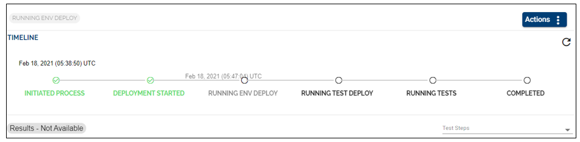

> [!Note]
> Note: Starting April 5th the TCD user guide will move on the [Temenos Customer Support Portal (TCSP)](https://tcsp.temenos.com/TCD/Modules/TemenosContinuousDeployment/Overview/Overview.htm). We recommend you to log in to the portal and check if your credentials are available. Raise a ticket at [CloudPlatformSupport@temenos.com](CloudPlatformSupport@temenos.com) if you encounter any issues.

# How to Create and Publish a New Template after a Successful Factory Run 

This feature offers the possibility to baseline a particular version of a product and create a template from that version. Furthermore, anybody will be able to create an environment with the baselined version of the product.

To set up the factory, follow the steps from [here](http://documentation.temenos.cloud/home/techguides/factories.html "here").

To run the factory, follow the steps from [here](http://documentation.temenos.cloud/home/techguides/run-factory.html "here").

# Create and Publish the New Template after the Successful Factory Run 

There are two alternatives to Create and Publish the new Template after the Successful Run:

1. Automated trigger 
 - save the New Template from the Factory Run 
 - go to Dashboard
 - on the Factory Run click on 'Actions' and select from the drop-down 'Create New Template

2. Manual trigger 
 - click on the newly created environment
 - on the right side of the page click on 'Save as a new template'
 - type in the Template Name and a brief description 

To see the new template, go to the Templates Catalogue tab. Your template is now available in your templates list.
 

 # User Permissions Required
To be able to perform the above operations the below permissions need to be enabled for your user:

- MANAGE _ COMPONENTS
- MANAGE _ STREAMS
- MANAGE _ STAGES
- MANAGE _ PRODUCTS
- CREATE _ FACTORY
- UPDATE _ FACTORY
- DELETE _ FACTORY
- SCHEDULE _ FACTORY
- START  -      FACTORY      -  RUN
- ABORT  -  FACTORY  -  RUN
- VIEW  -  FACTORY  -  RUN  _  HISTORY
- ALLOW  -  CUSTOM  -  TEMPLATES

To have a better understanding of the user permissions, hover the cursor over the variables and a short description will pop up or click [here](http://documentation.temenos.cloud/home/techguides/user-permissions) to read more.