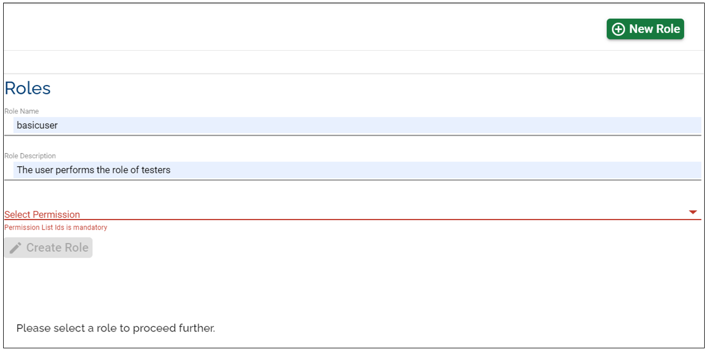

# User Roles Management #

By default, when your organisation is created, Temenos will provide you the link and access instructions to your designated organisation administrator (the first and only user with full rights on the platform).
The administrator can create more users and navigate to the Roles section on the portal to assign various permissions to each user. To create a role, the admin will click on 'New Role' and fill in the blanks:

The admin can select which permissions to set to each user.

Once the role is created, the admin can assign it to a specific user:

- go to the 'Users' tab and select the user 
- choose from the drop-down list the user 
- click 'Edit' on the user
- choose from the drop-down list the role that needs to be assigned 

Please find below a set of recommended user roles for your organisation:

## Administrator ##

Scope: the user has full overview over the organisation's capabilities and users (can create users and assign different roles)

Set permissions: select all permissions

## Developer ##

Scope: the user can create/ run environments/ factories etc. The Developer does not need the metadata or visibility on the users.

Set permissions (you can customize them at your convenience):  ABORT_FACTORY_RUN, ALLOW_CUSTOM_TEMPLATES, ALLOW_EXPORT_ENVIRONMENT, ASSIGN_ROLE, BOOST_ENVIRONMENT, CLONE_STREAM, CREATE_COMPONENT, CREATE_ENVIRONMENT, CREATE_FACTORY, CREATE_ORG_METADATA, CREATE_PRODUCT, CREATE_ROLE, CREATE_STAGE, CREATE_STREAM, CREATE_USER, CREATE_USER_METADATA, DELETE_COMPONENT, DELETE_ENVIRONMENT, DELETE_STAGE, DELETE_STREAM, DELETE_USER_METADATA, MANAGE_COMPONENTS, MANAGE_PRODUCTS, MANAGE_ROLES, MANAGE_STAGES, MANAGE_STREAMS, REDEPLOY_ENVIRONMENT, SCHEDULE_ENVIRONMENT, SCHEDULE_FACTORY, SCHEDULE_FACTORY, START_ALL_ENVIRONMENT, START_ENVIRONMENT, START_FACTORY_RUN, STOP_ALL_ENVIRONMENT, STOP_ENVIRONMENT, UPDATE_ENVIRONMENT, UPDATE_FACTORY, UPDATE_ORG_METADATA, UPDATE_PRODUCT, UPDATE_ROLE, UPDATE_STAGE, UPDATE_STREAM, UPDATE_USER, UPDATE_USER_METADATA, VIEW_FACTORY_RUN_HISTORY

## Reader ##

Scope: the user has permission to see all records but cannot do any changes.

Set permissions: MANAGE_STREAM, MANAGE_STAGES, MANAGE_PRODUCTS, MANAGE_FACTORIES, MANAGE_ENVIRONMENTS, MANAGE_USERS, MANAGE_ROLES, VIEW_FACTORY_RUN_HISTORY, MANAGE_ORG_METADATA, MANAGE_COMPONENTS

> [!Note]
Please note that by 'manage' the user can only view the streams, stages, products, factories, environments, users, roles, the factory run history, organisation metadata and components. A user with the 'reader' role cannot edit anything. 

All the roles can be customized to every user's needs.

Depending on the organization role, a user may/ may not have serveral permissions (eg. if the organisation does not have the assemble module, then the user will not be able to see the stages, the streams. The user will only see the environments, users and probably the metadata).

