# Deploy an update to an existing environment 
This document can be used by technical staff who need to deploy different features on a Temenos Continuous Deployment Environment. Each Environment has an associated Repository for uploading different type of features based on the Environment Template type, these features being deployed automatically to your Environment.

# Pre-requisites #

- Make sure you have a GUI Git Client installed in your local machine. This guide uses *TortoiseGit* Git Client that can be installed from <a href="https://tortoisegit.org/download/" target="blank">here</a>.
- Make sure you have an user created under your organisation that has a public ssh key attached. Please check this <a href="./user-creation-in-paas.md" target="blank">guide</a> to understand how you can create an user or how you can generate and attach a ssh key to an user.

# Clone Environment Repository #

 To clone an environment repository login to your organisation, select your environment and locate the Endpoint of **Repository** Application (this is the last available endpoint on the environment page). 
o
- Click the **copy to clipboard icon** from the right:

 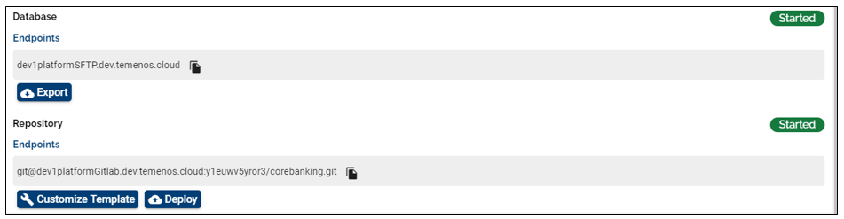

- Create a folder in any location from your local machine. In the current example, a folder name GitLabRepo is used.

- Go to your local repository folder (i.e. GitLabRepo), right click inside the folder and choose **Git Clone**.

 

- The bellow screen is opened where you have to paste the Endpoint of **Repository** Application of your Environment in URL textbox, set the Directory textbox to your local repository folder (GitLabRepo folder in our example) and load your private key.

 

- The content is downloaded from the Repository of your Environment to your local machine.

 
 
 

## The environment folder structure after the clone

Before the 202010 Temenos Continous Deployment platform release, the environment binaries' folders were comprised in 9 folders. From the 202010 platform release onwards, after cloning an environment, you can now find dedicated folders for each binaries where you can upload them. The example below shows what changed:

- Env Structure before Git Folder Standardization: 

 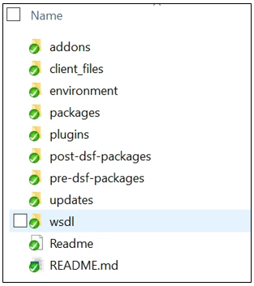

- Env Structure after Git Folder Standardization:

 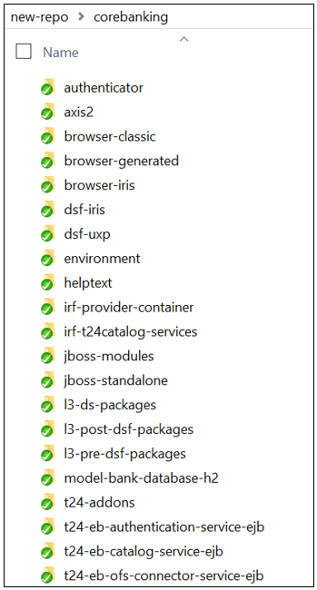

>[!Note]
>If you need to push new changes into your existing environments, you have to clone the GIT folder again.

 
 

With the 202010 platform release, you can find below and example of the before and after components name and structure (where N/A is present the component folder was not present in the old folder structure).

| BEFORE                     | AFTER                                    | PREVIOUS FORMAT   SUPPORTED                                    | CURRENT FORMAT   SUPPORTED                                                                                                                                                                    | NOTES AND   CHANGES IN THE EXISTING FUNCTIONALITY                                                                                                                                                                                                                                                                                                                                                                                                                         |
|----------------------------|------------------------------------------|----------------------------------------------------------------|-----------------------------------------------------------------------------------------------------------------------------------------------------------------------------------------------|---------------------------------------------------------------------------------------------------------------------------------------------------------------------------------------------------------------------------------------------------------------------------------------------------------------------------------------------------------------------------------------------------------------------------------------------------------------------------|
| N/A                        | authenticator                            | *.war                                                          | *.war                                                                                                                                                                                         | N/A                                                                                                                                                                                                                                                                                                                                                                                                                                                                       |
| N/A                        | axis2                                    | *.war                                                          | *.war                                                                                                                                                                                         | N/A                                                                                                                                                                                                                                                                                                                                                                                                                                                                       |
| N/A                        | browser-classic                          | *.war                                                          | *.war                                                                                                                                                                                         | N/A                                                                                                                                                                                                                                                                                                                                                                                                                                                                       |
| N/A                        | browser-generated                        | *.zip                                                          | *.zip                                                                                                                                                                                         | N/A                                                                                                                                                                                                                                                                                                                                                                                                                                                                       |
| N/A                        | browser-iris                             | *.war                                                          | *.war                                                                                                                                                                                         | N/A                                                                                                                                                                                                                                                                                                                                                                                                                                                                       |
| N/A                        | dsf-iris                                 | *.war                                                          | *.war                                                                                                                                                                                         | N/A                                                                                                                                                                                                                                                                                                                                                                                                                                                                       |
| N/A                        | dsf-uxp                                  | *.war                                                          | *.war                                                                                                                                                                                         | N/A                                                                                                                                                                                                                                                                                                                                                                                                                                                                       |
| client_files/helptext      | helptext                                 | *.zip                                                          | *.zip                                                                                                                                                                                         | N/A                                                                                                                                                                                                                                                                                                                                                                                                                                                                       |
| N/A                        | irf-provider-container                   | *.war                                                          | *.war                                                                                                                                                                                         | N/A                                                                                                                                                                                                                                                                                                                                                                                                                                                                       |
| N/A                        | irf-t24catalog-services                  | *.war                                                          | *.war                                                                                                                                                                                         | N/A                                                                                                                                                                                                                                                                                                                                                                                                                                                                       |
| N/A                        | irf-test-web                             | *.war                                                          | *.war                                                                                                                                                                                         | N/A                                                                                                                                                                                                                                                                                                                                                                                                                                                                       |
| N/A                        | irf-web-client                           | *.war                                                          | *.war                                                                                                                                                                                         | N/A                                                                                                                                                                                                                                                                                                                                                                                                                                                                       |
| packages                   | l3-ds-packages                           | *.jar,   *.zip                                                 | *.zip                                                                                                                                                                                         | N/A                                                                                                                                                                                                                                                                                                                                                                                                                                                                       |
| client_files/h2db          | model-bank-database-h2                   | *.zip                                                          | *.zip                                                                                                                                                                                         | db.properties file should be included in the zip file   . The format of db.properties should be as follows: db_name=TAFJDB ->   without extension .mv.db or .h2.db.                                                                                                                                                                                                                                                                                                       |
| client_files/sqldb         | model-bank-database-sqlserver            | *.bak                                                          | *.zip                                                                                                                                                                                         | db.properties file should be included in the zip file   . The format of db.properties should be as follows: db_name=UTPSQL2016 ->   without extension names.                                                                                                                                                                                                                                                                                                              |
| post-dsf-packages          | l3-post-dsf-packages                     | zip   of zip                                                   | zip   of zip                                                                                                                                                                                  | N/A                                                                                                                                                                                                                                                                                                                                                                                                                                                                       |
| pre-dsf-packages           | l3-pre-dsf-packages                      | zip   of zip                                                   | zip   of zip                                                                                                                                                                                  | N/A                                                                                                                                                                                                                                                                                                                                                                                                                                                                       |
| addons                     | t24-Addons                               | *.zip                                                          | *.zip                                                                                                                                                                                         | The environment file can be provided along with the   jars/wars which contains JAVA_OPTS that can to be added in the appserver   startup. If only environment file inside the zip is provided the JAVA_OPTS   will be added to the appserver without copying any war/jar files.   Additionally, this environment file can be used to add or update the java   heap size in the app server start up file (java_opts= - replace the   variables with the appropriate ones). |
| N/A                        | t24-eb-authentication-service-ejb        | *.jar                                                          | *.jar                                                                                                                                                                                         | N/A                                                                                                                                                                                                                                                                                                                                                                                                                                                                       |
| N/A                        | t24-eb-catalog-service-ejb               | *.jar                                                          | *.jar                                                                                                                                                                                         | N/A                                                                                                                                                                                                                                                                                                                                                                                                                                                                       |
| N/A                        | t24-eb-ofs-connector-service-ejb         | *.jar                                                          | *.jar                                                                                                                                                                                         | N/A                                                                                                                                                                                                                                                                                                                                                                                                                                                                       |
| N/A                        | t24-eb-resource-provider-service-ejb     | *.jar                                                          | *.jar                                                                                                                                                                                         | N/A                                                                                                                                                                                                                                                                                                                                                                                                                                                                       |
| N/A                        | t24-if-integration-framework-service-ejb | *.jar                                                          | *.jar                                                                                                                                                                                         | N/A                                                                                                                                                                                                                                                                                                                                                                                                                                                                       |
| N/A                        | t24-interactiontests-iris                |                                                                |                                                                                                                                                                                               | N/A                                                                                                                                                                                                                                                                                                                                                                                                                                                                       |
| N/A                        | t24-jars                                 | *.zip                                                          | *.zip                                                                                                                                                                                         | zip of multiple folders containing jars. For eg:   t24lib, l3lib. Note: We use the folders t24lib and l3lib for core and l3   libraries respectively. Hence the same naming convention has to be used for   the artifacts.                                                                                                                                                                                                                                                |
| client_files/localjars     | t24-l3-java                              |                                                                |                                                                                                                                                                                               | zip of l3libraries                                                                                                                                                                                                                                                                                                                                                                                                                                                        |
| plugins                    | war-package                              | *.zip   containing war, jar or war and optional .endpoint file | *.zip containing war, jar or war and optional .endpoint   file which contains the dns name. Ie.: Provider   APIs~https://t24-v1f2k9y77x18.temenos.cloud/provider-apis/api/v1.0.0/meta/apidocs | Optional .endpoint file within *.zip should now contain   he keyword 'localhost' instead of the dnsname to be able to used during   factory run. Ie.: Provider   APIs~https://localhost/provider-apis/api/v1.0.0/meta/apidocs                                                                                                                                                                                                                                             |
| N/A                        | t24-ud                                   | *.zip   containing UD folders                                  | *.zip   containing UD folders                                                                                                                                                                 | N/A                                                                                                                                                                                                                                                                                                                                                                                                                                                                       |
| updates                    | t24-updates                              | zip   of zip                                                   | zip   of zip                                                                                                                                                                                  | N/A                                                                                                                                                                                                                                                                                                                                                                                                                                                                       |
| wsdl                       | wsdl                                     |                                                                |                                                                                                                                                                                               | N/A                                                                                                                                                                                                                                                                                                                                                                                                                                                                       |
| client_files/localjars/ext | tafj-ext-jars                            | zip   of jars                                                  | zip   of jars                                                                                                                                                                                 | zip of l3libraries                                                                                                                                                                                                                                                                                                                                                                                                                                                        |
| N/A                        | tafj-installer                           | *.zip   containing installer                                   | *.zip   containing installer                                                                                                                                                                  | The TAFJ will be redeployed (full installation, not   patch) hence please make sure any properties that you would like to include   are present within the .properties file inside the installer. For more   details, refer to tafj.installer notes added in the Transact Template   Overview Page.                                                                                                                                                                       |
| N/A                        | tcib-api                                 | *.war                                                          | *.war                                                                                                                                                                                         | N/A                                                                                                                                                                                                                                                                                                                                                                                                                                                                       |
| N/A                        | tcua-tcuseradmin-iris                    | *.war                                                          | *.war                                                                                                                                                                                         | N/A                                                                                                                                                                                                                                                                                                                                                                                                                                                                       |
| N/A                        | tcua-useradministration                  | *.war                                                          | *.war                                                                                                                                                                                         | N/A                                                                                                                                                                                                                                                                                                                                                                                                                                                                       |
| N/A                        | tcxb2-generated                          | *.war                                                          | *.war                                                                                                                                                                                         | N/A                                                                                                                                                                                                                                                                                                                                                                                                                                                                       |
| N/A                        | tcxb2-iris                               | *.war                                                          | *.war                                                                                                                                                                                         | N/A                                                                                                                                                                                                                                                                                                                                                                                                                                                                       |
| N/A                        | tcxb2-retail                             | *.war                                                          | *.war                                                                                                                                                                                         | N/A                                                                                                                                                                                                                                                                                                                                                                                                                                                                       |
| N/A                        | temp.release                             |                                                                |                                                                                                                                                                                               | *.zip containing the temp.release                                                                                                                                                                                                                                                                                                                                                                                                                                         |
| N/A                        | tocf-ee                                  | *.zip                                                          | *.zip                                                                                                                                                                                         | N/A                                                                                                                                                                                                                                                                                                                                                                                                                                                                       |
| N/A                        | uxp-browser                              | *.war                                                          | *.war                                                                                                                                                                                         | N/A                                                                                                                                                                                                                                                                                                                                                                                                                                                                       |
| N/A                        | uxp-god-properties                       | *.zip                                                          | *.zip                                                                                                                                                                                         | N/A                                                                                                                                                                                                                                                                                                                                                                                                                                                                       |
| N/A                        | resourceserverwar                        | *.war                                                          | *.war                                                                                                                                                                                         | N/A                                                                                                                                                                                                                                                                                                                                                                                                                                                                       |
| N/A                        | irf-rp-services                          | *.war                                                          | *.war                                                                                                                                                                                         | N/A                                                                                                                                                                                                                                                                                                                                                                                                                                                                       |
| N/A                        | t24-eb.product                           |                                                                | *.txt                                                                                                                                                                                         | The text file should contain the number of product ,   product name separated by ‘~' (more than 1 product) and product codes   separated by '~’ (more than 1 product) . EX: 2,name1~name2,code1~code2                                                                                                                                                                                                                                                                     |
| N/A                        | jboss-modules                            |                                                                | *.zip                                                                                                                                                                                         | *.zip containing the folders, sub folders, jars, with   the module.xml which can be unzipped to modules folder in jboss It also   checks for the existing folders com/temenos/t24, com/temenos/tafj ,system ,if   exists it is ignored and other folders are copied                                                                                                                                                                                                       |
| N/A                        | standalone.xml                           |                                                                | *.xml                                                                                                                                                                                         | *.xml containing standalone.xml file. The template   file for OSS and TSS are provided at point 6 in this user guide for both OSS   and TSS templates.                                                                                                                                                                                                                                                                                                                    |

>[!Note] 
>Do not leave multiple versions of the same component type in the GIT folder as this would produce undesired results.
 
 

# Commit & Push features to Repository #

To commit and push any changes in the environment go to the repository folder from your local machine (i.e GitLabRepo) and copy your file/files (related to your required features that must be deployed to your Environment) to the specific folder/folders based on your requirement. In this guide, an update is pushed to the Environment Repository.

*Important: T24 Updates must be packaged as .zip of .zip file while it is deployed through the Git repository (the parent .zip file name can be anything). Example:*
> 
T24-updates.zip
>
&nbsp; &nbsp; &nbsp; |__T24-Updates-2020-X-Y.zip
>
&nbsp; &nbsp; &nbsp; &nbsp; &nbsp; &nbsp; &nbsp; &nbsp; |__ *.Jar

 

-  To commit the files/files to Environment Repository, right click inside repository folder from your local machine and choose **Git Commit -> "master"...** option.

 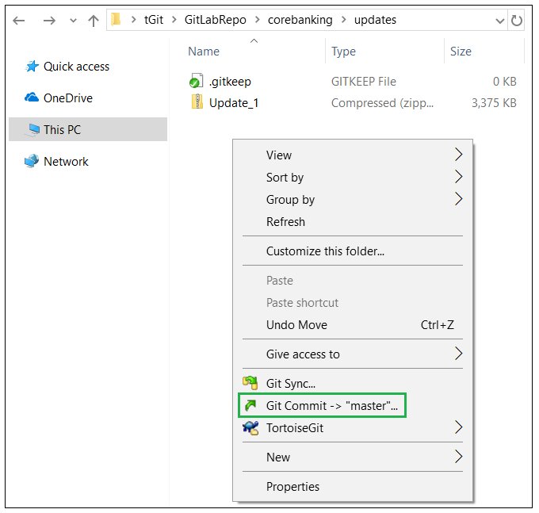

-  The following screen will appear in which your repository changes can be observed and commited. In order to commit, you have to input a commit message and check the checkbox next to each new file if it is the case.

 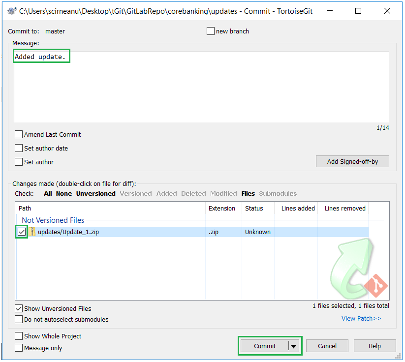

- The following screen will appear in which you have to push your changes to Environment Repository. In order to push, click the **Push** button.

 

- In the next screen, you have to click **Ok** button.

 

- Finally, the status screen for your push action is displayed.

 

 
 

# Trigger Deployment #
After all the required features are committed and pushed to the Environment Repository, you have to deploy these features in your Environment. To do this, login to your organisation, select your environment, locate **Repository** Application and click the **Deploy** button:

 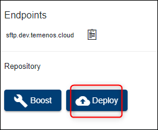

- A notification appears which displays the list of components that will be deployed. Tick the confirmation box to proceed:

 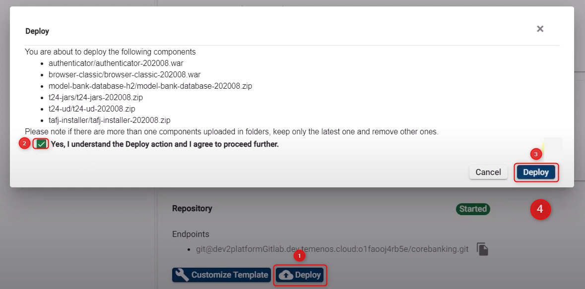

- The Environment and its manageable Applications status will be changed to Deploying during the deployment process and the Deploy button becomes disabled until the deployment is finished.

The logs generated by the deployment process can be also observed in the **Events** tab of your Environment where a new event for *RepositoryDeploy* will be created.

 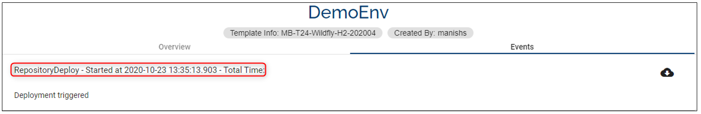
 
> [!Note]
> The deployment process is triggered **manually** by the user after commiting and pushing all the required features in Environment Repository or whenever is appropiate based on the fact that the user can commit and push features to Environment Repository multiple times and choose when to trigger the deployment.

> [!Note]
> Temenos Continuous Deployment uses PROC as the locking mechanism. If you need to change it, proceed via the TAFJEE properties set up. Refer to the TAFJ documentation for more details.

 
 

# How Temenos Continuous Deployment Platform installs DS packages
Temenos Continuous Deployment provides users the ability to deploy one or more Design Studio packages into the environment. This pages explains what happens in the background when packages are deployed to the environment.

-  one or more DS packages which with the .jar extension can be added directly into the Git folder packages as shown below.

 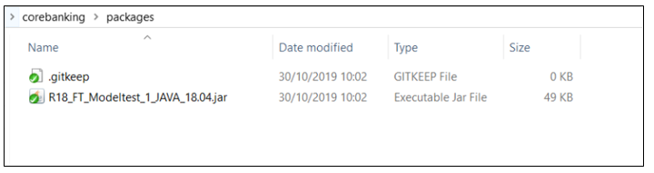

- one or more DS packages can be bundled into a .zip file and put under the Git folder packages/l3 folder 

 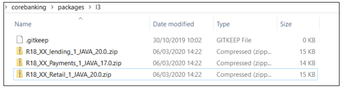

- the following files are cleared from the environment:

          <T24_HOME>/packages

          <T24_HOME/REL.*.ESON

          <T24_HOME>/REL.*.XML

- Any existing **<TAFJ_HOME>/log/packageDataInstaller.txt** will be renamed to **<TAFJ_HOME>/log/packageDataInstaller-<datetime>.txt**

- all the packages files with the .zip format are unziped to the **package** folder
 
- a backup of the **&SAVEDLISTS& f**older is created

- the **T24PackageInstaller** command is run for all the files under the **package** folder

-  an error message is displayed if the output of the above command is not successful

- all the  files released to DSPackageInstaller folder are copied to l3lib folder

- a module.xml is regenerated based on all the JAR files

- run the packageDataInstaller command. We retry this command until the records from the packages are all deployed or some records cannot be deployed further besides iteration. 

- the output of the command above command is saved into a file in **TAFJ/log** named **packageDataInstaller.txt**. An overall result of retries will be written at the end of packageDataInstaller.txt, which is X0 or X1.

- an error message is displayed in the events log  if the output of the **packageDataInstaller** command gives error X1

- a information message appears in the events log  if the output of the packageDataInstaller command is successful X0

- once the above steps are completed,  an automated task is run to authorize all the exception records

- the **appserver** is restarted and the environment is accesible.
 
 

# How Temenos Continuous Deployment Platform installs updates
 When a T24 update is deployed into a Temenos Continuous Deployment environment, either via the [Deploy button](http://documentation.temenos.cloud/home/techguides/deploy-an-update-to-an-existing-environment.html) or during a [factory run](http://documentation.temenos.cloud/home/techguides/run-factory.html), the following steps take place in sequence in the background.

> **Note**: **$T24_HOME corresponds to UD folder.** The environment variables and paths correspond to Linux based environment. Nonetheless, the same set of steps are executed for Windows templates. $T24_HOME corresponds to the path to UD folder. The $T24_HOME/&SAVEDLISTS& contains the UpdateLog and the REL files corresponding to the updates. 
> 
> Please check the files under $T24_HOME/&SAVEDLISTS& along with TAFJ/Log folder in SFTP in case of update failures.

- **$T24_HOME/updater/bin** is given proper rights

- (if it does not exist already) a folder called **T24Updates** is created under **$T24_HOME/../JARS** folder 

- a backup of the  **$T24_HOME/&SAVEDLISTS&** folder is taken and the folder is created again as type UD

- the **T24Version** and the updater command is run from updater/bin

- in the **tafj.properties** file, the precompile path is updated with the **T24Updates** folder path. The path will be $T24_HOME/../JARS/T24Updates:$T24_HOME/../JARS/t24lib

- the automated script stops all the TSA.SERVICE that are in AUTO and START mode. Please check the logs $T24_HOME/SER.LIST for more details on the services that are stopped during this step

- the updates released are copied from the **updates** folder to **T24Updates** folder. In case of service updates, the automated script copies the libraries under the main update folder and not the ones from extensions

- **T24.UPDATE.SERVICE** is run in the environment

- the automated script authorises the exceptions 

- the automated script reverts the **TSA.SERVICES** to their previous state. Please refer to **$T24_HOME/SER.LIST** for the list of services that will be restored during this process.

 
 

# How to deploy the DSF packages

To deploy DSF packages, the following components must be present in  Extend/ Assemble environments:

1. DSF Packager artefacts available in the T24 Environment. It is assumed that the UXP license file includes the license for the domain *.temenos.cloud. Reach out to Temenos license team to confirm the same.  

  dsf-iris.war

  dsf-uxp.war

2. IRF Catalog service in T24 environment:

 irf-t24catalog-services.war

3.  IRIS Catalog service in T24 environment:

 t24-eb-catalog-service-ejb.jar
 
 

 ## DSF Package Structure

 The l3-pre-dsf-packages and/or l3-post-dsf-packages containing DSF packages have the **format of zip of zip**. See below a  sample package:

 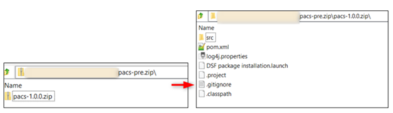

 
 

 ## DSF Deployment Overview

 See below what happens in the environment when a DSF packacke is deployed:

- The zip of zip file is downloaded into a temporary file within the TCD environment

- A curl command is executed to deploy the package file in the zip format. See the example below:

 `curl -X POST -L -F "package=@MyTestPack-1.0.0.zip;type=application/zip" http://<dnsname>/dsf-iris/api/v1.0.0/meta/dsfpackages/deploy)`

- The output of the curl command is displayed in the events log
- See below a sample output of a successful deployment (this is available in your **Events** tab on your environment page):

 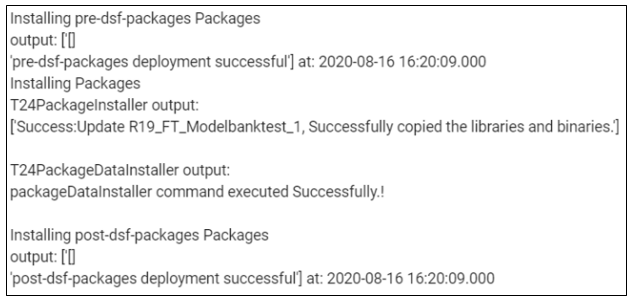

- See below a sample output of a failed deployment (this is available in your **Events** tab on your environment page):

 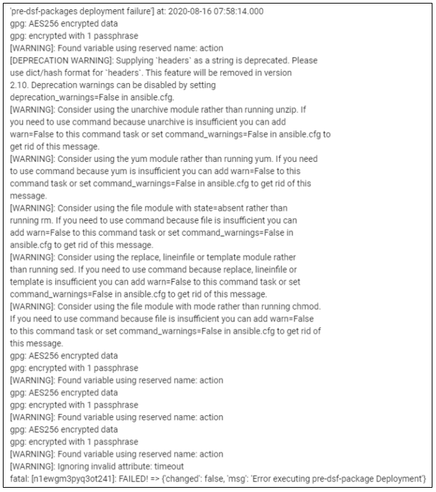
 
 

 ## DSF Deployment Notes

- For the factory run, the components mentioned in 1, 2 and 3 from the **How to deploy the DSF packages** should be defined in the factory.

- In an Extend environment, there will be two new folders named **pre-dsf-packages** and **post-dsf-packages**:

 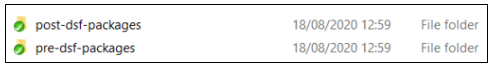

- In case you only have one set of DSF package to be installed into a Temenos Continuous Deployment Extend environment, please include the package in** pre-dsf-packages** folder in the GIT.

- We currently support a single file inside the pre-dsf / post-dsf folders. Bundle all your DSF Packages into a .zip file before uploading them
 
 
 
## Standalone.xml file notes

There are different standalone.xml templates for [TSS (Jboss/ SQL) and OSS (Widlfly/ H2)](http://documentation.temenos.cloud/home/techguides/templates-list.html#t24). These are provided to you by us.

### The standalone.xml TSS (Jboss & SQL) template 
- don’t change any of the static values

- the only changes you can apply to the files are:

    - in the datasource code block and give a new name (ie. instead of jndi-name="java:/jdbc/t24DS" you can change the name from t24DS to another one) or change the min/max-pool-size. If you want to add more datasource copy the entire code block highlighted below.

      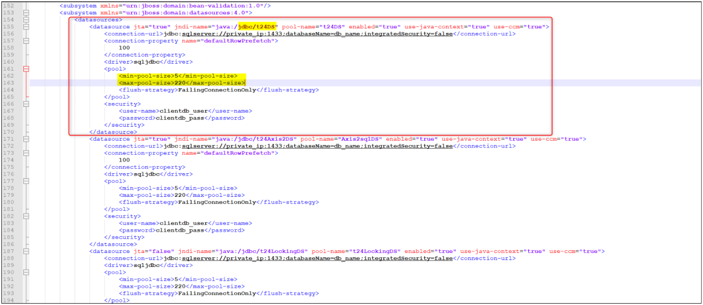

    - in the queues add new connection pools (copy-paste the link and change the name, max-pool-size)

      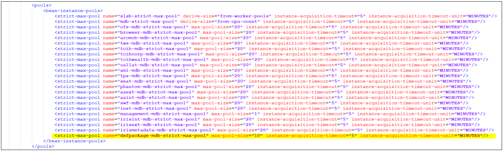

    - add custom queues ( copy the highlighted queue below and add another name (ie. instead of tecEventsTopic you can add another name)

     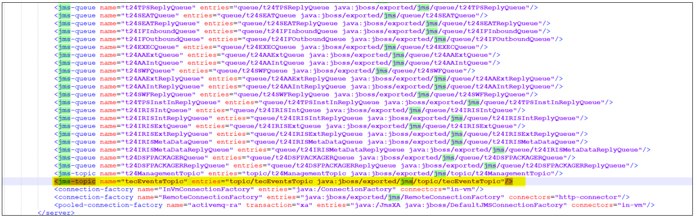

 **Other alterations added to the XML file will result in a failed deployment.**

### The db.properties file - only applicable for OSS (Wildfly/ H2) templates ###

You can place the TAFJDB.zip file in the model-bank-database-h2 folder. The db.properties file should be added to the corresponding H2 .zip files in the artifactory and the H2 machines must have a copy of this file.
 
>[!Note]
> If the Golden Copy is provided by you make sure to have the db.properties file under the model-bank-database-h2. If this is not present, the environment will be created using the default modelbank credentials.

**It is mandatory to have the db.properties file included along with your H2 DB .zip file, otherwise the environment will be created using the default modelbank credentials.**

  

You can add the db.properties file into the TAFJDB.zip. The db.properties file contains the db name, clientdb user and pass, as well as the dbuser and dbpassword where:

- The dbuser is the Transact/ T24 user which has SUPER.USER privileges

- These entries are used by the Temenos Continuous Deployment automation scripts to run the T24 programs and TSA SERVICES. If you fail to provide the below the automation scripts will use the default Model Bank credentials (INPUTT/123456) which might lead to failed database deployments.

  

- **If the folder inside TAFJDB.zip file is renamed, then it is mandatory in the db.properties to add the db-name the same as the db folder name and the credentials for the respective db.**

  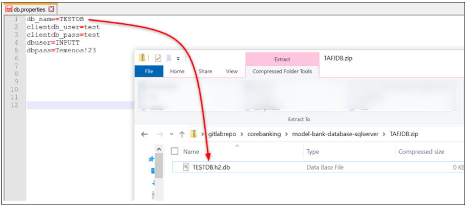

>[!Note]
>If you want to overwrite the database it is important to do at least one change before deploying it. Otherwise the platform will pick the initial database only.
 
 

# Attachments

You can download the Standalone OSS (Wildfly/ H2)/ TSS (Jboss/ SQL) and the db.properties files below:

- **<a href="./../zip/client-standalone-OSS-1">Standalone OSS (Wildfly/ H2) file applicable for lower template versions than 202008</a>** 

- **<a href="./../zip/client-standalone-OSS-2">Standalone OSS (Wildfly/ H2) file applicable for higher template versions than 202008 (including the 202008 version)</a>** 

- **<a href="./../zip/client-standalone-TSS-1">Standalone TSS (Jboss/ SQL) file applicable for lower template versions than 202008</a>** 

- **<a href="./../zip/client-standalone-TSS-2">Standalone TSS (Jboss/ SQL) file applicable for higher template than 202008 (including the 202008 version)</a>** 

- **<a href="./../zip/db.properties">db.properties file</a>** 

- Video tutorial available **[here](https://youtu.be/Kc5nXfJewKg)**.

# User Permissions Required
To be able to perform the above operations the below permissions need to be enabled for your user:

- UPDATE_USER (it is required to add the SSH Key if this hasn't been done after creating the user)
- CREATE_ENVIRONMENT
- UPDATE_ENVIRONMENT
- DELETE_ENVIRONMENT
- REDEPLOY_ENVIRONMENT
- START_ENVIRONMENT
- STOP_ENVIRONMENT
- MANAGE_ENVIRONMENTS

To have a better understanding of the user permissions, hover the cursor over the variables and a short description will pop up or click [here](http://documentation.temenos.cloud/home/techguides/user-permissions) to read more.

