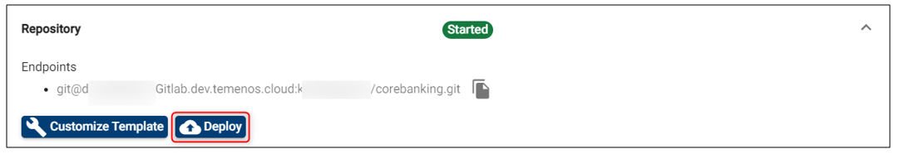

# Deploy an update to an existing environment
This document can be used by technical staff who need to deploy different features on a Temenos Continuous Deployment Environment. Each Environment has an associated Repository for uploading different type of features based on the Environment Template type, these features being deployed automatically to your Environment.

Before proceeding, please check the following requirements:
- Make sure you have a GUI Git Client installed in your local machine. This guide uses *TortoiseGit* Git Client that can be installed from <a href="https://tortoisegit.org/download/" target="blank">here</a>.
- Make sure you have an user created under your organisation that has a public ssh key attached. Please check this <a href="./user-creation-in-paas.md" target="blank">guide</a> to understand how you can create an user or how you can generate and attach a ssh key to an user.

# Clone Environment Repository #

•	Please login to your organisation, select your environment and locate the Endpoint of **Repository** Application (this is the last available endpoint on the environment page). 

- Click the **copy to clipboard icon** from the right:

•	Create a folder in any location from your local machine. In the current example, a folder name GitLabRepo is used.

•	Go to your local repository folder(GitLabRepo folder in our example), right click inside the folder and choose **Git Clone**.

•	The bellow screen is opened where you have to paste the Endpoint of **Repository** Application of your Environment in URL textbox, set the Directory textbox to your local repository folder(GitLabRepo folder in our example) and load your private key.

•	Content is downloaded from the Repository of your Environment to your local machine.

# Repository Structure #

The repository structure on your local machine should look like this:

> [!Warning]
> **Do not delete, change or move the environment folder**. This contains the manifest file.

| Folder                | Functionality                                                                                                                                                                                                                                                                                                                                                                                                                                                                                                                                                                                                                                                                                                                                                                                                                                                                                                                                                                                                         |
|-----------------------|-----------------------------------------------------------------------------------------------------------------------------------------------------------------------------------------------------------------------------------------------------------------------------------------------------------------------------------------------------------------------------------------------------------------------------------------------------------------------------------------------------------------------------------------------------------------------------------------------------------------------------------------------------------------------------------------------------------------------------------------------------------------------------------------------------------------------------------------------------------------------------------------------------------------------------------------------------------------------------------------------------------------------|
| addons                | This   folder is designed for AppDynamics. Upload files as JAR.                                                                                                                                                                                                                                                                                                                                                                                                                                                                                                                                                                                                                                                                                                                                                                                                                                                                                                                                                       |
| client_files\h2db     | Local   H2 database that will be uploaded to the Cloud Environment. Database username   must be t24 and password t24 (case sensitive). Database name is mandatory to   be “TAFJDB.h2.db” (case sensitive) and must be archived as a ZIP with name   TAFJDB.zip (case sensitive). If the above conditions are not satisfied, the   database will not be uploaded to the Cloud Environment. This procedure will   replace the existing database in the cloud with this one. The old database   will be lost, including any records loaded manually.                                                                                                                                                                                                                                                                                                                                                                                                                                                                     |
| client_files\helptext | Custom   Help Text files can be uploaded in this folder. The file structure must be   the same as HELP.TEXT T24 core. Thus, under client_files\helptext folder, the   HelpText folder with subfolders for each component (AA, EB, PP, etc.) is   expected.                                                                                                                                                                                                                                                                                                                                                                                                                                                                                                                                                                                                                                                                                                                                                            |
| packages              | If   you intend to upload one or more Design Studio packages, add it here as a   .jar file. Note that the Temenos Continuous Deployment platform does not   support the old .d format for Design Studio packages and only support the   current ESON or version/enquiry records.                                                                                                                                                                                                                                                                                                                                                                                                                                                                                                                                                                                                                                                                                                                                      |
| packages\l3           | One   or more Design Studio packages can be bundled in a .zip file format and   uploaded in this folder. Note that the Temenos Continuous Deployment platform   does not support the old .d format for Design Studio packages and only   support the current ESON or version/enquiry records.                                                                                                                                                                                                                                                                                                                                                                                                                                                                                                                                                                                                                                                                                                                         |
| plugins               | WAR   files can be uploaded in this folder. The files will be deployed inside Jboss   EAP. In addition to this, endpoints related to plugins can be automatically   added to an application. For more details, check this guide.                                                                                                                                                                                                                                                                                                                                                                                                                                                                                                                                                                                                                                                                                                                                                                                      |
| updates               | The   updates files downloaded from the portal in .zip of .zip format. The files   will be copied to the update folder and the T24 Update procedure is   triggered.                                                                                                                                                                                                                                                                                                                                                                                                                                                                                                                                                                                                                                                                                                                                                                                                                                                   |
| wsdl                  | WSDL   files and folders that are required by plug-ins (war file) need to be   uploaded here.                                                                                                                                                                                                                                                                                                                                                                                                                                                                                                                                                                                                                                                                                                                                                                                                                                                                                                                         |
| client_files\sqldb    | The   SQL database will be uploaded to the client_files\sqldb folder. The file   extensions of the database must be .bak, .zip or both (i.e. in case of more   .bak files need to be uploaded, you can add them under a .zip which would   also reduce the size during Git deploy). Note: the .zip or .bak file can have   any name. Nonetheless, the database name within the SQL database backup file   must be UTPSQLDB. If the database name is other than UTPSQLDB, the database   deployment will not work. The database credentials, schema security group   access, logical/physical file names, etc, should be followed as in UTP SQL   model bank database. By default, the Recovery model parameter is ‘FULL’,   incase of a larger database/more transactions involved, then it is preferred   to set the parameter as ‘SIMPLE’. This parameter will be retained after DB   import/cloned to a new environment. In case you need to convert the database   from H2 to SQL DB, please raise a PACS ticket. |
| l3-pre-dsf-packages   | To make changes to T24 records we use l3-pre-dsf and   l3-post-dsf packages. The priority and order of deployment can be specified   in pre and post packages. Go to the [How to deploy the DSF packages ](http://documentation.temenos.cloud/home/techguides/deploy-an-update-to-an-existing-environment.html#how-to-deploy-the-dsf-packages)  instructions to learn more.                                                                                                                                                                                                                                                                                                                                                                                                                                                                                                                                                                                                                                                                                                                                                                                 |
| l3-post-dsf-packages  | Same functionality as above.                                                                                                                                                                                                                                                                                                                                                                                                                                                                                                                                                                                                                                                                                                                                                                                                                                                                                                                                                                                          |
 

## Additional folders
The bellow folders are not present as default in environment repository. In any of the bellow functionalities is required, the folder related to that functionality must be first created in environment repository and only after this the functionality of the folder can be used.

| **Folder**  				| Functionality	|
|-					|-		|
|client_files\localjars	|	This folder is designed for local JARs (not released by T24 Core) installation. Any JAR file used by T24 or other parties can be uploaded in this folder. During deployment, all JARs present in this folder will be deployed in the environment. If a JAR file is corrupted or some dependencies are missing, the environment will not start. A module.xml file is regenerated based on all the JAR files.
   |
|client_files\localjars\ext	|	This folder is designed for local JARs installation inside **TAFJ/ext** folder from the environment. |
 
 

# Commit & Push features to Repository #
•	Go to repository folder from your local machine(GitLabRepo folder in our example) and copy your file/files (related to your required features that must be deployed to your Environment) to the specific folder/folders based on your requirement. In this guide, an update is pushed to the Environment Repository.

*Important: T24 Updates must be packaged as .zip of .zip file while it is deployed through the Git repository (the parent .zip file name can be anything). Example:*
> 
T24-updates.zip
>
&nbsp; &nbsp; &nbsp; |__T24-Updates-2020-X-Y.zip
>
&nbsp; &nbsp; &nbsp; &nbsp; &nbsp; &nbsp; &nbsp; &nbsp; |__ *.Jar

•	To commit the files/files to Environment Repository, right click inside repository folder from your local machine and choose **Git Commit -> "master"...** option.

•	The following screen will appear in which your repository changes can be observed and commited. In order to commit, you have to input a commit message and check the checkbox next to each new file if it is the case.

•	The following screen will appear in which you have to push your changes to Environment Repository. In order to push, click the **Push** button.

•	In the next screen, you have to click **Ok** button.

•	Finally, the status screen for your push action is displayed.

 
 

# Trigger Deployment #
•	After all required features are commited and pushed to Environment Repository, you have to deploy these features in your Environment. To do this, login to your organisation, select your environment, locate **Repository** Application and click the **Deploy** button.

•	The Environment and its manageable Applications status will be changed to Deploying during the deployment process and the Deploy button becomes disabled until the deployment is finished.

The logs generated by the deployment process can be also observed in the **Events** tab of your Environment where a new event for *RepositoryDeploy* will be created.

> [!Note]
> The deployment process is triggered **manually** by the user after commiting and pushing all the required features in Environment Repository or whenever is appropiate based on the fact that the user can commit and push features to Environment Repository multiple times and choose when to trigger the deployment.

 
 

# Deploy an update to an existing environment #

- Go to your environment and click **Go to Application** in order to log to T24 Browser.

- Sign in with your T24 user and password.

> [!Note]
> First T24 login will take a bit longer.

- In the command line, type TS, BNK/T24.UPDATES and press Go button
- In the new screen, put the service from Stop to **Start** and press **Commit the deal** button on the left. *(This will trigger the deployed updates).*

 - Go back to the portal, click your environment and click **Monitor Application**.
 - Sign in with your user and password. 

- Go to **Execute servlet** under Execution.
- Type the command **START.TSM** and then press **Submit**.
- Go back to T24 browser and in the command line type **SPF S SYSTEM** and press go. 
- In the new screen, scroll down until you see the updates that were added.

 
 

# How Temenos Continuous Deployment Platform installs DS packages
Temenos Continuous Deployment provides users the ability to deploy one or more Design Studio packages into the environment. This pages explains what happens in the background when packages are deployed to the environment.

-  one or more DS packages which with the .jar extension can be added directly into the Git folder packages as shown below.

- one or more DS packages can be bundled into a .zip file and put under the Git folder packages/l3 folder 

 

- the following files are cleared from the environment:

          <T24_HOME>/packages

          <T24_HOME/REL.*.ESON

          <T24_HOME>/REL.*.XML

- Any existing **<TAFJ_HOME>/log/packageDataInstaller.txt** will be renamed to **<TAFJ_HOME>/log/packageDataInstaller-<datetime>.txt**

- all the packages files with the .zip format are unziped to the **package** folder
 
- a backup of the **&SAVEDLISTS& f**older is created

- the **T24PackageInstaller** command is run for all the files under the **package** folder

-  an error message is displayed if the output of the above command is not successful

- all the  files released to DSPackageInstaller folder are copied to l3lib folder

- a module.xml is regenerated based on all the JAR files

- run the packageDataInstaller command. We retry this command until the records from the packages are all deployed or some records cannot be deployed further besides iteration. 

- the output of the command above command is saved into a file in **TAFJ/log** named **packageDataInstaller.txt**. An overall result of retries will be written at the end of packageDataInstaller.txt, which is X0 or X1.

- an error message is displayed in the events log  if the output of the **packageDataInstaller** command gives error X1

- a information message appears in the events log  if the output of the packageDataInstaller command is successful X0

- once the above steps are completed,  an automated task is run to authorize all the exception records

- the **appserver** is restarted and the environment is accesible.
 
 

# How Temenos Continuous Deployment Platform installs updates
 When a T24 update is deployed into a Temenos Continuous Deployment environment, either via the [Deploy button](http://documentation.temenos.cloud/home/techguides/deploy-an-update-to-an-existing-environment.html) or during a [factory run](http://documentation.temenos.cloud/home/techguides/run-factory.html), the following steps take place in sequence in the background.

> **Note**: **$T24_HOME corresponds to UD folder.** The environment variables and paths correspond to Linux based environment. Nonetheless, the same set of steps are executed for Windows templates. $T24_HOME corresponds to the path to UD folder. The $T24_HOME/&SAVEDLISTS& contains the UpdateLog and the REL files corresponding to the updates. 
> 
> Please check the files under $T24_HOME/&SAVEDLISTS& along with TAFJ/Log folder in SFTP in case of update failures.

- **$T24_HOME/updater/bin** is given proper rights

- (if it does not exist already) a folder called **T24Updates** is created under **$T24_HOME/../JARS** folder 

- a backup of the  **$T24_HOME/&SAVEDLISTS&** folder is taken and the folder is created again as type UD

- the **T24Version** and the updater command is run from updater/bin

- in the **tafj.properties** file, the precompile path is updated with the **T24Updates** folder path. The path will be $T24_HOME/../JARS/T24Updates:$T24_HOME/../JARS/t24lib

- the automated script stops all the TSA.SERVICE that are in AUTO and START mode. Please check the logs $T24_HOME/SER.LIST for more details on the services that are stopped during this step

- the updates released are copied from the **updates** folder to **T24Updates** folder. In case of service updates, the automated script copies the libraries under the main update folder and not the ones from extensions

- **T24.UPDATE.SERVICE** is run in the environment

- the automated script authorises the exceptions 

- the automated script reverts the **TSA.SERVICES** to their previous state. Please refer to **$T24_HOME/SER.LIST** for the list of services that will be restored during this process.

 
 

# How to deploy the DSF packages

To deploy DSF packages, the following components must be present in  Extend/ Assemble environments:

1. DSF Packager artefacts available in the T24 Environment. It is assumed that the UXP license file includes the license for the domain *.temenos.cloud. Reach out to Temenos license team to confirm the same.  

  dsf-iris.war

  dsf-uxp.war

2. IRF Catalog service in T24 environment:

 irf-t24catalog-services.war

3.  IRIS Catalog service in T24 environment:

 t24-eb-catalog-service-ejb.jar
 

 ### DSF Package Structure ###

 The l3-pre-dsf-packages and/or l3-post-dsf-packages containing DSF packages have the **format of zip of zip**. See below a  sample package:

 
 

 ### DSF Deployment Overview ###

 See below what happens in the environment when a DSF packacke is deployed:

- The zip of zip file is downloaded into a temporary file within the TCD environment

- A curl command is executed to deploy the package file in the zip format. See the example below:

 `curl -X POST -L -F "package=@MyTestPack-1.0.0.zip;type=application/zip" http://<dnsname>/dsf-iris/api/v1.0.0/meta/dsfpackages/deploy)`

- The output of the curl command is displayed in the events log
- See below a sample output of a successful deployment (this is available in your **Events** tab on your environment page):

     

- See below a sample output of a failed deployment (this is available in your **Events** tab on your environment page):

     

 ### DSF Deployment Notes ###

- For the factory run, the components mentioned in 1, 2 and 3 from the **How to deploy the DSF packages** should be defined in the factory

- In an Extend environment, there will be two new folders named **pre-dsf-packages** and **post-dsf-packages**

     

- In case you only have one set of DSF package to be installed into a Temenos Continuous Deployment Extend environment, please include the package in** pre-dsf-packages** folder in the GIT

- We currently support a single file inside the pre-dsf / post-dsf folders. Bundle all your DSF Packages into a .zip file before uploading them. 

# User Permissions Required
To be able to perform the above operations the below permissions need to be enabled for your user:

- UPDATE_USER (it is required to add the SSH Key if this hasn't been done after creating the user)
- CREATE_ENVIRONMENT
- UPDATE_ENVIRONMENT
- DELETE_ENVIRONMENT
- BOOST_ENVIRONMENT
- REDEPLOY_ENVIRONMENT
- START_ENVIRONMENT
- STOP_ENVIRONMENT
- MANAGE_ENVIRONMENTS

To have a better understanding of the user permissions, hover the cursor over the variables and a short description will pop up or click [here](http://documentation.temenos.cloud/home/techguides/user-permissions) to read more.

