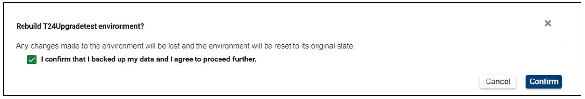

> [!Note]
>  With the 202103 release, the TCD user guide will move to the [Temenos Customer Support Portal (TCSP)](https://tcsp.temenos.com/TCD/Modules/TemenosContinuousDeployment/Overview/Overview.htm). We recommend you to log in to TCSP and check if your credentials are available. Raise a ticket at [CloudPlatformSupport@temenos.com](CloudPlatformSupport@temenos.com) if you encounter any issues.

# Environment Basic Operations

After creating an environment, there are several actions (operations) that can be done via the available buttons: 

1. Filter the Environment by typing in the keywords

2. Filter the environments' list  by ticking the **Extend**, **Manual factory** or **Automated Factory**.

3. **Start All User Environments**, **Stop All User Environments**, **Refresh**, Create **New Environment**

 

## Environment buttons ##

The user can also **clone**, **edit**, **delete**, **start**, **stop**, **rebuild**, **export the database** and **deploy the repository** and use the endpoints related to T24, the database or to the repository:

- **Start All User Environments** button - use this button to only start all user environments

  

 

- **Stop All User Environments** button - stops all running VMs that are part of the Environment

   

 

- **Refresh** the page - use this button to refresh any action in progress (related to an environment but also to a factory)

  

 

- Create a **New Environment** - displays the fields required to create an environment. here you can give a name and a description to your environment and choose a template

  

- the **Actions** button from the right-side of the screen is expandable and allows the user to:

  

 - **Start** an environment - after creating an environment, the Start button is automatically disabled as the environment is running. It will be enabled if an environment is stopped and it will start all the instances specified in the Environment configuration.

      - When the environment is stopped, start button is supposed to start the VMs where the database and the application server of a T24 environment are installed and also to start the application server (jboss, wildfly, WebSphere, etc.) so that T24 to be up and running. 

     - However, please **note** that start button is not triggering also the deployment of whatever is present into the associated Git repository (such as something that was committed when the environment was stopped or a T24 update package ( L1 development) that was not yet successfully deployed to the T24 area).

 - **Stop** an environment  - stop all running VMs that are part of the environment.

 - **Rebuild** an environment - recreate the resources into the cloud and re-installs T24 and H2 db. This is used for example when modifying the application templates (i.e. changing the T24 displayed name or adding a new application).

 - **Save as new template** - read more **[here](http://documentation.temenos.cloud/home/techguides/save-as-new-template.html)**.

 - **Edit the environment** - change the name and the description of an environment. You can ignore the **Auto Start / Stop Scheduler** as configured in the **Schedule Environments** from the General Tab:

       

 - **Clone environment** - create an identical environment by copying the Environment and configuration repository

 - **Upgrade** - read more **[here](http://documentation.temenos.cloud/home/techguides/upgrade-trials.html)**.

 - **Rebuild** the upgraded environment from the  **Actions** button - a pop-up informs that *Any changes made to the environment will be lost and the environment will be reset to its original state.* To proceed, tick the check box and click **Confirm**:

  

 -  **Clone** the upgraded environment from the **Actions** button -  a pop-up appears where you need to insert the **Environment Name**, **Environment Description** and **Labels**. The pop-up informs that if L3 packages are manually altered, then they will not be copied and the clone may not work if the T24 environment is upgraded:

  

 
 

## T24 Release section - available actions ##

### **Endpoints**:  ###
Depending on the template used to provision your environment, you will be able to access the below endpoints:

- T24 Browser Web

- TAFJ Web Application 

- Access Environment Files (login with your portal credentials)

- UXP Browser

- IRIS APIs

- IRIS Runtime

- IRIS Workbench

- Temenos Workbench 

- Temenos Connect User Administration (TCUA) 

- Internet Banking - Retail

- Design Studio Kit - you can start downloading Design Studio tool (DS version is compatible with your environment). 

1. To access this endpoints you check the Template Name (you will find it under the environment name in the Environment page)

2. Go to the **Templates Catalogue**, select the **Template Type** from the top-right, then look for the template you used for to provision the environment. On that Template page, under the **Release Notes** tab you can see the template’s **Topology** which displays all the credentials you need. 

### **Buttons**  ###

- **Exporting** an environment  allows to export and import an environment or a database through SFTP server

  

 

Clicking the 'Export Environment' button will generate a zip file on the tcdSFTP.temenos.cloud portal containing:

   - all jar files deployed in T24 sandbox and the correspondent module.xml file;
   - the content of the default folder of T24;
   - all war files deployed in the T24 sandbox and the Jboss server log.

 
 

## Database section - available actions ##

### **Buttons**  ###

- **Export** the database - by clicking the "Export database" button a zip file will be generated in the tcdSFTP.temenos.cloud portal which will contain the current database of the sandbox. Note: This database can be used as a backup that can be deployed later on into the sandbox as a duplicate for testing/development or for local development before deploying to the cloud.

  

### **Endpoints**  ###

 - tcdSFTP.temenos.cloud - allows you to copy the SFTP link.

 
 

## Repository section - available actions ##

### **Buttons**  ###

- **Customize template** - the operation triggered by the button will copy in the environment repository all the template files used to create the environment
 
  

- **Deploy** button - used when deploying newly added plugins, endpoints, updates, web services, packages etc.

 

### **Endpoints**  ###

This section displays the GitLab repository correspondent to your T24 sandbox that you can copy it in order to clone the repository.

- example: git@tcdGitlab.temenos.cloud:1dyomzt4lxuyo/corebanking.git

> [!Note]
> **IMPORTANT!**
> 
> As a good practice and in terms of reducing your costs, it is recommended that you don't keep an environment **unused**. Even if it's not used, it will still generate costs. The environment will be deleted by the Extend team (with a prior mail notification) when it is unused for more than 3 days (for internal clients), respectively for more than 7 days (for external clients).
> 
> Also to reduce costs, the environment can be put on **Stop** and started only when required. The environments that are stopped will not be deleted.

## Schedule Environments ##
Users have the option to schedule environments at their convenience. To proceed:

-  go to the left-side menu
-  click on General 
-  select the 'Schedule Environments' tab

The user can either start or stop all environments on certain dates, days or at a certain hour (UTC time zone). 

# User Permissions Required
To be able to perform basic  environment operations the below permissions need to be enabled for your user:

- MANAGE _ ENVIRONMENTS
- CREATE _ ENVIRONMENT
- UPDATE _ ENVIRONMENT
- DELETE _ ENVIRONMENT
- BOOST _ ENVIRONMENT
- REDEPLOY _ ENVIRONMENT
- START _ ENVIRONMENT
- STOP _ ENVIRONMENT
- ALLOW -  EXPORT  - ENVIRONMENT
- START -  ALL  - ENVIRONMENT
- STOP -  ALL  - ENVIRONMENT
- SCHEDULE _ ENVIRONMENT
- ALLOW - EXPORT - ENVIRONMENT
- MANAGE _ ENVIRONMENTS

To have a better understanding of the user permissions, hover the cursor over the variables and a short description will pop up or click [here](http://documentation.temenos.cloud/home/techguides/user-permissions) to read more.

