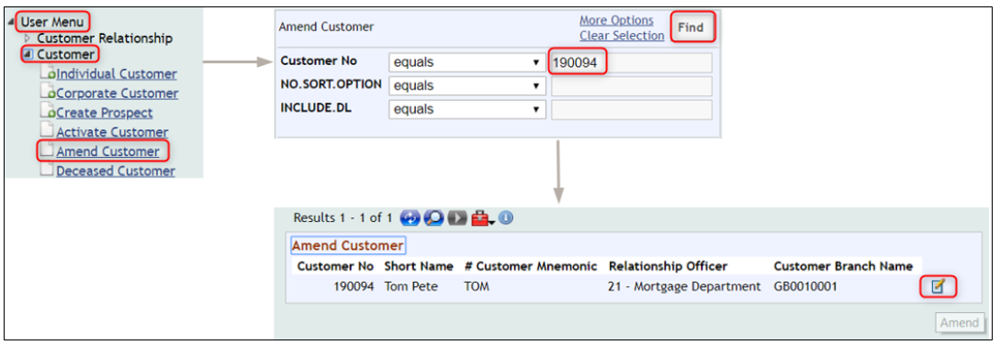
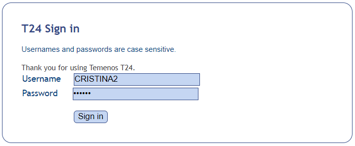
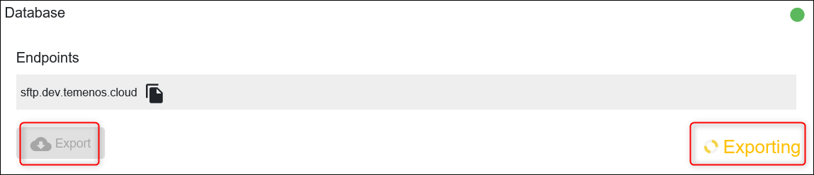
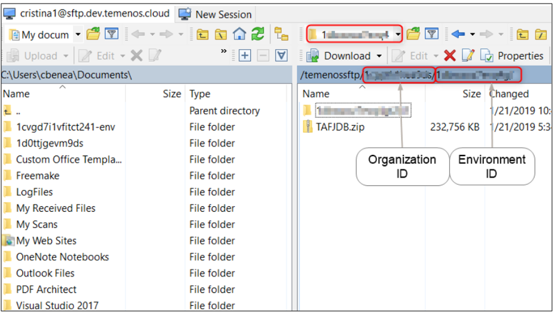
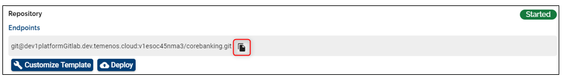
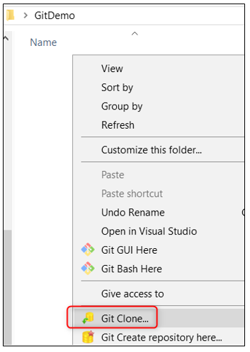
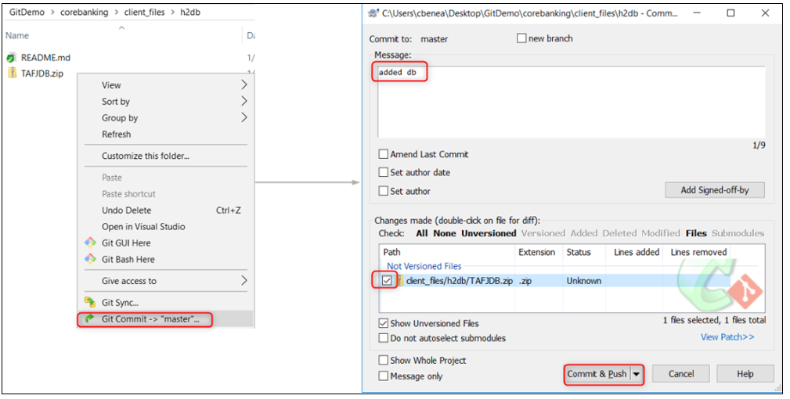
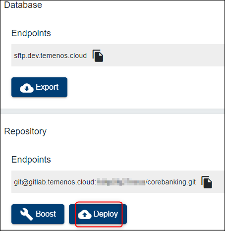

# Export and Import Databases #

This user guide explains how to import and export databases of a Temenos cloud environment in order to migrate datasets across environments. 

Login to your organization on the TCD (Temenos Continuous Deployment) portal ([portal.temenos.cloud](https://portal.temenos.cloud/)) read and accept the privacy notice.

## Create an Environment ##

 - Once logged, go to the Environments tab on the left and then click **New environment** button on the right.
 - Fill Name and Description fields.
 - Select T24 from Cloud Native Applications (dropdown list).
 - And then choose a T24 template with the version that you need (in current example R18.11).
 - *Labels field is optional*.
 - Click **Create** button.

> [!Note]
> To see how to create an environment, please also check <a href="./environment-creation-in-paas.md" target="_blank">**this**</a> user guide.

> [!Note]
> For this user guide, there are two environments created: 
>   - DevEnv
>   - DevEnv1
>
> They will be used to see how to export the DB from one environment and import it into the other one.
>
> 

## Amend a customer record ##

 - Go to User Menu > Customer > Amend Customer
 - In the new screen, type a customer number from your db (ex. 190094) and click **Find**
 - Then click amend button

 

- Change the GB Town/City from the Physical Address tab and then press **Commit the deal** button  in order to save the change. 

*(**Note**: You can do any change on any record type)*

 

 - Two notifications about Customer's documents will pop up > Mark them as '**Received**' and Click "**Accept Overrides**" > Transaction is complete
 - The next step is to authorize the record change:
 - Log out and login with a different user (in production, this user will have special rights)

- Go to User Menu > Customer > click **Authorise/ Delete Customer** menu
- Click authorise button (*double-check*) > The screen is expanded with the details of the customer > Click again authorise  

 

## Export the Database ##

In case you want to export and re-import the database into an environment or do some changes and import it back or to a different environment, please follow the steps below:

 - To trigger the export, click the **Export** button under Database (also confirm the action on the pop-up to be able to proceed).

 - After clicking, it will start exporting (the action should take less than a minute or more minutes based on the DB size). While exporting, the button is disabled, after the export is done, the button gets enabled back.

 

> [!Note]
> Please note that the same steps showed in this demo can be followed to export an environment. Start exporting by using the **Export** button (check the available buttons under T24 Release).

 - During this action, the db is exported through SFTP server to which you have to connect in order to download the related content on your local machine. 
 - Download WinSCP from <a href="https://winscp.net/eng/index.php" target="_blank">**here**</a>.
 - Open WinSCP and create a new site which will allow the connection through SFTP server:
   - For host name, use the endpoint of the db. *(You can copy it from your portal by clicking the copy icon near the endpoint of the database - 'sftp.temenos.cloud').*
   - For the user name, put the PaaS user name that you have created on the portal. *(Check Users tab to see the available users).*
   - Instead of password, click **Advanced**

 

   - A new screen is open
   - Choose SSH > Authentication > and browse for the private key related to your portal user > click OK.

 

After attaching the SSH key, click on save button – here we can give a site name that we want for future use.

  - Previous screen will appear - click **login** to connect to the SFTP server.
  - It will search for host and connect to it.
  - A successful connection will display two sides as follows:
    - On the left side - the location from your local machine where the db will be downloaded.
    - On the right side - the location of the exported db on the SFTP server; the DB is saved in the folder with the organization id and environment id (*/organisationID/environmentID folder structure*).

 

 - The database appears as TAFJDB.zip. In order to download the zip, select it and press F5. After is being downloaded, you can unzip it to see the db file.
 - After this step, you can close the SFTP connection: Session > Disconnect.

## Clone the Target Environment ##

- For each Environment there is a Repository associated to it. This repository needs to be cloned locally and then the database will be pushed into it. Next step is to deploy it to the Temenos Cloud target environment (DevEnv1 in current example).
 - To be able to clone, you need to have a GUI Git Client installed on your local machine. Example: <a href="https://tortoisegit.org/download/" target="_blank">**Tortoise Git**</a>

 - Also, during cloning, it will be necessary to attach the private ssh key related to your portal user. (If needed, please check <a href="http://documentation.temenos.cloud/home/techguides/user-creation-in-paas.html" target="_blank">**this**</a> user guide).
 - Login to your environment on the portal, locate the endpoint of the repository and copy it by selecting it OR clicking the icon on the right.

 

 - Create a folder on your computer (you can place it anywhere on your local machine). In this example is named 'GitDemo'
- Click right inside the folder and choose **Git Clone** (this command belongs to TortoiseGit)

 

 - In the screen that opens, fill the following:
   -  in the URL textbox, paste the Endpoint of Repository Application of your Environment (previously copied)
   - the Directory textbox to your local repository folder should be automatically determined as current folder location
   - load the private key (this is the private key corresponding to the public key of your portal user)
   - click OK

 

 - The content is downloaded from the repository of your environment to your computer, displaying a success message if the cloning was correct.
 - You will be able to see the **corebanking** repository structure with several folders like: addons, client_files, packages, plugins, updates, wsdl etc.
 - The TAFJDB.zip must be placed into client_files > h2db folder:

 

> [!Note]
> In case you made changes to the db file, please make sure you archive it as a ZIP and rename it as TAFJDB - *capital letters are case sensitive* - before pushing it into the repository).

 > Also note that this procedure will replace the existing database in the cloud with this one. The old database will be lost, including any records loaded manually.

## Commit and Push the DB ##

 - Click right inside the **h2db** folder and choose **Git commit master**, check the not versioned files that you want to push (in this case TAFJDB.zip), put a comment in the box, then commit and push. 
 - After the success message, close the box.

 

## Deploy DB and Check the Change ##

 - Go back to the portal to the target environment and click the **Deploy** button under the Repository

 

 -  After the deployment is done, you can check the change of the database as follows:
   - Click Go to Application to open a T24 Browser
   - Login with your T24 user and password
   - Under User Menu, go to Customer > Individual Customer > More Actions > Search Live File (from dropdown arrow) and click Go
   - The searched record is displayed > Click on the search/selection button on the left  > The GB Town Country line should be changed into *Portland* confirming the correct import of the database

 

# User Permissions Required
To be able to perform the above operations the below permissions need to be enabled for your user:

- CREATE _ ENVIRONMENT
- UPDATE _ ENVIRONMENT
- REDEPLOY _ ENVIRONMENT
- MANAGE _ ENVIRONMENTS
- ALLOW -  EXPORT  - ENVIRONMENT

To understand what each of the permission does, hover the cursor over the variables and a short description will pop up or click [here](http://documentation.temenos.cloud/home/techguides/user-permissions) to get an overview of the permissions.
