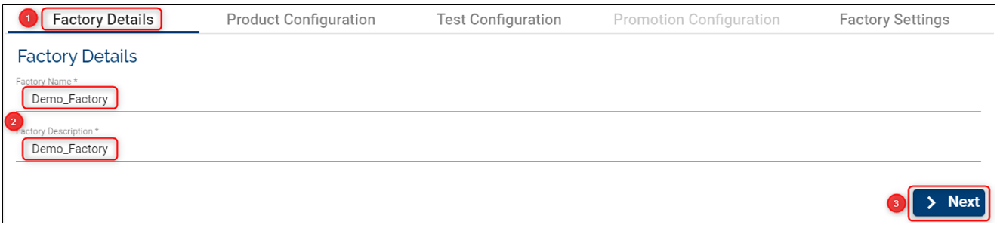
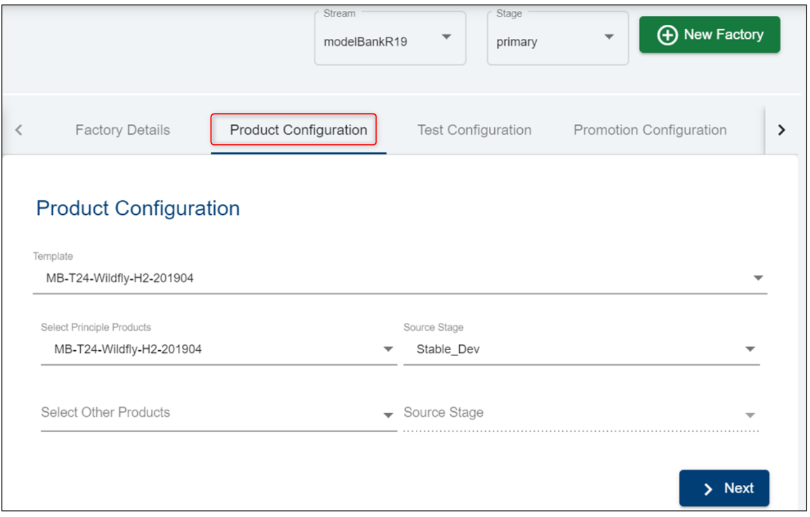
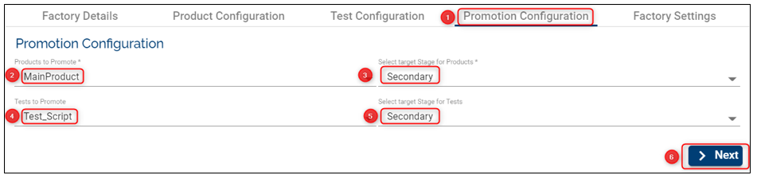
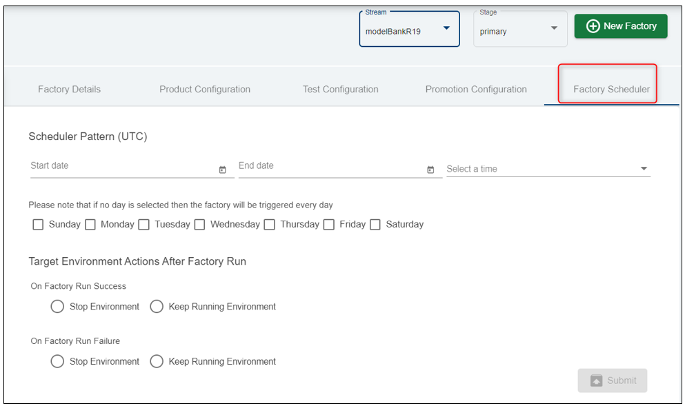
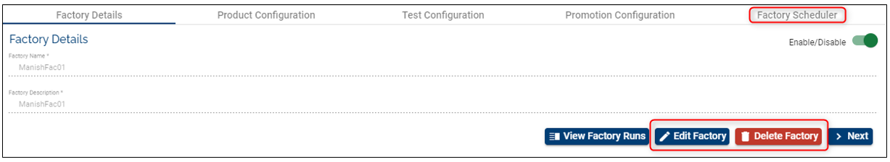

## Factories ##

Factories are the core Assemble components that define how, what and when to deploy, test and promote the various components used by an organization. 

Below you will find the pre-requisites to run a factory:

# Pre-requisites 
- **1 stream**

- **2 stages** within the stream you created (learn how to create streams [here](http://documentation.temenos.cloud/home/techguides/stream.html))

   a. Source stage - the stage from which pre-tested stable components can be picked up

  b. Base/Test Stage – the stage from which the “Other Products” (Base Products) components are fetched. This stage represents a stable version of components that is pre-tested from the perspective of the current factory.

- **the list of mandatory components from the environment template** (learn how to deploy the components [here](http://documentation.temenos.cloud/home/techguides/components-products.html))

- **2 products** (learn how to create a product [here](http://documentation.temenos.cloud/home/techguides/components-products.html#products--feature-description))

 a. Principle Products – Principle products simply mean the list of components that are being tested against a stable set of other pre-tested components. After successfully running the factory, the principle products are promoted to the next stage (the configured one).

 b. Other products (Base Products) – Products that are pre-tested (by other factories). These are products that don’t need to be promoted but they are required to test the Principle Products.

- **2 templates**

 a. Environment Template - holds the details of the template that is to be used to deploy the components selected by the factory

 b. Test Template – specifies the template that is required to deploy a test environment that holds the testing framework and test scripts. This is needed to generalize the test tools as a template.

 

## Validations ##

1. The list of selected products cannot contain components that are not understood by the selected Environment Template. 

    a. The list of components contained in the principle and other products needs to match a bare minimum of all mandatory components specified in the template.

    b. The list of components can possibly have more than one component of the same type if the template allows more than one count of the same type.

    c. The list of components cannot contain a component type that is unknown to the Template.

2. Templates – The selection of templates are restricted based on the type of the template and a selection list is already confined to allocated and valid templates.

3. Stages – No restriction. The factory can even choose to use the same Stage for all three stage values.

> [!Note]
> See below configurations to understand better how to configure correctly and the factory's behavior.

# Set-up/ Create a Factory #

- Click on Settings button on the main menu on the left.
- Make sure you select first the **Stream** and **Stage** (this is the stage where components are promoted) where you want to create a factory and then click **New Factory** button on the top-right.
- Fill the required fields (see all definitions above and also below example):
<b>
 

## Factory Details 
- **Factory Name**: choose a meaningful name for your factory.
- **Factory Description**: insert a description that will help knowing what the factory is about.

## Product Configuration 
This tab represents the test configuration that holds the template, the products and the source stage that are pre-tested from the perspective of the current factory.
    - **Template**: choose an Environment Template from the dropdown list. Based on this template  the environments will be created where you will be able to test different products
    - **Select Principle Products**: following a successful run, the principle products are promoted to the next stage (the configured one)
    - **Source Stage**: this is the stage with the stable version of components
    - **Select Other Products**: you can select more products that are required to test the Principle products
    - click **Next**
 

## Test Configuration
The Test Configuration consists in in-build service tasks and is used to  trigger tests for a given factory-run, trigger export of application logs.
Assuming that you select the Default Workflow, you need to fill in the following fields:

- **Test template**: specifies the template that is required to deploy a test environment that holds the testing framework and test scripts. This is needed to generalize the test tools as a template.

- **Component**: this is the component that holds the test scripts which runs against the T24 VM

- **No of VMs**: number of test VM's to be created during factory run
Test Stage: represents a stable version of components that is pre-tested from the perspective of the current factory

- **optional**: tick if the workflow should stop in case of failure

- Click **Next**

At the end of this step, when the first round of tests is completed, the test VM will be deleted, but it will not stop the T24 environment (this will be done at the end of the workflow)

 
 

## Promotion Configuration
This configuration enables the user to select all the required principle products along with the target stage to which they will be promoted after a successful factory run. In addition, the user can select the Test Components along with the target stage if they need promotion as well. 

#### Factory Scheduler
A user has the privilege to configure the schedule of the factory run in order to automatically run the tests and have the results available daily
- the scheduler can be configured to run one time per day
- if the factory run test is successful you can choose to stop/ or keep running the T24 environment
- the same applies for the Factory Run Failure scenario
The 'Stop Environment' and 'Keep Running Environment' options are aimed to be used for costs purposes

 To see the details of a factory please make sure to first select the stream and the stage from the top-right-side menu. If you have more stages, click on the stage where you created the respective factory. The list with the factories that belong to the respective stage will be displayed on the left side of the page:

**Limitation**: The user is not able to edit existing factories with a scheduler having start date set in the past. No option to disable the factory scheduler.

## Edit a Factory ##

- Click the **Edit** button
- Any field can be changed/ edited as long as the entire Factory configuration complies with the validation rules
- Click the **Update** button

## Delete a Factory ##

- You can easily delete a factory by clicking the **delete** button
- The products, stages and streams created before can be re-used.

# User Permissions Required
To be able to perform the above operations the following permissions need to be enabled for your user:

- MANAGE _ COMPONENTS
- MANAGE _ STREAMS
- MANAGE _ STAGES
- MANAGE _ PRODUCTS
- CREATE _ FACTORY
- UPDATE _ FACTORY
- DELETE _ FACTORY

To have a better understanding of the user permissions, hover the cursor over the variables and a short description will pop up or click [here](http://documentation.temenos.cloud/home/techguides/user-permissions) to read more.
