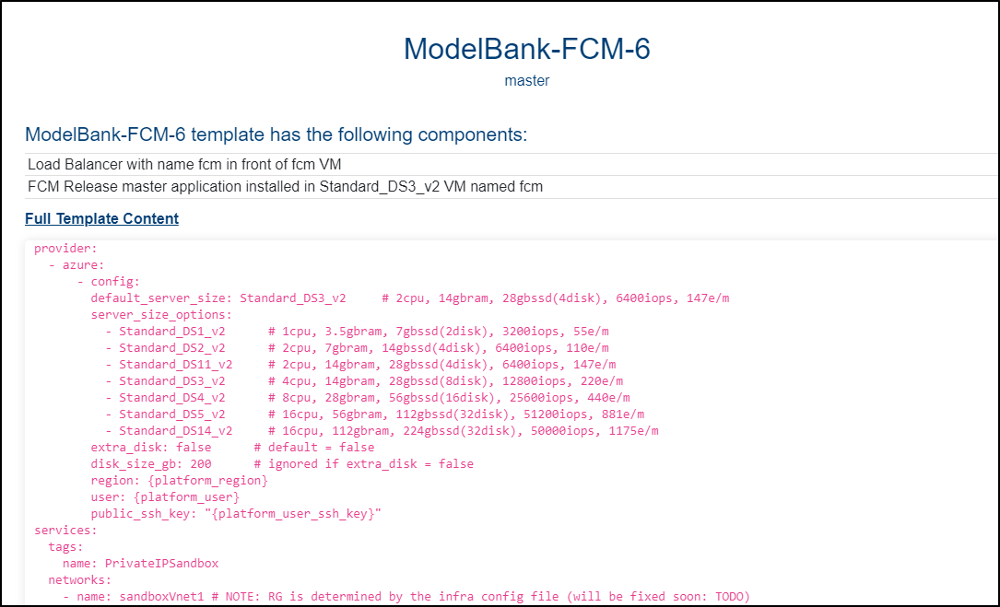
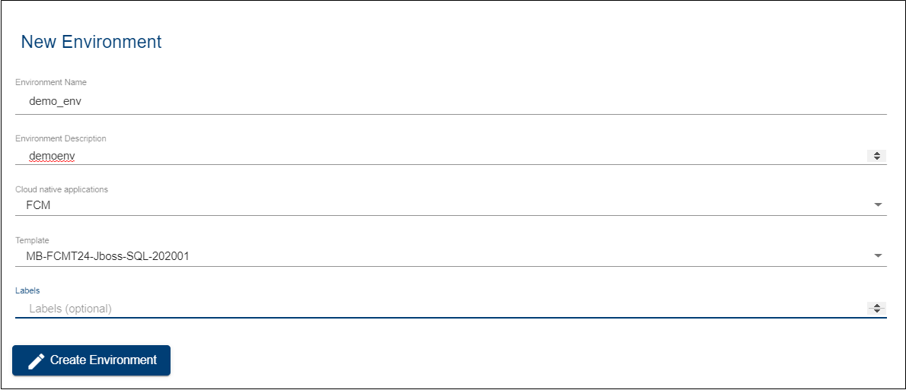
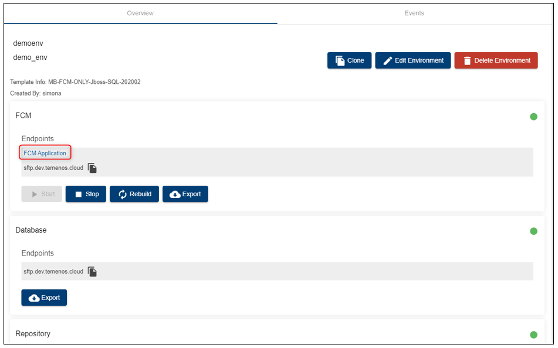
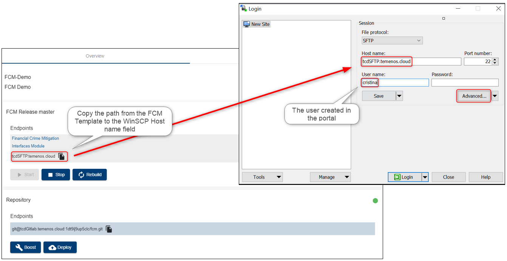
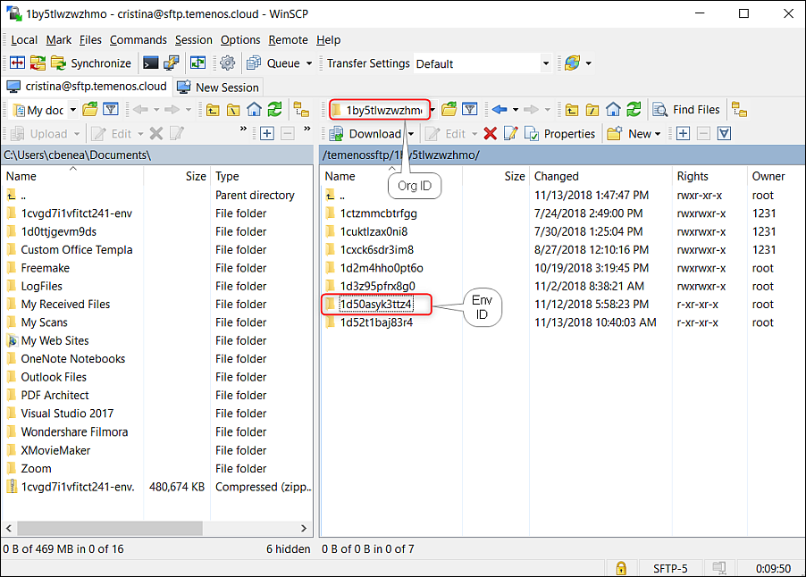
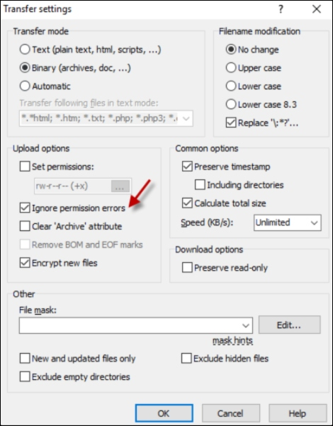

# Configure FCM Application

Learn how to use FCM application by accessing it via Temenos Continuous Deployment Platform.
    
> [!Note]
> Check also our <a href="https://www.youtube.com/watch?v=XBsmOZvg-z8" target="_blank">**Video tutorial** - to be updated.
</a>

## About FCM Template   

 - Login to your organization on the Temenos Continuous Deployment Platform ([https://portal.temenos.cloud/](https://portal.temenos.cloud/)) using the username and password provided by the Temenos team
 - Each time you login, you must accept the Privacy Notice in order to have access to the portal
 - Click the **Templates Catalog** on the left-side menu
   - Choose **the FCM template** version from the available list to see the short description of the components and also the full template content
   - The listed information comes from an infratemplate.yml file that describes the template used for an environment

## Create an Environment using the FCM Template

 - Go to Environments tab and click **New environment**

- Fill the mandatory fields:
  - **Name**
  - **Description**
- Select an application from **Cloud native applications**
- Choose a template from **Templates** list
- *Labels field is optional*
- Click **Create**

##  FCM Endpoints

- Check the two endpoints available in the FCM application:
  - Financial Crime Mitigation
  - Interfaces Module

 - A new login is required when accessing the first endpoint (Financial Crime Mitigation) > Next you will see all available modules of the FCM Suite
 - The Interfaces Module displays:
   - The Pipelines
   - The End Points
   - The JSON configuration file

## Main steps to follow

 - Connect to FCM using an SFTP server
 - Place a message to be processed
 - Check the processed message into the application

## Create a User on the Portal

This is required later when logging to the FCM through SFTP server connection, because it checks the authentication to the cloud environment with that specific user and the attached SSH key.

To see all the steps regarding how to add a new user on the portal and to attach the SSH key, please check the following user guide about how to [**Create Users**](../techguides/user-creation-in-paas.md).

## Connect via SFTP Client

 - In order to connect to the FCM app, you can install an FTP client from [https://winscp.net/eng/index.php](https://winscp.net/eng/index.php)
 - Open WinSCP application and fill the mandatory fields:
   - Host name > copy it from the environment endpoints
   - User name > input the exact name of the user added to the portal
 - Click **Advanced**

 - In the new screen, select SSH Authentication 
 - Upload the private key previously saved (corresponding to the public key attached to the portal user)
 - Click **OK**
 - Previous screen pops-up, click **Login**

## Process Messages in the FCM Application

- On the right window, locate your environment ID
*- Your organisation ID appears also on the top*

- Double click to access the live folders of the environment > Go to **screen_messages** folder > **mt** > **input** < This is where you have to place the messages to be processed by dragging them from the location identified on the left window
- In current case, you can see a file "messages.mtdemo.txt" representing a swift message in the folder named "mt demo" on the desktop. 
- From this location, the file is dragged into the right window in the **input** folder, from where the FCM application will instantly process it and remove/ delete it from this folder (the action won't be visible).

> [!Note]
> Please note that, once the message is moved into the FCM folder (**input**), the application will instantly process it and remove/ delete it from this folder and the action might not be visible. 
> When disconnecting and re-connecting to the server, the **input** folder will be empty.

 If you receive the 'Permission denied - Error code 3' notification when trying to move the message, please follow the below steps in WinSCP:
> 

- Go to options, then Preferences
- Click on Transfer, then select Default and Edit 

- Select the ignore permission errors

## Check the Messages in Transaction Alert Manager

- Go to the portal to your environment
- Click **Financial Crime Mitigation** endpoint
- Go to **Transaction Alert Manager**
- Check below the latest processed messages and click **Open** button to see the message details

 

 

# User Permissions Required
To be able to perform the above operations the below permissions need to be enabled for your user:

- CREATE _ USER
- MANAGE _ USERS
- CREATE _ ENVIRONMENT
- UPDATE _ ENVIRONMENT
- REDEPLOY _ ENVIRONMENT
- MANAGE _ ENVIRONMENTS 

To have a better understanding of the user permissions, hover the cursor over the variables and a short description will pop up or click [here](http://documentation.temenos.cloud/home/techguides/user-permissions) to read more.

 

