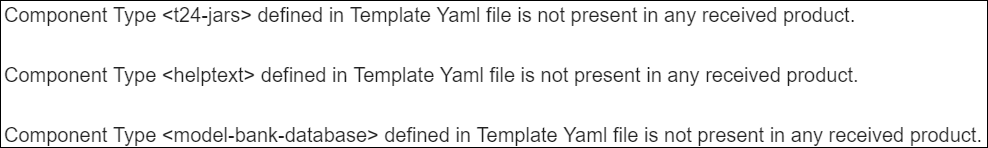

## Artifactory ##

Each Organisation provided has an repository associated automatically. This repository is available in Jfrog Artifactory and has a default name. 

Once logged into the portal, you can check the information related to the artifactory by clicking the General button on the left menu. This will display the Metadata Settings.

**Note:** If you wish to have a different name for the repository, you need to go to the Artifactory and create yourself a repository and then update its name in the metadata (ARTIFACTORY_URL).

**Note:** Make sure you set also the ARTIFACTORY_KEY which allows to download the components' binaries at the moment when running a factory. This is when the components and test cases are used. 

### Issue 1. Unable to Create Factory Due to Wrong Product Set-up ###

When setting-up a factory (see configuration steps in <a href="./factories.md#set-up-create-a-factory" target="blank"><b>this user guide</b></a>), in case the products used in the factory don't have the mandatory components uploaded, after pressing the **Create** button, an error similar to the example below will appear, showing the missing components:

#### **How to fix:** ####

Based on the template that you want to use, when creating the principle product, make sure you add all mandatory components belonging to that template. 

To know which are the required components, go to **Templates Catalog** button, select your template, go to components section inside the template and check which components are mandatory (marked with 'true'). 

Go back to your Product, press **Edit**, add the rest of the components required and then press **Update**.

After doing this correction you will be allowed to create the factory.

### Issue 2. Unable to Run Factory Due to Missing Artifact ###

In case that one of the components belonging to a product doesn't have the binaries uploaded into the artifactory, when running a factory you will encounter an error similar to the below example. This indicates the stream, the stage and the exact component(s) for which the artifacts are missing

#### **How to fix:** ####

Go to <a href="./components-products.md#how-to-set-up-delete-components" target="blank">**this**</a> section to see how to upload the artifacts. 

After that, go to the dashboard and run again the factory. 

> [!Note]
> The same error you will encounter in case the test cases aren't uploaded. The error will reflect the stream, the stage and the missing folder. You can also check <a href="./stage-testcases.md" target="blank">**this user guide**</a> to see how to add the test cases. 

