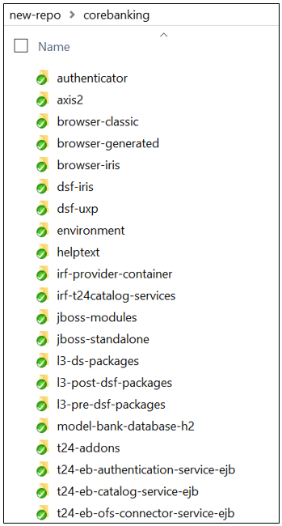
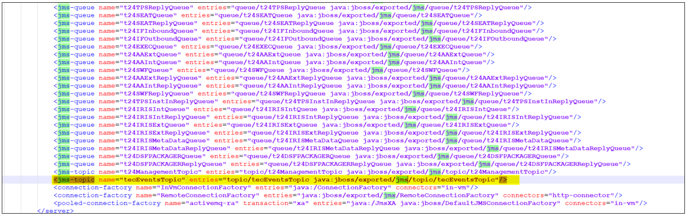

# Git Folder Standardization #

The GIT folder standardization enables Temenos Continuous Deployment to deploy client specific components in the environment created using model bank templates. This features allows you to deploy the same components both via Extend and Assemble environments.

> [!Note]
> All existing environments structure will be migrated automatically to the new folder structure.

# What is new? #

## 1.The environment folder structure ##

The files in your previous environment (left column in the table below) is migrated to the new folder structure in GIT.

If you need to push new changes into your existing environments, you have to clone the GIT folder again.

- Env Structure before Git Folder Standardization: 

 

- Env Structure after Git Folder Standardization:

 

>[!Note]
>If you need to push new changes into your existing environments, you have to clone the GIT folder again.

 
 

## 2. The Order of installation ##
 The sequence of the components that are installed is the following:

- model-bank-database​

- t24-jars​

- tafj-installer​

- tafj-ext-jars​

- t24-l3-java​

- jboss-module​

- t24-ud​

Other components​ that are deployed in the jboss application server

- t24-updates​

- l3-predsf-packages​

- l3-ds-package​

- l3-postdsf-packages​

- t24updates-data-project

 
 

## 3. The folders' name ##

Some of the folders have been renamed to better reflect the name of the components. You can find below and example of the before and after components name and structure (where N/A is present the component folder was not present in the old folder structure).

| BEFORE                     | AFTER                                    | PREVIOUS FORMAT   SUPPORTED                                    | CURRENT FORMAT   SUPPORTED                                                                                                                                                                    | NOTES AND   CHANGES IN THE EXISTING FUNCTIONALITY                                                                                                                                                                                                                                                                                                                                                                                                                         |
|----------------------------|------------------------------------------|----------------------------------------------------------------|-----------------------------------------------------------------------------------------------------------------------------------------------------------------------------------------------|---------------------------------------------------------------------------------------------------------------------------------------------------------------------------------------------------------------------------------------------------------------------------------------------------------------------------------------------------------------------------------------------------------------------------------------------------------------------------|
| N/A                        | authenticator                            | *.war                                                          | *.war                                                                                                                                                                                         | N/A                                                                                                                                                                                                                                                                                                                                                                                                                                                                       |
| N/A                        | axis2                                    | *.war                                                          | *.war                                                                                                                                                                                         | N/A                                                                                                                                                                                                                                                                                                                                                                                                                                                                       |
| N/A                        | browser-classic                          | *.war                                                          | *.war                                                                                                                                                                                         | N/A                                                                                                                                                                                                                                                                                                                                                                                                                                                                       |
| N/A                        | browser-generated                        | *.zip                                                          | *.zip                                                                                                                                                                                         | N/A                                                                                                                                                                                                                                                                                                                                                                                                                                                                       |
| N/A                        | browser-iris                             | *.war                                                          | *.war                                                                                                                                                                                         | N/A                                                                                                                                                                                                                                                                                                                                                                                                                                                                       |
| N/A                        | dsf-iris                                 | *.war                                                          | *.war                                                                                                                                                                                         | N/A                                                                                                                                                                                                                                                                                                                                                                                                                                                                       |
| N/A                        | dsf-uxp                                  | *.war                                                          | *.war                                                                                                                                                                                         | N/A                                                                                                                                                                                                                                                                                                                                                                                                                                                                       |
| client_files/helptext      | helptext                                 | *.zip                                                          | *.zip                                                                                                                                                                                         | N/A                                                                                                                                                                                                                                                                                                                                                                                                                                                                       |
| N/A                        | irf-provider-container                   | *.war                                                          | *.war                                                                                                                                                                                         | N/A                                                                                                                                                                                                                                                                                                                                                                                                                                                                       |
| N/A                        | irf-t24catalog-services                  | *.war                                                          | *.war                                                                                                                                                                                         | N/A                                                                                                                                                                                                                                                                                                                                                                                                                                                                       |
| N/A                        | irf-test-web                             | *.war                                                          | *.war                                                                                                                                                                                         | N/A                                                                                                                                                                                                                                                                                                                                                                                                                                                                       |
| N/A                        | irf-web-client                           | *.war                                                          | *.war                                                                                                                                                                                         | N/A                                                                                                                                                                                                                                                                                                                                                                                                                                                                       |
| packages                   | l3-ds-packages                           | *.jar,   *.zip                                                 | *.zip                                                                                                                                                                                         | N/A                                                                                                                                                                                                                                                                                                                                                                                                                                                                       |
| client_files/h2db          | model-bank-database-h2                   | *.zip                                                          | *.zip                                                                                                                                                                                         | db.properties file should be included in the zip file   . The format of db.properties should be as follows: db_name=TAFJDB ->   without extension .mv.db or .h2.db.                                                                                                                                                                                                                                                                                                       |
| client_files/sqldb         | model-bank-database-sqlserver            | *.bak                                                          | *.zip                                                                                                                                                                                         | db.properties file should be included in the zip file   . The format of db.properties should be as follows: db_name=UTPSQL2016 ->   without extension names.                                                                                                                                                                                                                                                                                                              |
| post-dsf-packages          | l3-post-dsf-packages                     | zip   of zip                                                   | zip   of zip                                                                                                                                                                                  | N/A                                                                                                                                                                                                                                                                                                                                                                                                                                                                       |
| pre-dsf-packages           | l3-pre-dsf-packages                      | zip   of zip                                                   | zip   of zip                                                                                                                                                                                  | N/A                                                                                                                                                                                                                                                                                                                                                                                                                                                                       |
| addons                     | t24-Addons                               | *.zip                                                          | *.zip                                                                                                                                                                                         | The environment file can be provided along with the   jars/wars which contains JAVA_OPTS that can to be added in the appserver   startup. If only environment file inside the zip is provided the JAVA_OPTS   will be added to the appserver without copying any war/jar files.   Additionally, this environment file can be used to add or update the java   heap size in the app server start up file (java_opts= - replace the   variables with the appropriate ones). |
| N/A                        | t24-eb-authentication-service-ejb        | *.jar                                                          | *.jar                                                                                                                                                                                         | N/A                                                                                                                                                                                                                                                                                                                                                                                                                                                                       |
| N/A                        | t24-eb-catalog-service-ejb               | *.jar                                                          | *.jar                                                                                                                                                                                         | N/A                                                                                                                                                                                                                                                                                                                                                                                                                                                                       |
| N/A                        | t24-eb-ofs-connector-service-ejb         | *.jar                                                          | *.jar                                                                                                                                                                                         | N/A                                                                                                                                                                                                                                                                                                                                                                                                                                                                       |
| N/A                        | t24-eb-resource-provider-service-ejb     | *.jar                                                          | *.jar                                                                                                                                                                                         | N/A                                                                                                                                                                                                                                                                                                                                                                                                                                                                       |
| N/A                        | t24-if-integration-framework-service-ejb | *.jar                                                          | *.jar                                                                                                                                                                                         | N/A                                                                                                                                                                                                                                                                                                                                                                                                                                                                       |
| N/A                        | t24-interactiontests-iris                |                                                                |                                                                                                                                                                                               | N/A                                                                                                                                                                                                                                                                                                                                                                                                                                                                       |
| N/A                        | t24-jars                                 | *.zip                                                          | *.zip                                                                                                                                                                                         | zip of multiple folders containing jars. For eg:   t24lib, l3lib. Note: We use the folders t24lib and l3lib for core and l3   libraries respectively. Hence the same naming convention has to be used for   the artifacts.                                                                                                                                                                                                                                                |
| client_files/localjars     | t24-l3-java                              |                                                                |                                                                                                                                                                                               | zip of l3libraries                                                                                                                                                                                                                                                                                                                                                                                                                                                        |
| plugins                    | war-package                              | *.zip   containing war, jar or war and optional .endpoint file | *.zip containing war, jar or war and optional .endpoint   file which contains the dns name. Ie.: Provider   APIs~https://t24-v1f2k9y77x18.temenos.cloud/provider-apis/api/v1.0.0/meta/apidocs | Optional .endpoint file within *.zip should now contain   he keyword 'localhost' instead of the dnsname to be able to used during   factory run. Ie.: Provider   APIs~https://localhost/provider-apis/api/v1.0.0/meta/apidocs                                                                                                                                                                                                                                             |
| N/A                        | t24-ud                                   | *.zip   containing UD folders                                  | *.zip   containing UD folders                                                                                                                                                                 | N/A                                                                                                                                                                                                                                                                                                                                                                                                                                                                       |
| updates                    | t24-updates                              | zip   of zip                                                   | zip   of zip                                                                                                                                                                                  | N/A                                                                                                                                                                                                                                                                                                                                                                                                                                                                       |
| wsdl                       | wsdl                                     |                                                                |                                                                                                                                                                                               | N/A                                                                                                                                                                                                                                                                                                                                                                                                                                                                       |
| client_files/localjars/ext | tafj-ext-jars                            | zip   of jars                                                  | zip   of jars                                                                                                                                                                                 | zip of l3libraries                                                                                                                                                                                                                                                                                                                                                                                                                                                        |
| N/A                        | tafj-installer                           | *.zip   containing installer                                   | *.zip   containing installer                                                                                                                                                                  | The TAFJ will be redeployed (full installation, not   patch) hence please make sure any properties that you would like to include   are present within the .properties file inside the installer. For more   details, refer to tafj.installer notes added in the Transact Template   Overview Page.                                                                                                                                                                       |
| N/A                        | tcib-api                                 | *.war                                                          | *.war                                                                                                                                                                                         | N/A                                                                                                                                                                                                                                                                                                                                                                                                                                                                       |
| N/A                        | tcua-tcuseradmin-iris                    | *.war                                                          | *.war                                                                                                                                                                                         | N/A                                                                                                                                                                                                                                                                                                                                                                                                                                                                       |
| N/A                        | tcua-useradministration                  | *.war                                                          | *.war                                                                                                                                                                                         | N/A                                                                                                                                                                                                                                                                                                                                                                                                                                                                       |
| N/A                        | tcxb2-generated                          | *.war                                                          | *.war                                                                                                                                                                                         | N/A                                                                                                                                                                                                                                                                                                                                                                                                                                                                       |
| N/A                        | tcxb2-iris                               | *.war                                                          | *.war                                                                                                                                                                                         | N/A                                                                                                                                                                                                                                                                                                                                                                                                                                                                       |
| N/A                        | tcxb2-retail                             | *.war                                                          | *.war                                                                                                                                                                                         | N/A                                                                                                                                                                                                                                                                                                                                                                                                                                                                       |
| N/A                        | temp.release                             |                                                                |                                                                                                                                                                                               | *.zip containing the temp.release                                                                                                                                                                                                                                                                                                                                                                                                                                         |
| N/A                        | tocf-ee                                  | *.zip                                                          | *.zip                                                                                                                                                                                         | N/A                                                                                                                                                                                                                                                                                                                                                                                                                                                                       |
| N/A                        | uxp-browser                              | *.war                                                          | *.war                                                                                                                                                                                         | N/A                                                                                                                                                                                                                                                                                                                                                                                                                                                                       |
| N/A                        | uxp-god-properties                       | *.zip                                                          | *.zip                                                                                                                                                                                         | N/A                                                                                                                                                                                                                                                                                                                                                                                                                                                                       |
| N/A                        | resourceserverwar                        | *.war                                                          | *.war                                                                                                                                                                                         | N/A                                                                                                                                                                                                                                                                                                                                                                                                                                                                       |
| N/A                        | irf-rp-services                          | *.war                                                          | *.war                                                                                                                                                                                         | N/A                                                                                                                                                                                                                                                                                                                                                                                                                                                                       |
| N/A                        | t24-eb.product                           |                                                                | *.txt                                                                                                                                                                                         | The text file should contain the number of product ,   product name separated by ‘~' (more than 1 product) and product codes   separated by '~’ (more than 1 product) . EX: 2,name1~name2,code1~code2                                                                                                                                                                                                                                                                     |
| N/A                        | jboss-modules                            |                                                                | *.zip                                                                                                                                                                                         | *.zip containing the folders, sub folders, jars, with   the module.xml which can be unzipped to modules folder in jboss It also   checks for the existing folders com/temenos/t24, com/temenos/tafj ,system ,if   exists it is ignored and other folders are copied                                                                                                                                                                                                       |
| N/A                        | standalone.xml                           |                                                                | *.xml                                                                                                                                                                                         | *.xml containing standalone.xml file. The template   file for OSS and TSS are provided at point 6 in this user guide for both OSS   and TSS templates.                                                                                                                                                                                                                                                                                                                    |

 
 

## 4. How to deploy an update to an environment? ##

### 4.1. Clone the environment repository ###
Refer to this [user guide](http://documentation.temenos.cloud/home/techguides/deploy-an-update-to-an-existing-environment.html#clone-environment-repository).

### 4.2 Commit & push the changes to the Environment Repository ###

> [!Note]
>Always Git → Pull before pushing new code in the environment repository. This command fetches and downloads content from a remote repository and immediately update the local repository to match that content.

 

### 4.3 Deploy the changes  ###

Refer to [this page](http://documentation.temenos.cloud/home/techguides/deploy-an-update-to-an-existing-environment.html#commit--push-features-to-repository) to learn how to deploy the changes to your environment.

During the deployment, the **Start**, **Stop**, **Rebuild**, **Upgrade** and **Clone Environment** buttons are not disabled.

> [!Note]
>It is very important to place the components in the folder with the format that the Temenos Continuous Deployment expects. Otherwise, your deployment fails. Below you can find an exercise with a passed and failed deployment - the root cause is the wrong file format deployed.

- Passed Deployment:

- Failed Deployment:

 

### 4.4 Standalone.xml file notes ###

There are different standalone.xml templates for TSS and OSS. These are provided to you by us.

### 4.4.1 The standalone.xml TSS template: ###
- don’t change any of the static values

- the only changes you can apply to the files are:

    - in the datasource code block and give a new name (ie. instead of jndi-name="java:/jdbc/t24DS" you can change the name from t24DS to another one) or change the min/max-pool-size. If you want to add more datasource copy the entire code block highlighted below.

      

    - in the queues add new connection pools (copy-paste the link and change the name, max-pool-size)

      

    - add custom queues ( copy the highlighted queue below and add another name (ie. instead of tecEventsTopic you can add another name)

     

 **Other alterations added to the XML file will result in a failed deployment.**

### 4.4.2 The db.properties file - only applicatble for OSS templates! ###

You can place the TAFJDB.zip file in the model-bank-database-h2 folder. The db.properties file should be added to the corresponding H2 .zip files in the artifactory and the H2 machines must have a copy of this file.
 
>[!Note]
>If the Golden Copy is provided by you make sure to have the db.properties file under the model-bank-database-h2. If this is not present, the environment will be created using the default modelbank credentials.
>
> It is mandatory to have the db.properties file included along with your H2 DB .zip file, otherwise the environment will be created using the default modelbank credentials.

  

The Git Folder Standardization allows you to add the db.properties file into the TAFJDB.zip. The db.properties file contains the db name, clientdb user and pass:

  

If the folder inside TAFJDB.zip file is renamed, then it is mandatory in the db.properties to add the db-name the same as the db folder name and the credentials for the respective db.

  

>[!Note]
>If you want to overwrite the database it is important to do at least one change before deploying it. Otherwise the platform will pick the initial database only.

##5. Attachments

You can download the Standalone OSS/ TSS and the db.properties files below:

- **<a href="./../zip/client-standalone-oss">Standalone OSS template</a>** 

- **<a href="./../zip/client-standalone-TSS">Standalone TSS template</a>** 

- **<a href="./../zip/db.properties">db.properties file</a>** 

- Video tutorial available **[here](https://youtu.be/Kc5nXfJewKg)**.