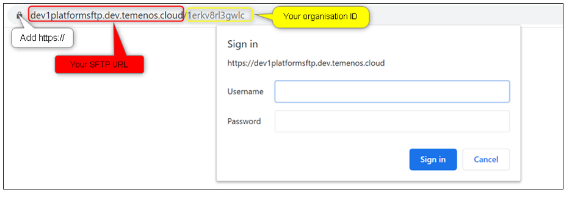
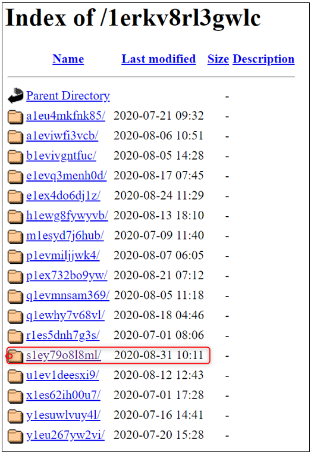
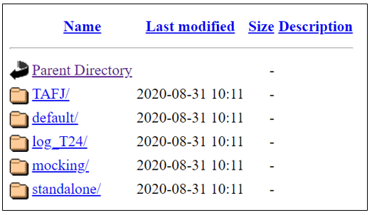

# How to access the SFTP using HTTPs

This guide shows describes how to easily access the T24 UD directories of your environment and make updates, using symbolic links on the Web server to the T24 VM machines.

Pre-requisites:

- access to the Temenos Continuous Deployment Platform 

- WEB client (i.e. [WinSCP](https://winscp.net/eng/index.php) or a Browser)

 

Follow the steps below to access the UD directories:

# 1. Change user password 

In order to access the SFTP using HTTPs you need to reset your password (learn how to change it [here](http://documentation.temenos.cloud/home/user-creation-in-paas.html))

# 2. Access SFTP

After the password is updated the SFTP server can be accessed via a browser:

1. Open a new page and type in the following URL **https://{sftp_url}/{orgId}** where: 

    1.1. **sftp_url** is retrieved from the environment endpoints

    1.2. the organisation ID that is found on the platform URL 
 

2. Type in the Temenos Continuous Deployment user credentials 
      

3. Identify your **environment ID** and click on it to access the environment's folders

    

4. Now you are able to access the environment

    

# 3. Connect to an environment via WEB client 
To have access to the T24/ VM Cloud Application live folders, you need to install a Web client (i.e. https://winscp.net/eng/index.php). Open WinSCP application and fill the mandatory fields:

- File Protocol - **WebDAV **

- Encryption - **TLS/SSL**

- Host name - copy it from your environment endpoint

- Port Number - **443**

- User name & Password – contact your Org Admin to get these details

- Click on Advanced 

    

- Paste your ORG ID into the Remote directory box and add a slash in front of it (ie: /1d5ap6fv5j4sg)

   

- Click OK 

- Save your site settings using the Save button

- Login using the Login button

     

- After successful login user can see the folders and files of organisation (right window below)
 
     

# 5. Connect to the environment using a Curl command #

**See below an example:**

    $ curl.exe --insecure -u demouser01:T3m3n0s2o2o#! -T "Desktop/Tasklists.txt" https://jpplatformsftp.dev.temenos.cloud/testupload/

**Output**

    % Total % Received % Xferd Average Speed Time Time Time Current
    Dload Upload Total Spent Left Speed
    100 424k 100 197 100 424k 47 101k 0:00:04 0:00:04 --:--:-- 101k<!DOCTYPE HTML PUBLIC "-//IETF//DTD HTML 2.0//EN">
    <html><head>
    <title>201 Created</title>
    </head><body>
    <h1>Created</h1>
    
Resource /testupload/Tasklists.txt has been created.

    </body></html>
    

