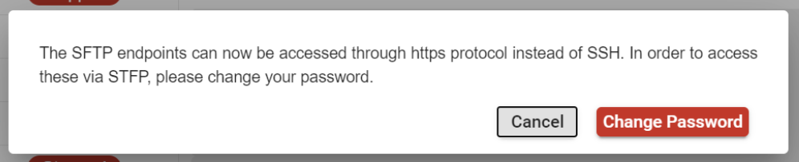
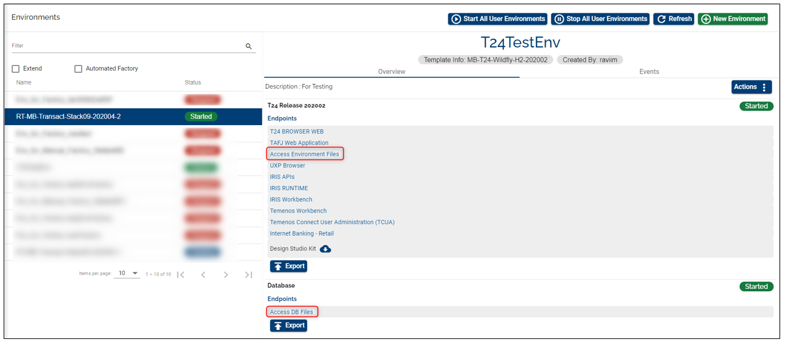
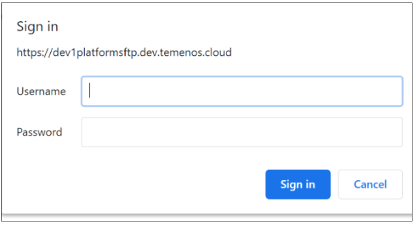
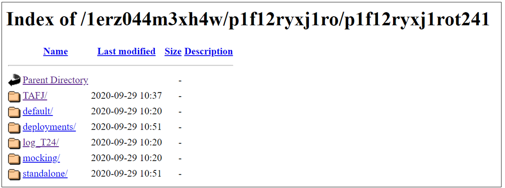
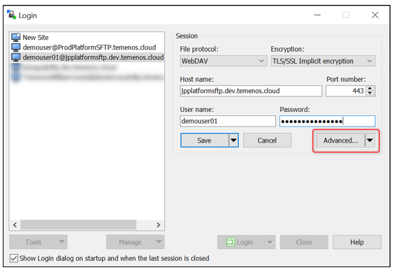
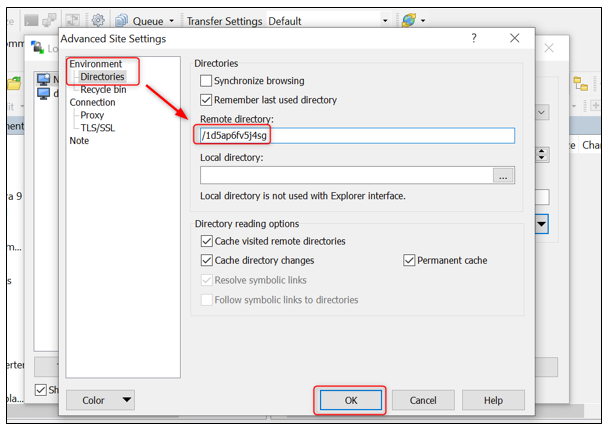
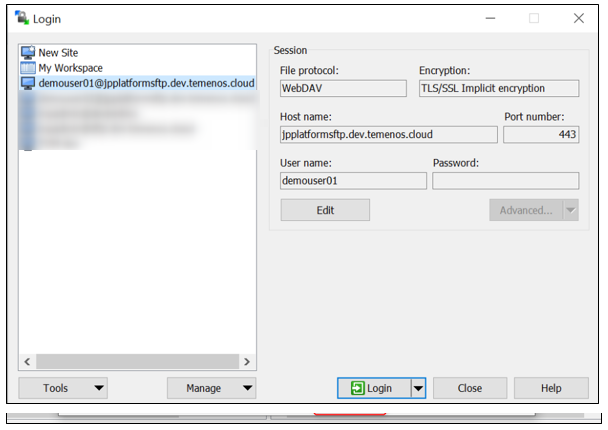
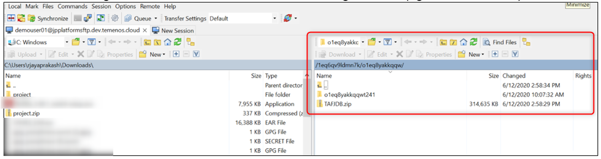

# How to access the SFTP using HTTPs

This guide shows describes how to easily access the T24 UD directories of your environment and make updates, using symbolic links on the Web server to the T24 VM machines.

Pre-requisites:

- access to the Temenos Continuous Deployment Platform 

- WEB client (i.e. [WinSCP](https://winscp.net/eng/index.php) or a Browser)

 

Follow the steps below to access the UD directories:
 
# 1. Change user password 

For the existing users, the access to the SFTP server is available only after the password has been changed. A pop-up message informs you to update it. Click **Change Password** to proceed.

 

Learn how to change the password [here](http://documentation.temenos.cloud/home/user-creation-in-paas.html). By changing the password, your entry is added in the HTTP server and enables you to access SFTP over the HTTP server. 

# 2. Access the SFTP server

- After the password is updated the SFTP server can be accessed via the endpoints present in the environment details: **Access Environment Files** in the T24 Release section and **Access DB Files** in the Database section:

 

- Click on each of them and you are prompted to insert your Temenos Continuous Deployment credentials: 

 

- Following the successful login, you are now able to access the environment folders.

 

 >Note: at this stage you have only view only access to the environment files. Click [here](http://documentation.temenos.cloud/home/techguides/export-import-database.html) to learn how to  export and import a database.

# 3. Connect to an environment via WEB client 
To have access to the T24/ VM Cloud Application live folders, you need to install a Web client (i.e. https://winscp.net/eng/index.php). Open WinSCP application and fill the mandatory fields:

- File Protocol - **WebDAV**

- Encryption - **TLS/SSL**

- Host name - copy it from your environment endpoint

- Port Number - **443**

- User name & Password – contact your Org Admin to get these details

- Click on Advanced 

    

- Paste your ORG ID into the Remote directory box and add a slash in front of it (ie: /1d5ap6fv5j4sg)

   

- Click OK 

- Save your site settings using the Save button

- Login using the Login button

     

- After successful login user can see the folders and files of organisation (right window below)
 
     

# 4. Connect to the environment using a CURL command #
You can also connect to a Temenos Continuous Deployment Environment using a curl command.
See below an example:

    $ curl.exe --insecure -u demouser01:T3m3n0s2o2o#! -T "Desktop/Tasklists.txt" https://jpplatformsftp.dev.temenos.cloud/testupload/

**Output**

    % Total % Received % Xferd Average Speed Time Time Time Current
    Dload Upload Total Spent Left Speed
    100 424k 100 197 100 424k 47 101k 0:00:04 0:00:04 --:--:-- 101k<!DOCTYPE HTML PUBLIC "-//IETF//DTD HTML 2.0//EN">
    <html><head>
    <title>201 Created</title>
    </head><body>
    <h1>Created</h1>
    
Resource /testupload/Tasklists.txt has been created.

    </body></html>
    

