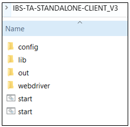
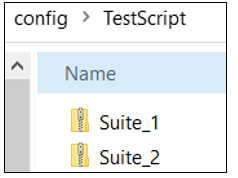
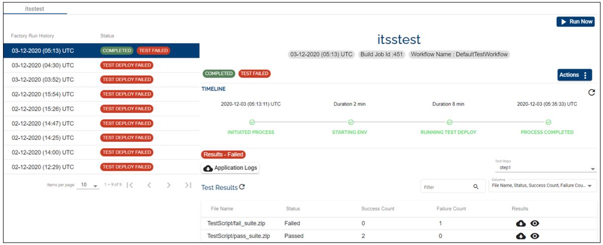

# ITSS Test Framework Template Implementation

This page provides information about the ITSS Test Framework Template, the pre-requisites to run the template and an example of the test framework, its structure and a sample of the consolidated results file.

## Implementation 

The ITSS Test framework Template pre-requisites:

- Windows Server 2016 Datacenter Edition with the following software/packages pre-installed:

 - Open Java/JDK 1.8

 - The latest version of the Google Chrome

 - The latest version of Google Chrome Drive

The Google Chrome Driver is downloaded to the ITSS client WebDriver folder in the provisioned VM.
 
 

## ITSS tool - general information

- The ITSS test tool contains a Server and a Client. 

- The Test Cases and Test Campaigns (ITSS terminology for Test Scenarios) are created and maintained in the ITSS server. 

- To maintain the Test Component structure in Artifactory to fit with the Assemble principle, Temenos Continuous Deployment manages and promotes the configuration files instead of the actual test cases and scenarios. Those configuration files gather all the necessary information for the ITSS test client to "download" from the ITSS test server at run time the set of test scenarios to run.

- The ITSS test framework is a Selenium-based framework embedded with other functionalities. See below the ITSS test client framework folder structure: 

 +---remote

 |     +—config (default folder which contains the configuration files IBSRemote.properties and parameters.properties)

 |     +—lib (client ITSS libraries)

 |     +—out (default folder where manifest and .pdf files are generated)

 |     +—webdriver (default webdriver folder provided by the ITSS client framework)

 The 3 default folders can be used as such or redirected when launching a test framework. See below a sample folder structure:

 

##  How to launch ITSS client framework

To launch the ITSS client framework you need to start.bat < < URL_T24/BrowserWeb > >  < < Test Campaign UUID > >.
 
 

## The Test Script Structure ##

The config files that can be used by the ITSS Template must be a .zip file within a .zip. The name of the .zip files can have any name. The parent .zip file can contain multiple .zips of tests (see the screenshot below).

 

Each test suite is a suite of config files that can be used by the ITSS client to connect to the ITSS server and download the test campaigns that will be executed. The test suite can have any name. Each test suite should contain the following files:

- IBSRemote.properties - the ITSS server connection parameters

- parameters.properties - the test campaign details including Test Campaign UUID

>Note:
>The template consolidates all the results from the output folder of the ITSS Client and produces consolidated results.
>The platform moves these consolidated results to a centralized storage account and provides a download facility from the dashboard.

 
 

### IBSRemote.properties file 

The properties file holds the configurable parameters used by the ITSS Client framework. The parameters have static values. Thus, the Temenos Continuous Deployment Platform expects them to be present in the properties file. See below example of the file structure:

 - ibs.server.api.url= << ITSS Server API URL >>

 - ibs.server.api.key= << ITSS Server API key >> (used to connect to the server API)

 - ibs.server.url=<< ITSS Server URL >> (used in the run time to check if the server is accessible → This parameter is by the Temenos template and not directly by the ITSS test framework)

**The convention name is  “IBSRemote.properties”.**
 
 

### parameters.properties file

Same as above, see below example of the file structure:

- ibs.ta.param.testcase.id=<< TestCampaign-UUID >> - the value will be used by the template at the run time. 

- ibs.ta.param.user.id=<< UserAppUUID >>

- ibs.ta.param.env.id=<< TestEnvironment-UUID >>

- ibs.ta.param.profile.id=<< TestProfile-UUID >>

- ibs.ta.param.testcase.id=<< TestCampaign-UUID >> - this parameter is required by the Temenos template and not directly by the ITSS test Framework. It is used to populate the tests client launch command line).

**The convention name is “parameters.properties”.**
 
  

## Template Runtime 

- The ITSS client is delivered with the Chrome driver. To avoid Chrome version compatibility issues, the test template will replace Chrome driver in sync with the Chrome browser version deployed on the test VM.

- Before the test execution, the template checks if the ITSS server is accessible and fails execution if not accessible.

- In the event of a network issue preventing the ITSS client framework to connect to its server, a retry mechanism (once) is implemented if the test result files were not generated.

- Temporarily, ibs.ta.param.testcase.id=<< TestCampaign-UUID >> from *parameters.properties* file is used by the template at the run time to pass it as an argument to the ITSS test client execution command.

 - This functionality from Temenos Continuous Platform is removed in the next phase when the ITSS team releases the next version of ITSS client which will pick the value from the files by default.

- The standard output of the ITSS client command execution is written to a log file and is available for download as part of the .zip files.

- A HTML file is generated dynamically and displays the contents of the **result.pdf** generated as part of the ITSS execution results.
 
 

## Test Results Consolidation 

There are 2 results generated as part of the ITSS client command execution.

- a **result.pdf** which has all the step by step execution details of each test case along with the screenshots. These are available in the **View Results** page in the portal. During run time, the template creates a HTML file which simplifies the content display of this .pdf file. 

- a **consolidated-results.xml** which contains information about the test run, i.e. the total number of cases, success count, failed count etc. The generated file follows the sample specified below:

        <?xml version="1.0" encoding="UTF-8" standalone="yes"?>
        <!-- configured only by authorised user-->
        <Manifest>
        <Report>
        <ScenarioName>Temenos Testing</ScenarioName>
        <TestCaseName>get <https://t24URL/BrowserWeb</TestCaseName>>
        <ExpectedResult></ExpectedResult>
        <ReportStatus>PASS</ReportStatus>
        </Report>
        <Report>
        <ScenarioName>Temenos Testing</ScenarioName>
        <TestCaseName>setText (id signOnName *****)</TestCaseName>
        <ExpectedResult></ExpectedResult>
        <ReportStatus>PASS</ReportStatus>
        </Report>
        <Report>
        <ScenarioName>Temenos Testing</ScenarioName>
        <TestCaseName>sleep (sec)</TestCaseName>
        <ExpectedResult></ExpectedResult>
        <ReportStatus>PASS</ReportStatus>
        </Report>
        <Report>
        <ScenarioName>Temenos Testing</ScenarioName>
        <TestCaseName>setText (id password )</TestCaseName>
        <ExpectedResult></ExpectedResult>
        <ReportStatus>PASS</ReportStatus>
        </Report>
        <Report>
        <ScenarioName>Temenos Testing</ScenarioName>
        <TestCaseName>sleep (sec)</TestCaseName>
        <ExpectedResult></ExpectedResult>
        <ReportStatus>PASS</ReportStatus>
        </Report>
        <Report>
        <ScenarioName>Temenos Testing</ScenarioName>
        <TestCaseName>sleep (sec)</TestCaseName>
        <ExpectedResult></ExpectedResult>
        <ReportStatus>PASS</ReportStatus>
        </Report>
        <Report>
        <ScenarioName>Temenos Testing</ScenarioName>
        <TestCaseName>sleep (sec)</TestCaseName>
        <ExpectedResult></ExpectedResult>
        <ReportStatus>PASS</ReportStatus>
        </Report>
        <Report>
        <ScenarioName>Temenos Testing</ScenarioName>
        <TestCaseName>sleep (sec)</TestCaseName>
        <ExpectedResult></ExpectedResult>
        <ReportStatus>PASS</ReportStatus>
        </Report>
        <Report>
        <ScenarioName>Temenos Testing</ScenarioName>
        <TestCaseName>switchToFrame()</TestCaseName>
        <ExpectedResult></ExpectedResult>
        <ReportStatus>FAIL</ReportStatus>
        </Report>
        <Report>
        <ScenarioName>Temenos Testing</ScenarioName>
        <TestCaseName>setText (id commandValue CUSTOMER I F3)</TestCaseName>
        <ExpectedResult></ExpectedResult>
        <ReportStatus>FAIL</ReportStatus>
        </Report>
        <Report>
        <ScenarioName>Temenos Testing</ScenarioName>
        <TestCaseName>sleep (sec)</TestCaseName>
        <ExpectedResult></ExpectedResult>
        <ReportStatus>PASS</ReportStatus>
        </Report>
        <Report>
        <ScenarioName>Temenos Testing</ScenarioName>
        <TestCaseName>sleep (sec)</TestCaseName>
        <ExpectedResult></ExpectedResult>
        <ReportStatus>FAIL</ReportStatus>
        </Report>
        <Report>
        <ScenarioName>Temenos Testing</ScenarioName>
        <TestCaseName>sleep (sec)</TestCaseName>
        <ExpectedResult></ExpectedResult>
        <ReportStatus>PASS</ReportStatus>
        </Report>
        <Report>
        <ScenarioName>Temenos Testing</ScenarioName>
        <TestCaseName>sleep (sec)</TestCaseName>
        <ExpectedResult></ExpectedResult>
        <ReportStatus>PASS</ReportStatus>
        <ReportImagePath>F:\TCD\TestResults\automation-screenshots\screenshot4955634319564025885.png</ReportImagePath>
        </Report>
        <passedTests>11</passedTests>
        <failedTests>3</failedTests>
        <totalTests>14</totalTests>
        <Name>Temenos Automation Testing Framework</Name>
        <toolVersion>1.2</toolVersion>
        <startDate>2020.04.03 09:34:34</startDate>
        <duration>112.94700</duration>
        <result>FAIL</result>
        <hostName></hostName>
        </Manifest>

 
 
 
From the below structure, the Temenos Continuous Deployment Platform needs to mandate the following information in order to populate in the dashboard:

    <passedTests>11</passedTests>
    <failedTests>3</failedTests>
    <totalTests>14</totalTests>
    <Name>Temenos Automation Testing Framework</Name>
    <toolVersion>1.2</toolVersion>
    <startDate>2020.04.03 09:34:34</startDate>
    <duration>112.94700</duration>
    <result>FAIL</result>
    <hostName></hostName>

 
 

The consolidation utility generates the consolidated-results.xml file with the above details. The below table describes the manifest tags and their purposes.

| Tag         | Description                                                                            |
|-------------|----------------------------------------------------------------------------------------|
| passedTests | It denotes the prorated number of passed test cases in the current run.                |
| failedTests | The number of failed test cases in the current run.                                    |
| totalTests  | The overall test cases count in the respective run.                                    |
| result      | The overall test result. The value should be “FAIL“ even if there is a single failure. |

The Temenos Continuous Deployment Platform will use this information to populate the dashboard. Below you will find an example format with both pass and fail test suites.

 

The Temenos Continuous Deployment platform moves these consolidated results to a centralized storage account and provides a download facility from the dashboard for each test suite.
 
 

## Attachments 

- The sources of the sample config files, which can only be used as a sample and has to be supplied as per the needs is available **<a href="./../zip/TestScript.zip">here </a>**.

- The .zip file comprising the consolidated test results that the Temenos Continuous Deployment platform will archive is attached **<a href="./../zip/itsstest-testresults.zip">here </a>**.

 >Note
 >The 2 test scripts rely on existing, valid, and static test campaigns in the ITSS test servers. If those tests are altered from the server-side for any reason, then those sample tests may not be valid anymore.