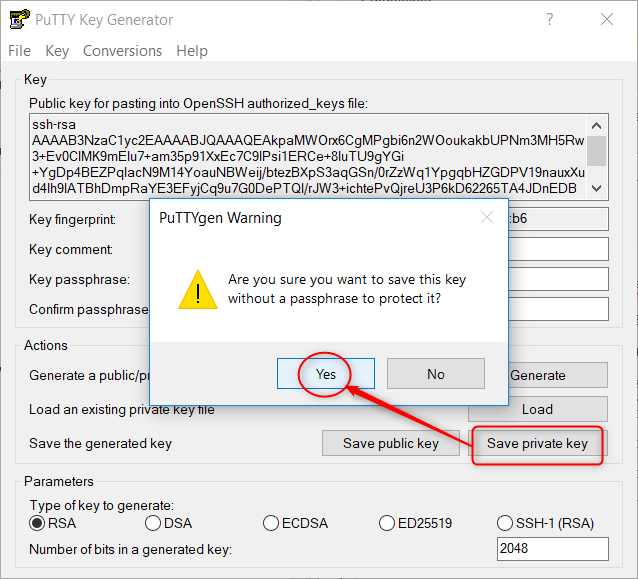
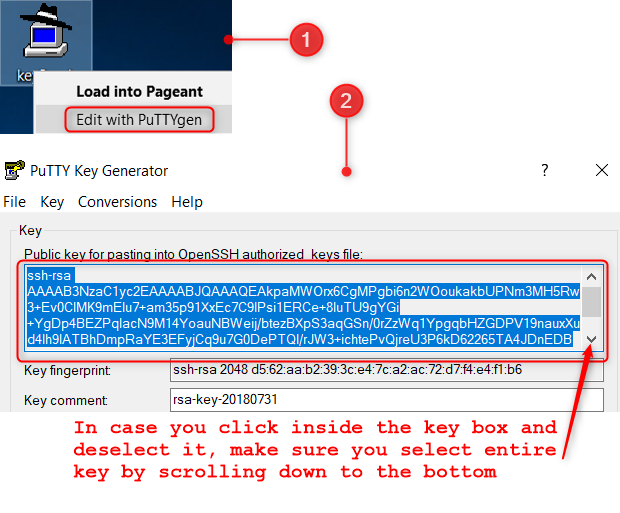
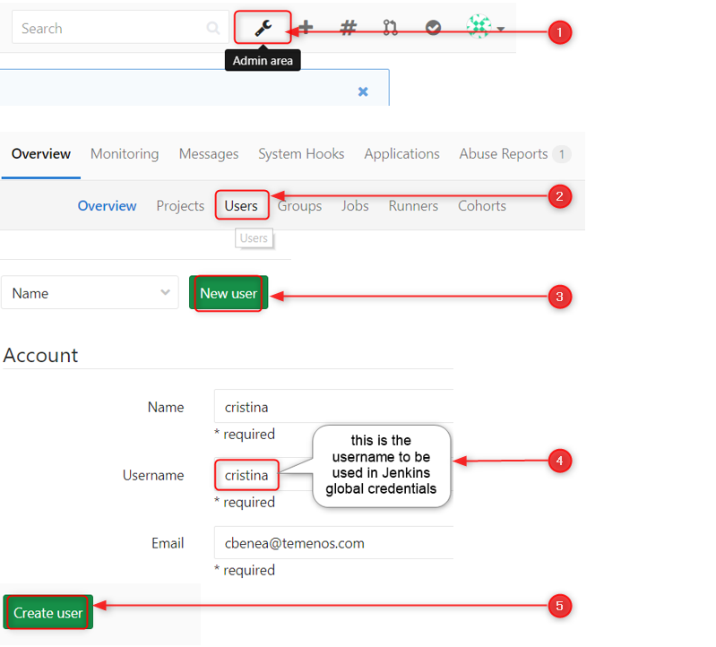
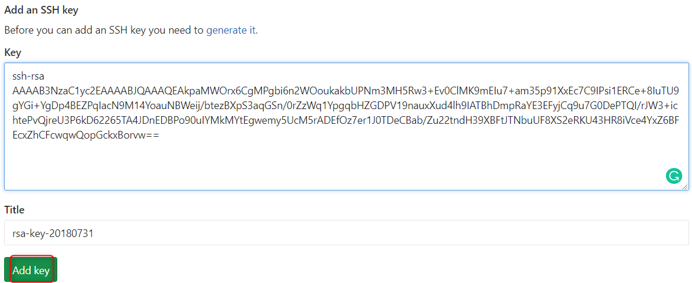
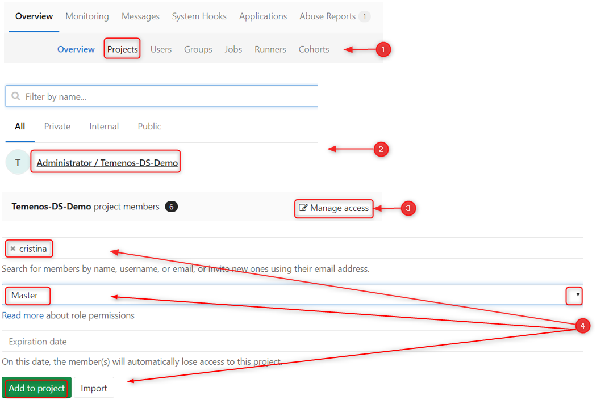
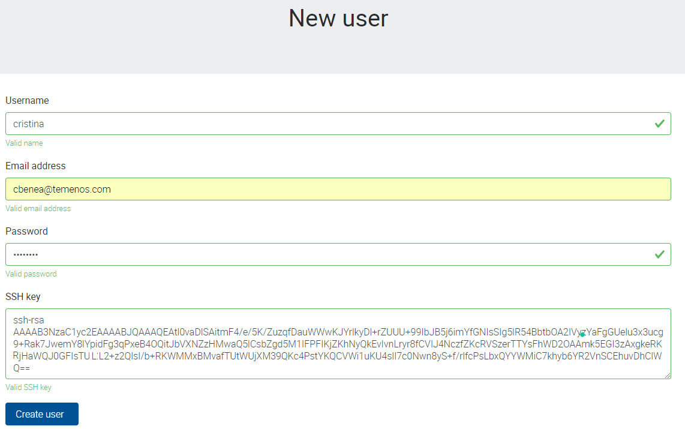
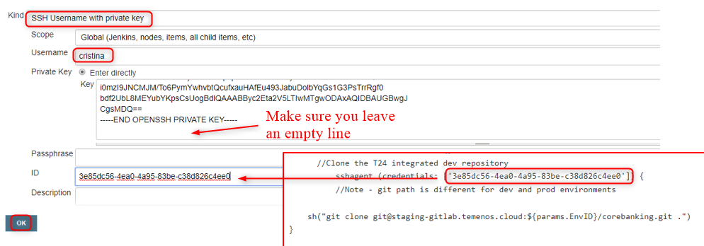

## Use Jenkins to Build Pipelines

> [!Note]
> Check also our [**Video Tutorial**](https://www.youtube.com/watch?v=NKuOZJURZzg)!

## Introduction

This document explains how to configure the Jenkins build and promote pipelines. 

**'Build pipeline'** builds the artifacts and deploys them in test environment. 

Once the testing is successful and it's ready for promotion, **'Promote pipeline'** deploys the tested artifacts into integrated dev environment. 

For this tutorial, we will be integrating Jenkins with GitHub so that Jenkins can pull the code and build artifacts.

To implement the Pipeline as a code we will use Jenkins Pipeline in order to automate tasks associated with building, testing and deploying software.

## Access Development Portal

Sign into following URL: `portal.temenos.cloud` using the credentials provided by Temenos (Username and Password):

 

## Create a new environment

Press **'New environment'**

> [!Note]
> You will need to create following three environments:
> 
> • A build environment with template "Build resources"
> 
> • A source environment with the required template (*in our example is "Retail Suite R17.12(H2)"*)
> 
> • A target environment with the same template as the last one

Fill the following parameters and press **'Create environment'**:

•	Name

•	Description

•	Template

•	*Labels (optional)*

> [!Note]
> It might take about 15 minutes to create the enviroment.

The environment named 'Integrated Dev Environment' has been created:

## Login to Jenkins

Click on the **BUILD** environment created (the first environment created - "Build resources") and then go to Jenkins Dashboard

 

In the new screen, click Login button on the top-right corner:

 

Sign in with user ***admin*** and password ***changeit***

> [!Note]
> After first login, you will need to change the password.

## Change the password

- Click on **'Admin'** button on top-right corner and then, on the left side, click on **'Configure'** button 

 

- Input a new password, confirm it, click **'Apply'** and then **'Save'**

> [!Note]
>  In case of a coffee break during the Jenkins configuration, the session may expire. 
> 
> Make sure when you come back that you are **still** logged or login again.

## Build pipeline workflow

Build Pipeline works based on pipeline script (Jenkins file). 

**Requirements:**

 - It requires valid credentials to pull the code from your Git repository (Github/Gitlab..etc). Users need to add credentials to clone the git repositories. 
   - For setting up credentials please refer to below section "Add SSH keys inside Jenkins"

**Steps during build:**

 - Pulls the code from GIT 
 - Builds the artifacts using DS binaries
 - Deploys the artifacts in the TEST environments

## Generate SSH key

This section explains how to add the credentials in order to clone the Git repositories.

The Jenkins Server requires a Source code repository, which will be taken from Github repository (or another kind of repository that you have), then a Developement environment and a Test environment. The dependencies between all of them are done through the ssh keys.

The SSH key is used to authenticate between the Jenkins server and the environments. The keys solve different problems such as: user identification, security/ privacy and continuos integration and delivery best practices  

First, you will need a SSH key, which can be generated by using PuTTY:

As instructed on PuTTY screen, move the mouse over the blank area to generate the key.

#### PRIVATE KEY

After the key is generated, go to Conversions tab and choose **Export OpenSSH key (force new file format)**

#### PUBLIC KEY

Click on **Save private key** button

Later during Jenkins configurations, it will be necessary to use these SSH keys.

To use the public key, you need to click right on the key saved *(.ppk format)* and select **Edit with PuTTYgen**

## Add SSH key to GitLab repository

We are using GitLab repository, but you can use a different one. 

In this repository you have to add a user to connect to Jenkins in order to build resources.

- Log in to GitLab as an **admin** and follow below steps:

 - Change user password:

After clicking **Create user** button, click Edit button up-right and set a new password, confirm it and then click **Save changes**.

 - Now logout from admin user and login with the newly created user. 
 - Once you login, you will notice that it will be required automatically to setup a new password (Input your current password > Set a new password > Confirm it > Click **Set new password**
 - After this step you will be automatically logged out and you need to login again with the new password
 - Click on the user icon on the top-right corner and select 'Settings'
 - Go to **SSH Keys** tab and paste the public key that you generated before as follows:
   - paste the entire public key > you will notice that the Title field is automatically completed with the last part of the key (*rsa-key-20180731*)
   - delete the last part until equal sign and press **Add key**

## Add user to your Gitlab project

You also need to add the created user to your project and give full access:

 - Login back as an admin and go to admin area (*use settings button*)
  1. Click on **Projects** tab
  2. Then find your project
  3. Then **Manage access** on the right
  4. Then find your member (user), select Master from dropdown list to give full permission for this user and then **Add to project**

Go to Credentials from left pane inside Jenkins console and then click global:

 

Then add credentials:

 

 - A new screen is open. 

 - In the Kind box - click the dropdown button and select ‘SSH Username with private key’
 - Scope - you can leave the default option 'Global (Jenkins, node...)'
 - Choose a username. In current case we have chosen ‘gituser1’ so that we can easily identify that it is associated with demorepo repository in GitHub. 
 - Go to Private Key field, select **'Enter directly'** and paste the ***private*** key generated at previous step
 - Click OK

 

Now if you click on credentials, you will see the following screen with user details:

> [!Note]
> This uniqe ID of SSH key will be used in the pipeline scripts (Jenkins File) to clone the repositories. 

### Add user to the portal

 - Go to portal.temenos.cloud
 - Click on **New user**
 - And fill the required fields

> [!Note]
> Copy-paste the entire public key generated before and then delete the last part until equal sign and press **Create user**

## Configure Jenkins pipeline job to use SSH keys

  - Go to My View from left pane inside Jenkins console 

 

- Click on 'Build'

 

- Then on 'Configure'

- And finally click on 'Pipeline'

 

  - On the same screen, make sure you have the Jenkins File path in Script Path, then click on Apply and 'Save' 

## Add a second user to the portal

The same as for the first user added, first make sure you generated a new SSH key and then:

 - Go to portal.temenos.cloud
 - Click on **New user**
 - And fill the required fields

> [!Note]
> Copy-paste the entire **public** key generated before and then delete the last part until equal sign and press **Create user**

 - Then go to Credentials from left pane inside Jenkins console and then click global.
 - Click 'Add credentials' and fill the required fields

 - In the Kind box - click the dropdown button and select ‘SSH Username with private key’
 - Scope - you can leave the default option 'Global (Jenkins, node...)'
 - Insert the second username you just added to the portal. 
 - Go to Private Key field, select **'Enter directly'** and paste the ***private*** key generated at previous step
 - Click OK

## Build the Jenkins job

 - It’s time now to go ahead and build our job.

Go to left pane inside Jenkins console and press 'Jenkins' button

 

Then click on 'Built on'

 

New screen is open. The following parameters are **required to change** according to your setup:

•	SrcRepo 

•	EnvID (see the note below)

•	emailRecipientsList (optional)

Click **Build**.

 

> [!Note] The environment ID is the one that appears on the URL address after you login and you click on your environment:
> 
> 

## Promote pipeline workflow

Go again to left pane inside Jenkins console and press 'Jenkins' button

Then click on 'Built on' button on 'Promote Changes' line

 

New screen is open:

 

Click **Build**.
