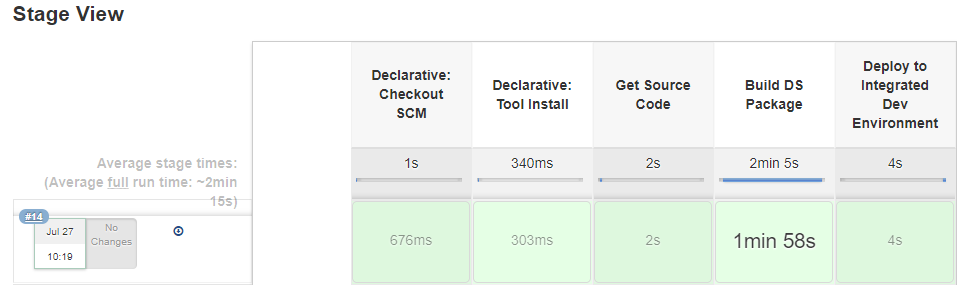

## Use Jenkins to Build Pipelines

> [!Note]
> Check also our [**Video Tutorial**](https://www.youtube.com/watch?v=NKuOZJURZzg)! *(to be updated)*

## Introduction

This document explains how to configure the Jenkins build and promote pipelines. 

The **'Build pipeline'** job builds the artifacts and deploys them into the test environment. 

Once the testing is successful and it's ready for promotion, the **'Promote pipeline'** deploys the tested artifacts into the integrated dev environment. 

For this tutorial, we will be integrating Jenkins with GitLab (or Bitbucket - depending on your repository) so that Jenkins can pull the code and build artifacts.

## Main steps

- Merge the team changes to existing code​.

- Run the integrated build​.

- Deploy the changes to a Integrated DEV Environment​.

- Continue with the existing flow.

 

To implement the Pipeline as a code we will use Jenkins Pipeline in order to automate tasks associated with building, testing and deploying software.

## Access Development Portal

Sign into one of the following URLs (choose the link you have been provided with): [https://portal.temenos.cloud](https://portal.temenos.cloud/) or [https://tcd-portal.temenos.cloud/](https://tcd-portal.temenos.cloud/) using the credentials provided by Temenos (Username and Password):

 

## Create the required environments

Fill the following parameters and press **'Create environment'**:

•	Name

•	Description

•	Template

•	*Labels (optional)*

- Fill the required fields and press **Create**.

> [!Note]
> It might take about 15-20 minutes to create an environment.

> [!Note]
> You will need to create following three environments:
> 
> • A **build** environment with the required template (*in our example is "BuildResources-Jenkins-Jfrog-R18.11"*)
> 
> • A **source** environment with the required template (*in our example is "Retail Suite R18.11"*)
> 
> • A **target** environment with the same template as the last one.

## Login to Jenkins

After the "BuildServices" environment has been created, click on it and go to Jenkins Dashboard:

 

In the new screen, click Login button on the top-right corner:

 

Sign in with user ***admin*** and password ***changeit***

> [!Note]
> After first login, you will need to change the password.

## Change the password

- Click on **'Admin'** button on top-right corner and then, on the left side, click on **'Configure'** button 

 

- Input a new password, confirm it, click **'Apply'** and then **'Save'**

> [!Note]
>  In case of a coffee break during the Jenkins configuration, the session may expire. 
> 
> Make sure when you come back that you are **still** logged or login again.

## Build pipeline workflow

Build Pipeline works based on pipeline script (Jenkins file). 

**Requirements:**

 - It requires valid credentials to pull the code from your GitLab (or Bitbucket) repository (or a different repository that will be made available). Users need to add credentials to clone the git repositories. 
   - For setting up credentials please refer to below section "Add SSH keys inside Jenkins"

**Steps during build:**

 - Pulls the code from the Gitlab (or Bitbucket) repository 
 - Builds the artifacts using DS binaries
 - Deploys the artifacts in the TEST environments

## Generate SSH key

This section explains how to add the credentials in order to clone the Git repositories.

The Jenkins Server requires a Source code repository, which will be taken from Github repository (or another kind of repository that you have), then a Development environment and a Test environment. The dependencies between all of them are done through the ssh keys.

The SSH key is used to authenticate between the Jenkins server and the environments. The keys solve different problems such as: user identification, security/ privacy and continuos integration and delivery best practices  

First, you will need a SSH key, which can be generated by using PuTTY:

As instructed on PuTTY screen, move the mouse over the blank area to generate the key.

#### PRIVATE KEY

After the key is generated, go to Conversions tab and choose **Export OpenSSH key (force new file format)**

#### PUBLIC KEY

Click on **Save private key** button

Later during Jenkins configurations, it will be necessary to use these SSH keys.

To use the public key, you need to click right on the key saved *(.ppk format)* and select **Edit with PuTTYgen**

## Add user to the portal

 - Go to [portal.temenos.cloud](https://portal.temenos.cloud/), respectively [https://tcd-portal.temenos.cloud/](https://tcd-portal.temenos.cloud/).
 - Click on **New user**
 - And fill the required fields

> [!Note]
> Copy-paste the entire public key generated before and press **Create user**
> Don't forget to click **Save private key** from PuTTY Key Generator in order to save the private key that you may use later.

## Add a second user to the portal

The same as for the first user added, first make sure you generated a **new** SSH key and then:

 - Go to [portal.temenos.cloud](https://portal.temenos.cloud/), respectively [https://tcd-portal.temenos.cloud/](https://tcd-portal.temenos.cloud/).
 - Click on **New user**
 - And fill the required fields

> [!Note]
> Copy-paste the entire **public** key generated before and press **Create**
> Don't forget to click **Save private key** from PuTTY Key Generator in order to save the private key that you may use later.

## Add SSH key to GitLab repository

We are using GitLab repository, but you can use a different one. 

In this repository you have to add the ssh keys for the users created in order to connect to Jenkins and build resources.

The users created into the https://portal.temenos.cloud/ will be automatically added in the Gitlab repo.

- Log into GitLab ([https://staging-gitlab.temenos.cloud/admin](https://staging-gitlab.temenos.cloud/admin)) as an **admin** and follow below steps:

    - Click on the key for admin area:
    - 
    - Go to **users** tab.
    - Search the users created (*example: cristina*) and press enter. In case the user is not automatically added (due to a different platform use), please go to **New user** button and add the required users. 
    - Click on the user name and then on the edit button on the right.
    - Set a password of minimum 8 chars and repeat password for confirmation, then Save changes.
    - Logout from admin menu and login with the new user and the password set before.

- **Change user password:**

    - Once you login, you will notice that it will be required automatically to setup a new password (Input your current password > Set a new password > Confirm it > Click **Set new password**
    - After this step you will be automatically logged out and you need to login **again** with the new password
    - Click on the user icon on the top-right corner and select 'Settings'
 - Go to **SSH Keys** tab and paste the public key that you generated before as follows:
     - paste the entire public key > you will notice that the Title field is automatically completed with the last part of the key (*rsa-key-20180731*)
     - delete the last part until equal sign and press **Add key**

Repeat the same steps from this section **('Add SSH key to GitLab repository')** for the second portal user that you created.

## Add user to your Gitlab project

You also need to add the created user to your project and give full access:

> [!Note]
> Repeat the same steps below also for the other user created in the portal

 - Login back as an admin and go to admin area (*use settings button*)
  1. Click on **Projects** tab
  2. Then find your project
  3. Then **Manage access** on the right
  4. Then find your member (user), select Master from dropdown list to give full permission for this user and then **Add to project**

## Add credentials and Use ID from 'Temenos-DS-R18.11-Demo' Project

- Go back to your organisation on TCD portal, click on BuildServices environment and access from there the Jenkins Dashboard.
- Login with user admin and the password previously changed (see <a href="./jenkins-build-promote-pipelines.md#login-to-jenkins" target="blank">**this step**</a>).

- Inside Jenkins console, go to Credentials from left pane and then click global:

 

Then add credentials:

 

 - A new screen is open
 - In the Kind box - click the dropdown button and select ‘SSH Username with private key’
 - Scope - you can leave the default option 'Global (Jenkins, node...)'
 - Choose a username. In current case we have chosen ‘gituser1’ so that we can easily identify that it is associated with demorepo repository in GitHub. 
 - Go to Private Key field, select **'Enter directly'** and paste the ***private*** key generated at previous step
 - Click OK

> [!Note]
> The ID field must be completed with the **sshagent credentials** taken from the JenkinsFile available on [https://staging-gitlab.temenos.cloud/root/Temenos-DS-R18.11-Demo/blob/master/JenkinsFile](https://staging-gitlab.temenos.cloud/root/Temenos-DS-R18.11-Demo/blob/master/JenkinsFile) as in the picture above.

 

 - Add credentials for the second user
 - Go to Credentials from left pane inside Jenkins console and then click global.
 - Click 'Add credentials' and fill the required fields
 - In the Kind box - click the dropdown button and select ‘SSH Username with private key’
 - Scope - you can leave the default option 'Global (Jenkins, node...)'
 - Insert the second username you just added to the portal. 
 - Go to Private Key field, select **'Enter directly'** and paste the ***private*** key generated at previous step
 - Click OK

Now if you click on credentials, you will see the following screen with both users details (on the Jenkins dashboard from your 'BuildServices' environment):

> [!Note]
> This unique ID of SSH key will be used in the pipeline scripts (Jenkins File) to clone the repositories. 

## Configure Jenkins pipeline job to use SSH keys

  - Go to My View from left pane inside Jenkins console 

 

- Click on 'Build'

 

- Then on 'Configure'

- And finally click on 'Pipeline'

 

  - On the same screen, make sure you have the Jenkins File path in Script Path, then click on Apply and 'Save' 

## Build the Jenkins job

 - It’s time now to go ahead and build our job.

Go to left pane inside Jenkins console and press 'Jenkins' button

 

Then click on 'Built on'

 

New screen is open. The following parameters are **required to change** according to your setup:

•	SrcRepo 

•	EnvID (see the note below)

•	emailRecipientsList (optional)

Click **Build**.

 

> [!Note] The environment ID is the one that appears on the URL address after you login and you click on your environment:
> 
> 
> In this case, we have used the DevEnv_201811 created initially on the platform.

Build should be successful:

 

## Promote pipeline workflow

 - Click on 'Promote Changes'

 - Then on 'Configure'

 - And finally click on 'Pipeline'

-  Insert your repository URL (*in our example: git@staging-gitlab.temenos.cloud:root/Temenos-DS-R18.11-Demo.git*)
-  Credentials: use the second user that you added to the portal
-  Script Path: PromoteChangesJenkinsFile

Go again to left pane inside Jenkins console and press 'Jenkins' button

Then click on 'Built on' button on 'Promote Changes' line

 

New screen is open:

 

Click **Build**.

> [!Note] 
> The image above displays only an example.
> 
> **SourceEnvID** is the one of the DevEnv_201811 created on the platform.
> 
> **TargetEnvID** is the one of the IntegrationEnv_201811created on the platform.
> (see <a href="./jenkins-build-promote-pipelines.md#create-the-required-environments" target="blank">**here**</a>).