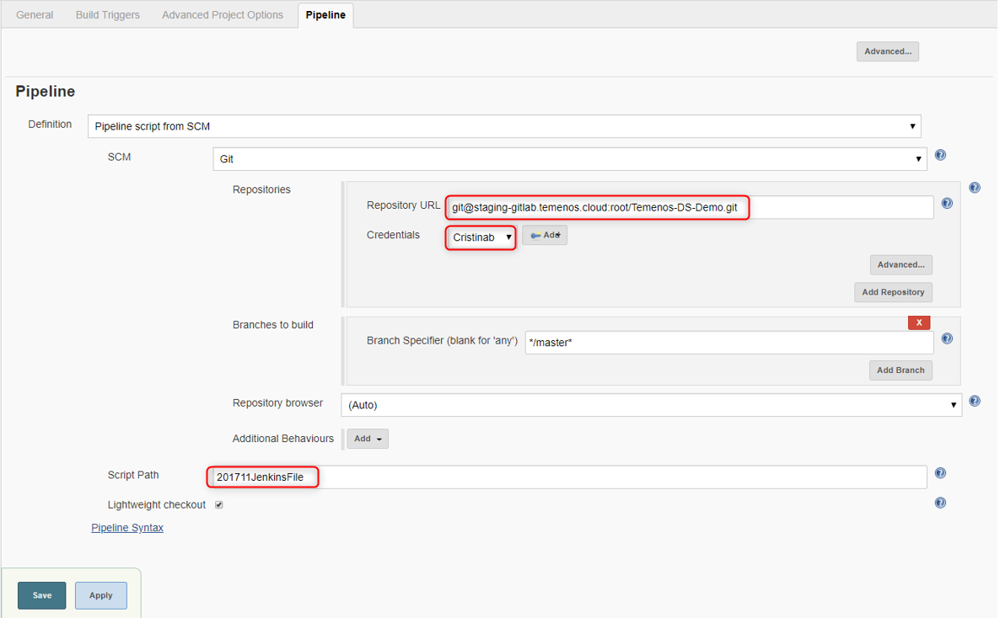

## Use Jenkins to Build Pipelines

## Introduction

This document explains how to configure the Jenkins build and promote pipelines. 

'Build pipeline' builds the artifacts and deploys them in test environment. Once the testing is successful and it's ready for promotion, 'Promote pipeline' deploys the tested artifacts into integrated dev environment. 

The core of the pipeline is the file called Jenkins File. It performs the list of jobs as illustrated in the flowchart. For this tutorial, we will be integrating Jenkins with GitHub so that Jenkins can pull the code and build artifacts.

To implement the Pipeline as a code we will use Jenkins Pipeline used to automate tasks associated with building, testing and deploying software.

## Prerequisites

•	Valid SSH keys to clone the GIT repositories
•	Environments IDs - Test/Integrated Dev
•	Pipeline scripts - Build/Promote 

## Enter Temenos Cloud

All you need is to sign into following URL: `portal.dev.temenos.cloud` using the credentials provided by Temenos (Username and Password):

## Create a new environment

Press 'New environment'

Fill the following parameters and press 'Create environment':

•	Name

•	Description

•	Template

•	*Labels (optional)*

> [!Note]
> It might take about 15 minutes to create the enviroment.
> 
>  Please refresh the page if the new environment doesn't appear 'green' after more than 15 minutes.

## Login to Jenkins

Click on the environment created and than go to Jenkins Dashboard

In the new screen, click Login button on the top-right corner.

Sign in with user 'admin' and password 'changeit'

> [!Note]
> After first login, you will need to change the password.

## Change the password

- Click on 'Admin' button on top-right corner
- On the left side, click on 'Configure' button 
- Input a new password, confirm it, click "Apply' and then 'Save'

> [!Note]
>  In case of a coffee break during the Jenkins configuration, the session may expire. 
> 
> Make sure when you come back that you are **still** logged or login again.

## Build pipeline workflow

Build Pipeline works based on pipeline script (Jenkins file). 

**Requirements:**

 - It requires valid credentials to pull the code from your Git repository (Github/Gitlab..etc). Users need to add credentials to clone the git repositories. 
   - For setting up credentials please refer to below section "Add SSH keys inside Jenkins"

**Steps during build:**

 - Pulls the code from GIT 
 - Builds the artifacts using DS binaries
 - Deploys the artifacts in the TEST environments

> [!Note]
> Jenkins File for reference https://github.com/temenostech/temenos-ds-demo/blob/master/201711JenkinsFile

## Generate SSH key

This section explains how to add the credentials in order to clone the Git repositories.

First, you will need a SSH key, which can be generated by using PuTTY:

As instructed on PuTTY screen, move the mouse over the blank area to generate the key.

After the key is generated, **COPY** the key, save it somewhere and click 'Save private key'

## Add SSH Keys inside Jenkins

Go to Credentials from left pane inside Jenkins console and then click global:

 - A new screen is open. 
 - In the Kind box, click the dropdown button and select ‘SSH Username with private key’
 - Scope, you can leave the default option 'Global (Jenkins, node...)'
 - Choose a username. In current case we have chosen ‘gituser1’ so that we can easily identify that it is associated with demorepo repository in GitHub. 
 - Go to Private Key field, select 'Enter directly' and paste the **private** key generated at previous step
 - Click OK

You will see the following screen with user details:

> [!Note]
> This uniqe ID of SSH key will be used in the pipeline scripts (Jenkins File) to clone the repositories. See next step.

## Configure Jenkins pipeline job to use SSH keys

  - Go to My View from left pane inside Jenkins console 

 

- Click on 'Build'

 

- Then on 'Configure'

 

- And finally click on 'Pipeline'

 

  - On the same screen, make sure you have the same details in Script Path as below, then click on Apply and 'Save' 

 

 - It’s time now to go ahead and build our job.

## Build the Jenkins job

Go to left pane inside Jenkins console and press 'Jenkins' button

 

Then click on 'Built on'

 

New screen is open. The following parameters are required to change according to your setup:

•	SrcRepo
•	workspacePath
•	PackagePrefix
•	EnvID
•	emailRecipentsList (optional)

 

## Promote pipeline workflow

Go again to left pane inside Jenkins console and press 'Jenkins' button

Then click on 'Built on' button on 'Promote Changes' line

 

New screen is open:

 
