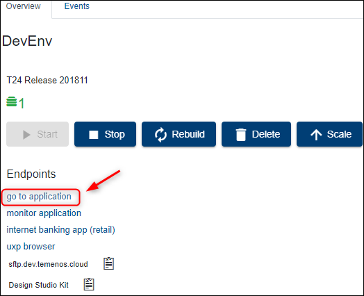

# Make Updates on a Temenos Continuous Deployment Environment #

This document describes how to easily make an update of a T24 Cloud environment. Each Environment has an associated Repository for uploading different type of features based on Environment Template type, these features being deployed automatically to your Environment.

Before proceeding, please check the following requirements:
- Make sure you have a GUI Git Client installed on your local machine. This guide uses *TortoiseGit* Git Client that can be installed from <a href="https://tortoisegit.org/download/" target="blank">**here**</a>.
- Make sure you have an user created under your organisation that has a public SSH key attached. Please check <a href="./user-creation-in-paas.md" target="blank">**this user guide**</a> to understand how you can create a user or how you can generate and attach a SSH key to a user.

## Clone Environment Repository ##

•	Login to the <a href="https://portal.temenos.cloud/" target="blank">**portal**</a> *(or your dedicated portal)* with your user and password, select your environment and locate the Endpoint of **Repository** Application. 
•	Click the **copy to clipboard icon** from the right:

)

•	Create a folder in any location from your local machine. In the current example, the folder name is *GitDemo*.

•	Go to your local repository folder (*GitDemo folder in our example*), click right inside the folder and choose **Git Clone**.

•	A new screen is open. Input the following:

 - paste the Endpoint of **Repository** Application of your Environment in URL textbox
 - set the Directory textbox to your local repository folder (GitDemo folder in our example) - *the path should be automatically filled with your folder location*
 - load your private key corresponding to the public key of your portal user
 - click OK

•	Content is downloaded from the Repository of your Environment to your local machine and should display a success message.

- The repository should contain the following folder structure:
  - addons
  - client_files
  - environment
  - packages
  - plugins
  - updates
  - wsdl

Into the **updates** folder you need to place the T24 updates file as shown in the next section.

## Commit & Push the Updates to Repository ##

> [!Note]
> In order to get the updates file you need to have access to <a href="https://tcsp.temenos.com/SitePages/Home.aspx" target="_blank">**Temenos Customer Support Portal**</a> as per your contract agreement.

 - Go to the repository folder from your local machine *(GitDemo folder in our example)* and copy the T24 Updates zip file *(keep the name and format as it is)* into the **Updates** folder from your local repository.

- To commit the files/files to Environment Repository, right click inside repository folder from your local machine and choose **Git Commit -> "master"...** option.
 

- In the new screen:
   - Check the Not Versioned Files
   - Input a commit message about the action done
   - Commit & Push

 - After getting the success message, you can close the TortoiseGit window.

## Trigger the Deployment ##

 - After committing and pushing the updates file into the repository, it also has to be deployed into the cloud environment. 
 - For this, go back to the portal, select your environment, locate **Repository** Application and click the **Deploy** button.

•	The Environment and its manageable Applications status will be changed to Deploying during the deployment process and the Deploy button becomes disabled until the deployment is finished.

The logs generated by the deployment process can be also observed in the **Events** tab of your Environment where a new event for *RepositoryDeploy* will be created.
•	The action may take around 5 minutes.

> [!Note]
> The deployment process is triggered **manually** by the user after committing and pushing all the required features in Environment Repository or whenever is appropriate based on the fact that the user can commit and push features to Environment Repository multiple times and choose when to trigger the deployment.

## Check the Updates into Environment ##

- Go to your environment and click **Go to Application** in order to log to T24 Browser.

- Sign in with your T24 user and password.

> [!Note]
> First T24 login will take a bit longer.

- In the command line, type TS, BNK/T24.UPDATES and press Go button
- In the new screen, put the service from Stop to **Start** and press **Commit the deal** button on the left. *(This will trigger the deployed updates).*

 - Go back to the portal, click your environment and click **Monitor Application**.
 - Sign in with your user and password. 

- Go to **Execute servlet** under Execution.
- Type the command **START.TSM** and then press **Submit**.
- Go back to T24 browser and in the command line type **SPF S SYSTEM** and press go. 
- In the new screen, scroll down until you see the updates that were added.

