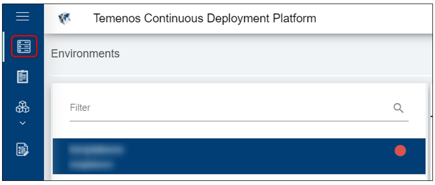
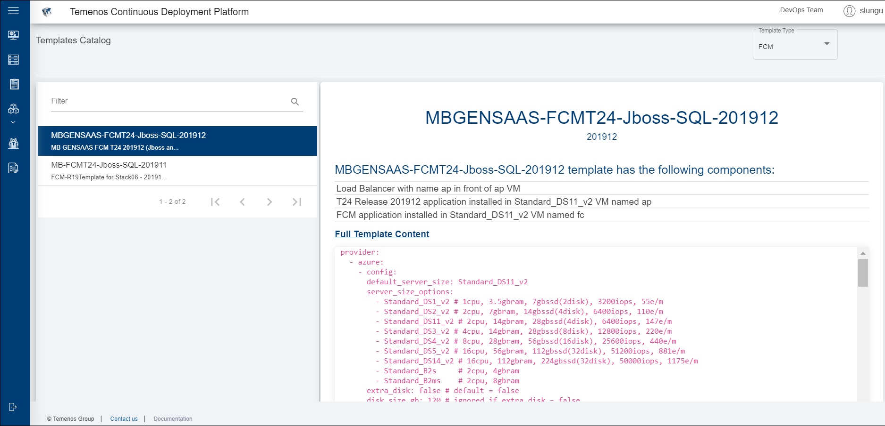

## Manage Environments 

----------

- **Organisation ID**

The Temenos Development Platform support multitenancy and Organisations are designed to be distinctive accounts.  

Upon subscription you'll receive a **unique** Organisation Id as a URL link. Your Organisation Id will look similar to this: 

 

The confirmation of your Organisation activation will contain the link and access instructions to your designated Organisation administrator. The administrator is the first and only user.

 

- **Environments**

The Development platform (Extend) has the capability to provision environments in a variety of different configurations. Users can initiate a new environment and select from a predefined list of templates the application, the release and stack they wish to provision. Each month we host a new template with the latest release of Temenos suite. 

The environments are customisable in terms of Name and brief description to explain their purpose. The templates follow the official Temenos configuration stack but they can be customised for Releases 2016 onwards.   

Create your own environment:

- Either click the Environments tab on the left menu and then click **New Environment** button on the top right corner.  
- Or you can already see the environment page open with the fields available to create a new environment.

 

 - Fill Name and Description fields
 - Select one of the available templates from dropdown list, based on your requirements
 - Click **Create environment**
All fields are mandatory except 'Labels'.

 

 To see the details of an environment please make sure to first select it from the top-right-side menu:

- **Templates**

Check the list with all available templates. Click the **Templates Catalog** on the left menu.

Currently, the screen that opens will display an FCM and T24 default template. Click on the Template Type and select for one of the applications, for example T24 to see the latest retail Suites versions and other available templates.

# User Roles Required#
To be able to create an environment the below permissions need to be enabled for your user:

- CREATE _ ENVIRONMENT
- MANAGE _ ENVIRONMENTS

To understand what each of the permission does, hover the cursor over the variables and a short description will pop up or click [here](http://documentation.temenos.cloud/home/techguides/user-permissions) to get an overview of the permissions.

