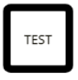
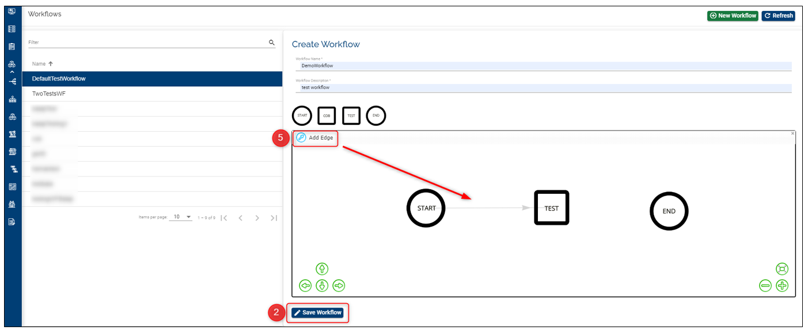

> [!Note]
>  Starting April 5th the TCD user guide will move to the [Temenos Customer Support Portal (TCSP)](https://tcsp.temenos.com/TCD/Modules/TemenosContinuousDeployment/Overview/Overview.htm). We recommend you to log in to the portal and check if your credentials are available. Raise a ticket at [CloudPlatformSupport@temenos.com](CloudPlatformSupport@temenos.com) if you encounter any issues.

# Manage Workflows

Workflows enable the user to run tests with multiple steps in a designated sequence. Based on the business needs, the workflow can be customized and the same can be added during the factory set-up.

The workflow diagram consists of the following elements that can be dragged into a canvas:

- **start workflow**

  

 

 - **COB** -  runs various processes that are split into 5 stages (Individual application processes,  system wide processes, main system reports,  start of day such as standing orders, split month end events, cash flow maintenance and so on-, and online -any non-critical reports and processes which can be run after the system has returned to online mode)
  -  based on your contract, the COB button may/ may not appear to all users in the workflow customization stage. 
  -  see what happens when COB is triggered during a factory run **[here](http://documentation.temenos.cloud/home/techguides/trigger-cob.html)**
 
  

 

 - **test workflow** - triggers the test request. This button configures the template, components, numbers of Test VMs and the stage from which the test will be picked from during the factory run. 

 

 

- **end workflow**

  

 
 
# Create workflow 
To create your own workflow in the Temenos Continuous Deployment Platform you need to follow the below steps:

1. Select the **Workflow** tab from the left menu

2. Click on **New Workflow** from top-right

3. A new window opens. Add a **name** and a **description** to the workflow

4. To define the workflow, simply drag and drop the shapes onto the canvas and connect them with arrows

   

5. To connect the elements click on Add Edge; to delete any edge or element, select the item first then click on Delete Selected

6. When the elements have been placed and connected accordingly, click Save Workflow. Based on the above diagram, a particular workflow will be sent to workflow service to proceed with the steps defined by the user

 

After the workflow is created, the user can add this workflow to any factory within his organisation (learn [here](http://documentation.temenos.cloud/home/techguides/automated-factories.html) how to set up factories)

# Edit and delete a workflow
Users can edit and delete workflows only if these are not assigned to a factory.

- to edit a workflow click on the **Edit** button. In this phase you can change the workflow elements and connections. Click Update workflow once you finish updating it.

- the **Edit Workflow** and **Delete Workflow** buttons are disabled for the Default Workflows

  

# Validations 
- the COB and Test elements can be dragged and dropped multiple times whereas all other tasks can be implemented only once. To create a connection the Edit button should be clicked for the corresponding task connection
- only the users with the permissions listed on the User Permissions Required sub-heading can either manage/ create/ update/ delete workflows

# User Permissions Required 
To be able to perform the above operations the following permissions need to be enabled for your user:

- MANAGE_ WORKFLOWS (enables user to view the workflows for an organisation and assign it to the required factory)

- CREATE_WORKFLOW 

- UPDATE_WORKFLOW 

- DELETE_WORKFLOW 

To have a better understanding of the user permissions, hover the cursor over the variables and a short description will pop up or click [here](http://documentation.temenos.cloud/home/techguides/user-permissions) to read more.

