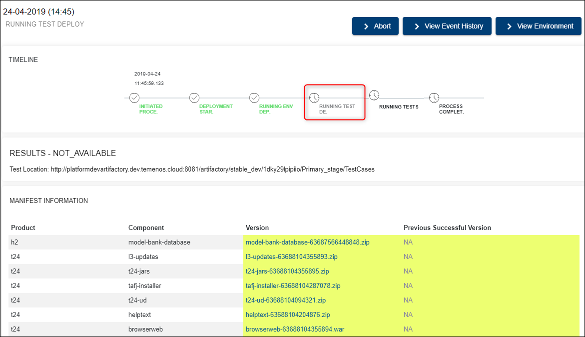

## Run Factory ##

After setting-up a factory (see configuration steps in <a href="./factories.md#set-up-create-a-factory" target="blank"><b>this user guide</b></a>), go to **Dashboard** on the main menu and select the factory you created (in case you have more factories). 

> [!Note]
> In order to run your factory, make sure first you select the stream and stage where you created the factory *(top right)*.

If the factory has never been run, you will notice the following message on the screen, under the respective factory: *The factory has never been run before. Please start the factory process now by clicking on the "Run Now" button.*

Click **Run Now**.

The process is initiated and it will get immediately to the stage where an environment based on your chosen template is created. 
> [!Note]
>  In the event of a mistake, the user can abort a factory run by clicking the 'Abort' button on the top right side of the page. This action prevents you from deploying, testing or promoting the components. The user can edit the factory and then click 'Run now' again to see the results.   

Clicking on the Environments tab on the left menu, you can check the creation of the environment. The name of the environment will be "Env for Factory xxx", where xxx is the name of your factory.

> [!Note]
> 1. The environment creation stage may take between 20 minutes and a few hours depending on the template used. 
> 
>  A factory can be enabled or disabled at any time. If a factory is disabled, factory runs (both scheduled and user triggered) will not be triggered. 

After the environment deployment phase is completed, the next phase (stage) is Running Test Deploy. During this phase a test environment is created (you can check it under Environments tab). 

**Note** that this environment is automatically deleted after the tests are run and the process is completed.

After running the tests successfully, you will see some details about all stages and the results, as in the example below:

Based on any factory run, the user can take several actions:

- **Trigger New Environment** - trigger a new environment to do triage, demo or ad-hoc testing (this will clone the factory environment)

- **View Environment** - view the environment used for the factory run

- **View Event History** - view the flow of status of the factory run

- **Create New Template** - this contains all the components that were associated with the factory run environment. This new template will be visible in the Templates Catalogue.

> [!Note] The 'Create New Template' button will be available only if the factory run is successful. 
> 
If  you want to have the creation of the new template enabled even when the factory run fails go to General on the left side of the menu and select the 'Setup Factory' tab. Tick the 'Yes' value that corresponds to the key 'Do you want to allow creation of template from failed factories'.

