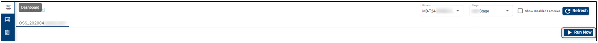
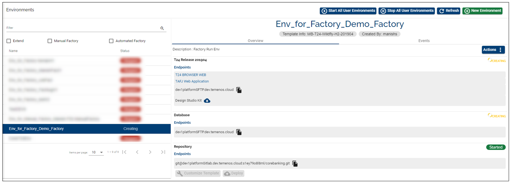

## Run Factory ##

After setting-up a factory (see configuration steps in <a href="./factories.md#set-up-create-a-factory" target="blank"><b>this user guide</b></a>), go to **Dashboard** on the main menu and select the factory you created (in case you have more factories). 

> [!Note]
> In order to run your factory, make sure first you select the stream and stage where you created the factory *(top right)*.

If the factory has never been run, you will notice the following message on the screen, under the respective factory: *The factory has never been run before. Please start the factory process now by clicking on the "Run Now" button.*

Click **Run Now**.

The process is initiated and it will get immediately to the stage where an environment based on your chosen template is created.

Clicking on the Environments tab on the left menu, you can check the creation of the environment. The name of the environment will be "Env for Factory xxx", where xxx is the name of your factory.

> [!Note]
> The environment creation stage may take between 20 minutes and a few hours depending on the template used.

After the environment deployment phase is completed, the next phase (stage) is Running Test Deploy. During this phase a test environment is created (you can check it under Environments tab). 

**Note** that this environment is automatically deleted after the tests are run and the process is completed.

After running the tests successfully, you will see some details about all stages and the results, as in the example below:

