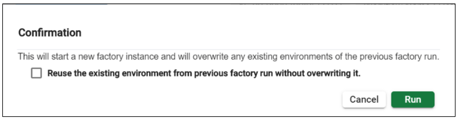
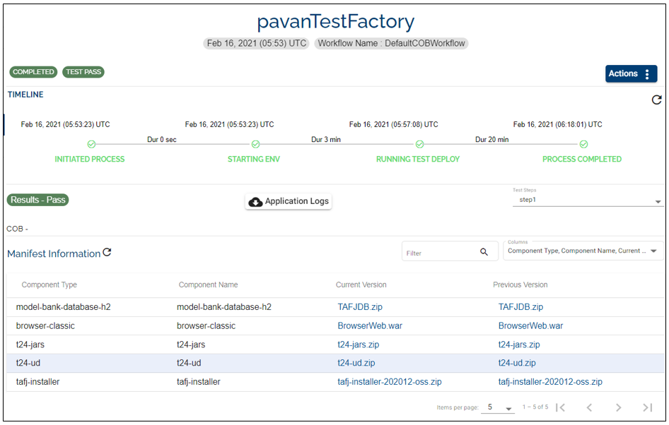
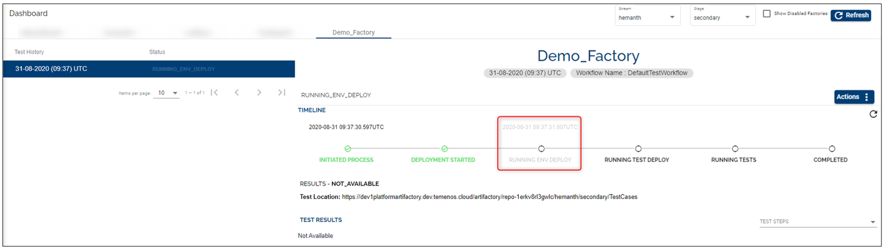
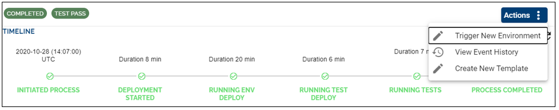

## Run Factory ##

After setting-up a factory (see configuration steps [here](http://documentation.temenos.cloud/home/techguides/automated-factories.html#set-up-create-a-automated-factory), go to **Dashboard** on the main menu and select the factory you created (in case you have more factories). 

> [!Note]
> In order to run your factory, make sure first you select the stream and stage where you created the factory *(top right)*.

If the factory has never been run, you will notice the following message on the screen, under the respective factory: *The factory has never been run before. Please start the factory process now by clicking on the Run Now button.* Click on the **Run now** button.

 
 

If the factory has been run at least once, a pop-up appears which enables you to proceed with the factory run by creating a new transact environment or skipping the factory environment creation for the current factory run. This functionality is useful when you want to change the tests and use the same Transact environment used for a previous factory run.

   
 

-  **Option 1**: If you want to skip the factory environment creation and reuse the environment from the previous factory run, select the option **Reuse the existing environment from previous factory run without overwriting it** and click on **Run** button.

-  **Option 2**: If you don't want to skip the factory environment creation just click on **Run** button.
 
 

See the following scenarios if you choose to skip the factory environment creation:

  - **Scenario 1** - If the factory environment status is **STARTED**, the factory run will trigger directly the test environment. 

  
 

  - **Scenario 2** - If the factory environment status is **STOPPED** and previous environment status is **STARTED** - the factory run automatically starts the environment and once it is **STARTED**, it triggers the test environment. 

> [!Note]
> If the factory environment creation has failed during the previous factory run, it is not possible to use it for your current factory run. You need to first identify and solve the issue in order to see the **Reuse the existing environment from previous factory run without overwriting it** in the pop-up. Otherwise this checkbox will not appear in the pop-up.
 

  

Once the **Run** button is clicked, the process is initiated and it gets immediately to the stage where an environment based on your chosen template is created:

During the factory run you are able to:

1. See the duration of total time between different stages and the status of the current stage

2. Click on the **Actions** button to:

     2.1 **View Environment** -  check the creation of the environment. The name of the environment will be "Env _ for _ Factory _ xxx", where xxx is the name of your factory (in our case Env _ for _ Factory _ Demo _ Factory)
       

  

     2.2 **View Event History** - see the logs of the factory run
       

  
     2.3 **Abort** a factory run by clicking the 'Abort' button on the top right side of the page (i.e. in case of a mistake). This action prevents you from deploying, testing or promoting the components. By clicking on **Abort** a confirmation pops-up which asks you to confirm the action. You can edit the factory and then click 'Run now' again to see the results.
            
  

3. Refresh the timeline by clicking on the **Refresh** icon

 
 

 > [!Note]
 > 1. The environment creation stage may take between 20 minutes and a few hours depending on the template used. 

 > 2. A factory can be enabled or disabled at any time. If a factory is disabled, factory runs (both scheduled and user triggered) will not be triggered. 

After the environment deployment phase is complete, the next phase (stage) is Running Test Deploy. During this phase a test environment is created (you can check it under Environments tab). 

**Note** that this environment is automatically deleted after the tests are run and the process is completed.

 After running the tests successfully, you will see some details about all stages and the results, as in the example below 

You are able to do the following:

-  - click to view the test scripts location in the Artifactory (you need to login with your user credentials)

-   - click to download the factory logs

-   - click on the downloadable icon to store the results on your local machine

-    - click on the modular eye icon to view the test results in a new page as below:

 

> [!Note]
>The Test Results URL is accessible as long as the portal login session is valid. When the portal session expires, the test results page throws a 401 error.

Based on any factory run, the user can take several actions:

- **Trigger New Environment** - trigger a new environment to do triage, demo or ad-hoc testing (this will clone the factory environment)

- **View Environment** - directs you to the environment created during the factory run

- **View Event History** - view the flow of status of the factory run

- **Create New Template** - this contains all the components that were associated with the factory run environment. This new template will be visible in the Templates Catalogue.

> [!Note] 
> The 'Create New Template' button will be available only if the factory run is successful. 

 If  you want to have the creation of the new template enabled even when the factory run fails go to General on the left side of the menu and select the 'Setup Factory' tab. Tick the 'Yes' value that corresponds to the key 'Do you want to allow creation of template from failed factories'.

   
 

# User Permissions Required
To be able to perform the above operations the below permissions need to be enabled for your user:

- MANAGE _ COMPONENTS
- MANAGE _ STREAMS
- MANAGE _ STAGES
- MANAGE _ PRODUCTS
- CREATE _ FACTORY
- UPDATE _ FACTORY
- DELETE _ FACTORY
- SCHEDULE _ FACTORY
- START - FACTORY - RUN
- ABORT - FACTORY - RUN
- VIEW - FACTORY - RUN - HISTORY

To have a better understanding of the user permissions, hover the cursor over the variables and a short description will pop up or click [here](http://documentation.temenos.cloud/home/techguides/user-permissions) to read more.
