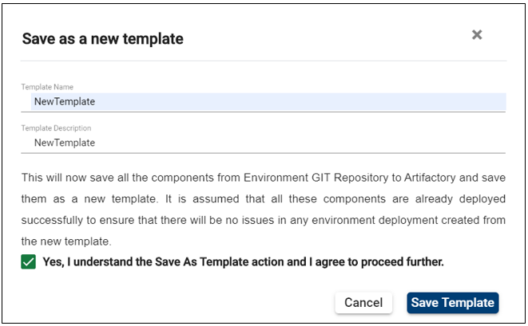

# Save as New Template

You can easily customize your templates via the **Save as New Template** feature. This self-service functionality enables you to create custom templates from a model bank template in just a few click. During this operation component binaries, deployment mechanisms or infrastructure can be changed and new components can be added.

By clicking on the **Save as New Template**  all the components are copied from the environment GIT Repository to Artifactory and saves them as a new template. 

To customize your template, you need to have at least the mandatory components uploaded and deployed successfully. This is to ensure that there will be no issues in any environment created from the new template (read [here](http://documentation.temenos.cloud/home/techguides/deploy-an-update-to-an-existing-environment.html) how you can deploy a component).

## **How to create a new template** ##

After deploying the components:

1. Click on the **Environment** tab from the left-side menu.

2. Select the **Environment** from the list.

3. On the environment page, expand the **Actions** button from the right.

4. Click on **Save as New Template**.

 

5. Read the information in the pop-up. Fill in the blanks, tick the box and then click on **Save Template**.

       

6. The template creation is initiated and you will be able to see it in the template catalog shortly. 
 
 

## **Post template creation actions** ##
After the template is successfully created you can:

1. Provision an environment with the newly created template (learn [here](http://documentation.temenos.cloud/home/manage-environments.html) how to create an environment). 

2. Run a factory using the template (learn [here](http://documentation.temenos.cloud/home/techguides/run-factory.html) how to run factories).

Watch the video tutorial [**here**](https://www.youtube.com/watch?v=4G7PH5tsej0&feature=youtu.be).

# User Permissions Required
To be able to perform basic  environment operations the below permissions need to be enabled for your user:

- MANAGE _ ENVIRONMENTS
- CREATE _ ENVIRONMENT
- UPDATE _ ENVIRONMENT
- DELETE _ ENVIRONMENT
- BOOST _ ENVIRONMENT
- REDEPLOY _ ENVIRONMENT
- START _ ENVIRONMENT
- STOP _ ENVIRONMENT
- ALLOW -  EXPORT  - ENVIRONMENT
- START -  ALL  - ENVIRONMENT
- STOP -  ALL  - ENVIRONMENT
- SCHEDULE _ ENVIRONMENT
- ALLOW - EXPORT - ENVIRONMENT
- MANAGE _ ENVIRONMENTS

To have a better understanding of the user permissions, hover the cursor over the variables and a short description will pop up or click [here](http://documentation.temenos.cloud/home/techguides/user-permissions) to read more.

