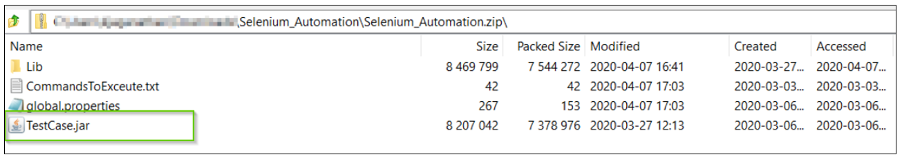
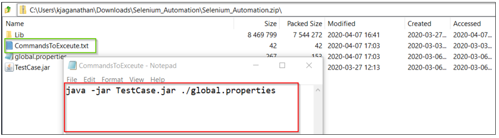

# Selenium Test Template Implementation 

This page explains the steps needed to be followed in order to do the Java implementation for a Selenium Test Template based on the client's framework.

## Implementation 
The Selenium Template will provision the following:

- Windows 2016 VM with below software/packages pre-installed:

    - Open JAVA / JDK  1.8

    - the latest version of Google Chrome

    - the latest version of Google Chrome driver (which will be used by Selenium) - this will be present in F:/TCD/WebDriver folder

    - the latest version of Geckodriver (which will be used by Selenium) - this will be present in F:/TCD/WebDriver folder
    
 
 

The test script component that can be used by this template must be a .zip file with the following folders:

- **Test suite 1** (this could be any name - it is assumed this as a suite of tests that needs to be executed)

    - 1 or multiple .jar files:

        - these files contain the elenium test cases to be executed

        - this must copy all the test results to F:/TCD/TestResults folder

            - Temenos Continuous Deployment Platform will move the results in this folder to a store account and give a download facility from the Temenos Continuous Deployment Platform

        - this must as well create a manifest file (the sample structure will be present in the documentation portal). The same must be uploaded to F:/TCD/TestResults folder

    - a folder named "Lib"
   
        - all the libraries that are needed by the test cases must be kept here. This includes the Selenium library, its extension and its dependencies.

    - property file with at least the following  properties  (“sys.t24.IP”, “sys.t24.port", “sys.test.results.folder”, “sys.web.driver.folder”)

        - while the test VM is provisioned, Temenos Continuous Deployment Platform will alter these values based on the IP and Port of the T24 VM

        - it will change the value of “sys.test.results.folder“ to “F://TCD//TestResults”

        - it will change the value of “sys.web.driver.folder“ to “F://TCD//WebDriver”

        - it is assumed that the user name and password will be known by the clients writing test cases and the same will be present in the golden copy

        - this property file can have other properties needed by the jar files, but the Temenos Continuous Deployment Platform will not alter these values at the run time

    - a text file named “CommandsToExceute.txt”

        - the Temenos Continuous Deployment Platform will execute all the commands listed here

        -  the Temenos Continuous Deployment Platform will validate whether all the commands are  “Java” commands before executing

        - any other commands present here, will result in termination of Factory run saying deployment failure with details mentioning why it failed

- **Test suite 2**

    - follows the same structure as above. These will be executed in a separate test client if test parallelisation is enabled. Otherwise, these will be executed in the same test client once the first test suite is complete.

- …

- **Test suite n**
 
 

##  Framework structure example

The below shows the test framework folder structure and general expectations:

 
 

**Lib Folder**

The lib folder contains the libraries used by the Selenium framework. We expect all the library to be present in the same folder and the relative path should be handled in the test framework.

 
 

**.properties file**

The properties file holds the configurable parameters used by the Selenium framework. Some of the parameters have static values.

For instance, sys.t24.IP=http://127.0.0.1:9080/BrowserWeb value is replaced dynamically at the run time. The same applies to all parameters highlighted in the RedBox

 
 

**TestCase.jar**

We expect the test cases to be compiled as an executable file. 

Note: The Selenium_Automation.zip can have multiple *.jar files. 

 
 

**CommandsToExecute.txt**

This file contains the list of commands that the Temenos Continuous Deployment Platform will execute in sequence. We expect the command to start with “java” as anything other than the java command will be considered as deployment failure.

In case the Test script has more jar files then the execution of the files can be handled in the CommandsToExecute file. Nonetheless, please remember that will validate the command and execute it only if it starts with “java” so assuming any other pre-requisites and environment variable will be passed as a runtime parameter.

