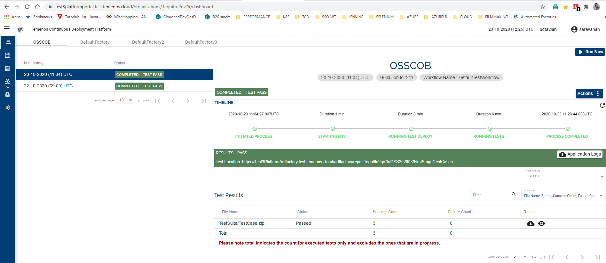

# Selenium Template Implementation 

This page provides information about the Selenium Template, the pre-requisites needed to test the template, as well as an example of the framework structure and the manifest file.

## Implementation 
The Selenium Template will provision the following:

- Windows Server 2016 Datacenter Edition with the below software/packages pre-installed:

    - Open JAVA / JDK  1.8

    - the latest version of Google Chrome and Firefox Browsers

    - the latest version of Google Chrome driver

    - the latest version of Gecko Driver 
 
 

The Google Chrome Driver and the Gecko Driver are downloaded to the F:/TCD/WebDriver folder in the provisioned VM.

# Test Script Structure 

The test script component that can be used by the Selenium Template must be a .zip file within a .zip. The parent .zip file can contain multiple zips of tets (see screenshot below):

Each test suite is assumed to be a suite of tests that can be executed.  Name of the test suite can by of any name.  Each test suite should contain the following files/folders:

 
 

## One or more Executable .jar files 

- The jar files contain the binaries of  Selenium+Junit test cases or Selenium only test cases to be executed.

- If the test framework makes use of junit, it must generate all the junit test results to a “junit” folder under the folder specified in the global.properties (sys.test.results.folder).

- If the test framework is Selenium only framework, it should generate the consolidated results in a file called ‘consolidated-results.xml’ under the folder specified in global.properties (sys.test.results.folder).

>[Note:]
>
>- The Selenium Template will consolidate all the junit results from this folder and produce consolidated results in case of Junit based test framework. 
>
>- The Temenos Continuous Deployment Platform will move these consolidated results to a centralized storage account and provide a download facility from the dashboard.

 
 

## Lib Folder

The lib folder contains the libraries used by the Selenium framework. We expect all the library files to be present in the same folder and the relative path should be handled in the test framework.

All the libraries (.jar) referenced or required by the testcase jars must be included in the Lib folder.
 
 

## global.properties file

The properties file holds the configurable parameters used by the Selenium framework. Some of the parameters have static values. Thus, the Temenos Continuous Deployment Platform expects them to be present in the properties file.

For instance, sys.tcdenv.transact.host=127.0.0.1 value is replaced dynamically at the run time. The same applies to all parameters highlighted in the RedBox below.  The property sys.tcdenv.transact.host can be used to build the URL (browser, browserweb,…) to test.

- The name of the properties file must be global.properties and it must have the following mandatory properties:

 •	sys.tcdenv.transact.host=127.0.0.1 

 •	sys.test.results.folder=F:/TCD/TestResults

 •	sys.web.driver.folder=F:/TCD/WebDriver

 •	The Selenium template will change the values for the above properties at the runtime after the test VM is provisioned

 The above three properties are also available as Environment Variables on the Test VM, so that the values for these properties can be accessed as System.getEnv(“<<propertykey>>”) in java code or as %<propertykey>% as java arguments.

- Optional properties like the following can also me mentioned in it

 - sys.t24.login.username1=XXXXXX

 - sys.t24.login.password1=XXXXXX

 - sys.t24.login.username2=XXXXXX

 - sys.t24.login.password2=XXXXXX

 - It is assumed that the usernames and passwords will be known to the clients while writing the test cases and the same will be present in the golden copy.

 - This property file can have any other properties needed by the jar files. The Selenium Template will not alter/change the values for these properties.

 
 

## CommandsToExecute.txt

- A text file that contains the list of all the java commands to run/execute the test cases in separate lines

 - The expectation is that each command to start with “java” as anything other than a Java command will be considered as deployment failure.

 - The Selenium Template will execute all the java commands reading this text file line by line.

 - The Selenium Template will also validate the lines in this file whether they are java commands before execution

 - If any of the line in the text file is not a valid java command, results in the termination of Factory Run.

 
 

# Test Results Consolidation #

## 1. Selenium + Junit Test Framework 

The test framework should write all the test results to the “junit” folder under the  default test results folder specified in the global.properties (sys.test.results.folder).  The Selenium Template looks for the junit test results in specified folder for consolidation. 

After the execution of all commands for each test suite, the Selenium Template runs a consolidation utility that consolidates all the junit test results and produces a consolidated-results.xml file and a corresponding html file.

## 2. Selenium Only Test Framework 

The test framework should generate a consolidated-results.xml which contains information regarding the test run, i.e. the total number of cases, success count, failed count etc.  The generated file should follow the sample specified below.

    <?xml version="1.0" encoding="UTF-8" standalone="yes"?>
    <!-- configured only by authorised user-->
    <Manifest>
    <Report>
    <ScenarioName>Temenos Testing</ScenarioName>
    <TestCaseName>get <https://t24URL/BrowserWeb</TestCaseName>>
    <ExpectedResult></ExpectedResult>
    <ReportStatus>PASS</ReportStatus>
    </Report>
    <Report>
    <ScenarioName>Temenos Testing</ScenarioName>
    <TestCaseName>setText (id signOnName *****)</TestCaseName>
    <ExpectedResult></ExpectedResult>
    <ReportStatus>PASS</ReportStatus>
    </Report>
    <Report>
    <ScenarioName>Temenos Testing</ScenarioName>
    <TestCaseName>sleep (sec)</TestCaseName>
    <ExpectedResult></ExpectedResult>
    <ReportStatus>PASS</ReportStatus>
    </Report>
    <Report>
    <ScenarioName>Temenos Testing</ScenarioName>
    <TestCaseName>setText (id password )</TestCaseName>
    <ExpectedResult></ExpectedResult>
    <ReportStatus>PASS</ReportStatus>
    </Report>
    <Report>
    <ScenarioName>Temenos Testing</ScenarioName>
    <TestCaseName>sleep (sec)</TestCaseName>
    <ExpectedResult></ExpectedResult>
    <ReportStatus>PASS</ReportStatus>
    </Report>
    <Report>
    <ScenarioName>Temenos Testing</ScenarioName>
    <TestCaseName>sleep (sec)</TestCaseName>
    <ExpectedResult></ExpectedResult>
    <ReportStatus>PASS</ReportStatus>
    </Report>
    <Report>
    <ScenarioName>Temenos Testing</ScenarioName>
    <TestCaseName>sleep (sec)</TestCaseName>
    <ExpectedResult></ExpectedResult>
    <ReportStatus>PASS</ReportStatus>
    </Report>
    <Report>
    <ScenarioName>Temenos Testing</ScenarioName>
    <TestCaseName>sleep (sec)</TestCaseName>
    <ExpectedResult></ExpectedResult>
    <ReportStatus>PASS</ReportStatus>
    </Report>
    <Report>
    <ScenarioName>Temenos Testing</ScenarioName>
    <TestCaseName>switchToFrame()</TestCaseName>
    <ExpectedResult></ExpectedResult>
    <ReportStatus>FAIL</ReportStatus>
    </Report>
    <Report>
    <ScenarioName>Temenos Testing</ScenarioName>
    <TestCaseName>setText (id commandValue CUSTOMER I F3)</TestCaseName>
    <ExpectedResult></ExpectedResult>
    <ReportStatus>FAIL</ReportStatus>
    </Report>
    <Report>
    <ScenarioName>Temenos Testing</ScenarioName>
    <TestCaseName>sleep (sec)</TestCaseName>
    <ExpectedResult></ExpectedResult>
    <ReportStatus>PASS</ReportStatus>
    </Report>
    <Report>
    <ScenarioName>Temenos Testing</ScenarioName>
    <TestCaseName>sleep (sec)</TestCaseName>
    <ExpectedResult></ExpectedResult>
    <ReportStatus>FAIL</ReportStatus>
    </Report>
    <Report>
    <ScenarioName>Temenos Testing</ScenarioName>
    <TestCaseName>sleep (sec)</TestCaseName>
    <ExpectedResult></ExpectedResult>
    <ReportStatus>PASS</ReportStatus>
    </Report>
    <Report>
    <ScenarioName>Temenos Testing</ScenarioName>
    <TestCaseName>sleep (sec)</TestCaseName>
    <ExpectedResult></ExpectedResult>
    <ReportStatus>PASS</ReportStatus>
    <ReportImagePath>F:\TCD\TestResults\automation-screenshots\screenshot4955634319564025885.png</ReportImagePath>
    </Report>
    <passedTests>11</passedTests>
    <failedTests>3</failedTests>
    <totalTests>14</totalTests>
    <Name>Temenos Automation Testing Framework</Name>
    <toolVersion>1.2</toolVersion>
    <startDate>2020.04.03 09:34:34</startDate>
    <duration>112.94700</duration>
    <result>FAIL</result>
    <hostName></hostName>
    </Manifest>

From the below structure, the Temenos Continuous Deployment Platform needs to mandate the following information in order to populate in the dashboard:

    <passedTests>11</passedTests>
    <failedTests>3</failedTests>
    <totalTests>14</totalTests>
    <Name>Temenos Automation Testing Framework</Name>
    <toolVersion>1.2</toolVersion>
    <startDate>2020.04.03 09:34:34</startDate>
    <duration>112.94700</duration>
    <result>FAIL</result>
    <hostName></hostName>

The consolidation util will generate the cosolidated-results.xml file with the above details. The below table describes the manifest tags and its purposes.

| Tag         | Description                                                                            |
|-------------|----------------------------------------------------------------------------------------|
| passedTests | It denotes the prorated number of passed test cases in the current run.                |
| failedTests | Number of failed test cases in the current run.                                        |
| totalTests  | The overall test cases count in the respective run.                                    |
| result      | The overall test result. The value should be “FAIL“ even if there is a single failure. |

The Temenos Continuous Deployment Platform will use this information to populate the dashboard. Below you will find an example format.

The Temenos Continuous Deployment Platform will move these consolidated results to a centralized storage account and provide a download facility from the dashboard for each test suite.

 
 

# Attachments 

- Click  **<a href="./../zip/test-framework.zip">HERE</a>**  to download the sources of the sample selenium-junit test framework, which is based on selenium and Junit and produces the test results in an xml format specified by junit.  This is a java project which can be imported into an IDE for further enhancements.

- Also click **<a href="./../zip/TestCase.zip">HERE</a>** to download the TestCase.zip with the structure mentioned above that includes Lib folder that contains all the dependencies to run the TestCase, a global properties file and a CommandsToExecute.txt file.

- Source for the Sample TestCase Java Project can be found **<a href="./../zip/sample-test.zip">HERE</a>**.  The test cases in this project can be adapted and can be used as part of the factory run.

- The zip file comprising the consolidated test results that the Temenos Continuous Deployment platform will archive is available **<a href="./../zip/testresults1.zip">here (testresults1)</a>** and **<a href="./../zip/testresults2.zip">here (testresults2)</a>**.

- A sample of the consolidated results from the junit test results can be retrieved from this **<a href="./../zip/consolidated-results.xml">link </a>** and the html page is available **<a href="./../zip/run_results.html">here </a>**.

