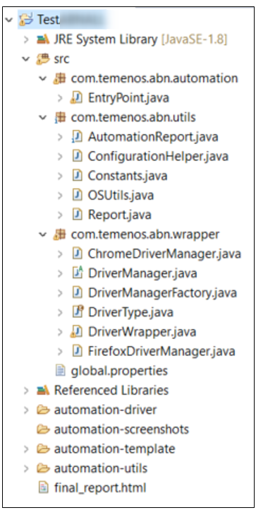
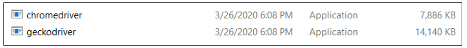
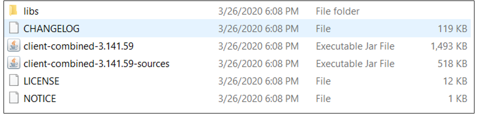
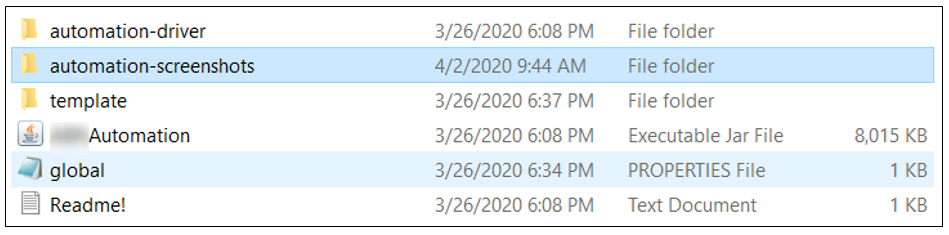
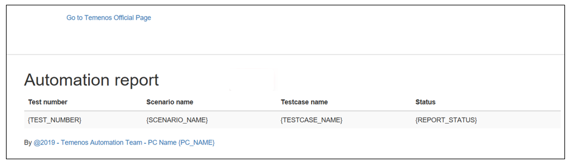
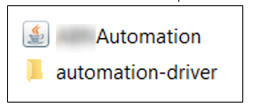

This page explains the steps needed to be followed in order to do the Java implementation for a Selenium Test Template based on the client's framework.

# Implementation 

The Java implementation using Selenium WebDriver automation is using 2 types of browsers:

- Chrome
- Firefox

The structure of the application will be displayed as below. The main class for the application is **EntryPoint.java**.

 

# Structural design of the application #

The application is using the Factory pattern having a DriverManager class which has 2 implementations for both Firefox and Driver browsers. These are defined in:

- ChromeDriverManger.java 

- FirefoxDriverManager.java

## A.	“global.properties” file
-	there are two **browser.type** options: Chrome and Firefox
-	**organization.id** represents the organization ID used to test the template
-	**report.path** represents the path where the report will be saved (HTML format with CSS)

  

## B.	Automation-driver-executable
This folder contains all the drivers for the Selenium Webdriver:

- the automation-driver-executable folder contains:

 

- the automation-driver-libraries folder contains the Java Selenium WebDriver libraries:

  

## C.	Automation-screenshots 
In this folder will be stored all the screenshots:
 
 

Following the completion of the execution a message will be displayed on the screen:
         

## D.	Reporting 
The reports will be based on the template below:
         

## E.	Execution from command line 
Java –jar CLIENTAutomation.jar

Or with parameters

java -jar CLIENTAutomation.jar **chrome** **e1efgs6bc7ul**

**D:\\DevelopmentLast\\TestCLIENT\\TestCLIENT\\**

where

- the green parameter is the browser [firefox | chrome]

- the red parameter represents the organization ID

- the blue parameter represents the folder which stores the report

# Packaging JAR file and running with params 
To the Jar file CLIENTAutomation a new automation-driver folder will be added as below:

 

After the automation-driver has been added, the package will be executed:

 