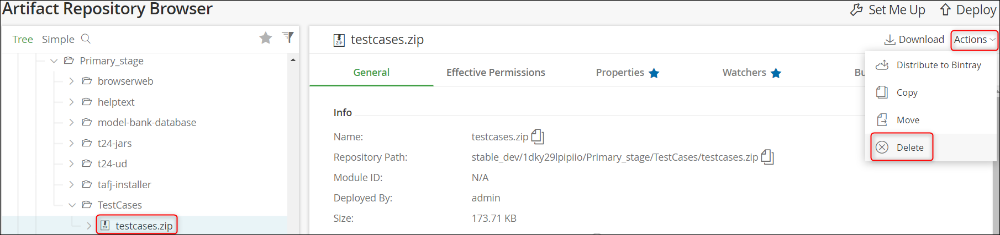

# Upload and Delete Test Cases #

>**Note: Due to the latest Temenos Continuous Deployment platform upgrades this page will shortly be removed from the documentation portal. You should refer to the [Factory Migration](http://documentation.temenos.cloud/home/techguides/factory-migration.html) instructions instead.**

## Upload Test Cases ##

For any new created stage, there is automatically created into the Artifactory a **TestCase** folder where the tests can be manually uploaded.

After connecting to JFrog Artifactory, you should first identify your stage (based on the name that you gave on the platform). The TestCases folder appears in the repository under the created stage just after the added components as in the example below:

It will not be possible to run a factory without uploading the test-cases into the respective folder. 

- Click on the TestCases folder, then in Deploy button on the top right. From here choose Single or Multi based on number of zip folders that you need to upload and drop or select the test cases zip file. **Note**: In order to be processed the archive must be named exactly like this: **testcases.zip**.
- Click the Deploy button that appears on the file selection window.
- The zip file will be uploaded successfully and will appear under TestCases folder.

## Delete Test Cases ##

In order to delete the uploaded test cases, click on testcases.zip file, then on the Actions button (under Deploy) and Delete.

 

# User Permissions Required
To be able to perform the above operation the below permission needs to be enabled for your user:

- MANAGE _ STAGES

To understand what which of the permission does, hover the cursor over the variables and a short description will pop up or click [here](http://documentation.temenos.cloud/home/techguides/user-permissions) to get an overview of the permissions.
