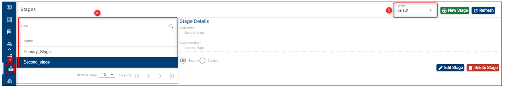

> [!Note]
>  Starting April 5th the TCD user guide will move to the [Temenos Customer Support Portal (TCSP)](https://tcsp.temenos.com/TCD/Modules/TemenosContinuousDeployment/Overview/Overview.htm). We recommend you to log in to the portal and check if your credentials are available. Raise a ticket at [CloudPlatformSupport@temenos.com](CloudPlatformSupport@temenos.com) if you encounter any issues.

# Stages

A Stage is a logical name for a promotional stage. 

Every component/module developed by an organization needs to go through several steps to be declared ready for deployment to product. These steps are exactly what we call stages. 

Each stage has the following fields:

**1.** Name: A simple name for the stage 

> [!Note]
> The name can only be set on creation time and **it cannot be updated**.

**2.** Description: A simple description to be helpful to users.

**3.** Enabled/ Disabled Flag: A stage can be enabled or disabled at any time provided there are no Factories associated to it.

When a new stage is created, an isolated folder is created in the Artifactory Server to enable the binary/ installable components to be uploaded. When the components work well with other components/modules, the component is promoted to other stages, as defined by factories. 

The promotion of the components across stages is conditional based on the status of tests that are done during a factory run. If the tests succeed, the components will be promoted to the next stage. 

# How to Set Up/ Edit/ Delete Stages #

## Set-up/ Create a Stage ##

 Login to the Temenos Continuous Deployment Platform:
1. Click on **Settings** button on the left menu > this will expand a menu containing buttons - click on **Stage** icon

2. From the top-right  select the **Stream** where you want to add a stage

   >Note: if the stream does not have any stage, a tool tip indicates that there is no entry in the respective drop-down
   >
3. Click on  **New Stage** on the top right

4. Fill the **Stage Name** and ** Stage Description**
 
5. Click **Create Stage**. 

**Note**: *Instead of choosing the enable option, you can create a disabled stage and enable it later, but the default option should be enable.*

 

## Edit a Stage ##

A stage can have only the description edited/ changed, but not the name. Why? Because when creating a stage, a folder is created automatically in the Artifactory containing the stage name. This folder will contain the components that you may be added for the respective stage.

Just click the edit button, change the description and then click update.

 

## Default Stage (Configuration Stage) ##

After logging to the portal, go to the **General** button on the left menu. Here you can see and edit the metadata.

The CONFIGURATION STAGE NAME can be defined after the creation of an organization in order to be able to use the assemble features and **can be editable**.

In case it has not been defined at the beginning, then when you try to create a stream, a new field about default stage will appear and here you need to insert a name for the default stage. 

This field will be automatically added into the metadata and **will not be editable**.
 

## Delete a Stage ##

> [!Note]
> The default stage cannot be deleted (this is the stage configured into the metadata).

Example: 
- Suppose we have created a stage named Primary_stage. No matter if we have configured further components and products, we can just go and delete this stage.

Any other created stage can be deleted at any moment as it is not dependent of the subsequent features added such as components and products. Components and Products belong to the streams.

Example of the default stage defined into the metadata (you can set any name you prefer instead of *Primary_stage*):

 To see the details of a stage:

1. Select the **Stream** icon from the top-right-side menu
 
2.  From the top-right select the **Stream** name you are interested in

3. The list with the stages that belong to the respective stream will be displayed on the left side of the page:

Hover over the **Name** to sort the streams alphabetically.

# User Permissions Required
To be able to perform the above operations the below permissions need to be enabled for your user:

- MANAGE _ STAGES
- CREATE _ STAGE
- UPDATE _ STAGE
- DELETE _ STAGE

To have a better understanding of the user permissions, hover the cursor over the variables and a short description will pop up or click [here](http://documentation.temenos.cloud/home/techguides/user-permissions) to read more.
