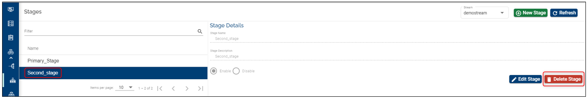

# Stream UI – Feature Description #

A Stream is a collective name representing all coordinated efforts by an organization (that are registered to use the Assemble module) to make a specific improvement to their deployed product. 

For example a bank that is running T24 can choose to make a new enhancement to the T24 installation. All efforts to develop, test and release this enhancement can be collectively called a **stream**.

It represents a group dedicated to a specific development feature (or other logical grouping to represent a new feature implementation etc.) that may consist of the following resources:

1.	People – Developers, testers, business managers and other people involved in developing new features for the bank.

2.	Code and other digital resources – Code specific to the features, Binaries, VMs, Test Scripts etc.

3.	Processes – Each team works with a different workflow and may have variations in the processes.

Each stream requires an isolated setup of resources to keep their work separate from other streams. For example, each stream will have a **separate folder** (or repository) for all of their digital resources and can possibly implement a customized workflow for their development promotion. Each stream has other inherent components for it to be useful. 
The parts of the stream are listed below:

1.	Stages 
2.	Components
3.	Products 
4.	Factories 
5.	Factory Run 
6.	Environments 

 These components, together, act as an isolated group of elements for each Stream and help an organization create and manage efforts of a group. An organization can create as many streams as needed. 
**Each stream is just a logical name for the grouping and has nothing more than a “Name” and a “Description”.**

# How to Set-up/ Edit/ Delete Streams 

## Set-up/ Create a Stream ##

 - Login to the Temenos Continuous Deployment Platform
 - Click on Settings button on the left menu > this will expand a menu containing buttons for: Streams, Stages, Products, Factory and General.  
 - Click on Stream button and then on the **New Stream** on the top right
 - Fill the name *(mandatory field)*. Take into account these conditions (also notified on the screen): Name can start only with a letter or an underscore and it can contain only letters, digits, underscores or hyphens.
 - Fill the description *(mandatory field)*.
 - Check the Enable option and then click **Create**. 

**Note**: *Instead of choosing the enable option, you can create a disabled stream and enable it later, but the default option should be enable.*

After the successful creation, your stream will appear on the screen *(in case you already have other streams, the newly created will be the last in chronological order)* and it will automatically have associated the default stage named 'Stable_Dev' (as in current example). Please **note** that the default stage name is defined in the metadata settings of your organization (On the main menu > General).

## Edit a Stream ##

You can edit anytime the name, the description of the stage or choose the disable option by clicking the edit button. 

## Delete a Stream ##

> [!Note]
> In order to delete a stream, you need to delete first all the subsequent features created. See example and explanations below.

Example 1: 
- Suppose we have created a stream named Dev2 that has just the default stage (
- ) and without adding other stages or configuring further components and products.
- We can just go and delete this stream (even if it has the stable_dev associated to it).

Example 2:
- Suppose we have created a stream named Dev that has the default stage (stable_dev) and and also a stage named Primary_stage, without configuring further components and products.
- In order to be able to delete a stream that has **more than the stable_dev stage**, we need first to go and delete the stages attached to it.
- Go first to Stages button on the left menu > Select first your stream (top right) > Select the stage that you want to delete (others then stable_dev - *because this stage cannot be deleted*) > And click the delete button.

- Go back to Streams and you will notice that your stream has only the stable_dev stage associated, therefore you are able to delete the stream. Click the Delete button.

If you have added other stages and also components and products, first delete all the products, then the components, then the associated stages and finally you will be able to delete the stream. In case you skip one of these features deletion, the system will notify that is not possible to delete the respective stage.

