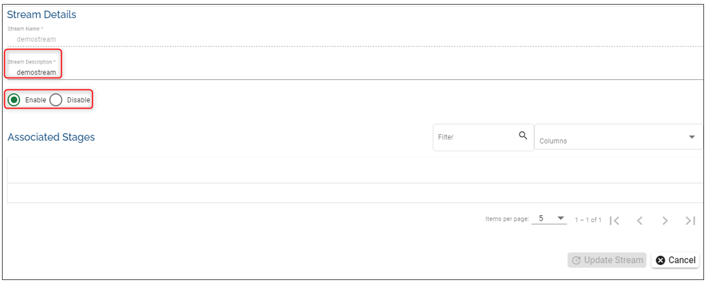
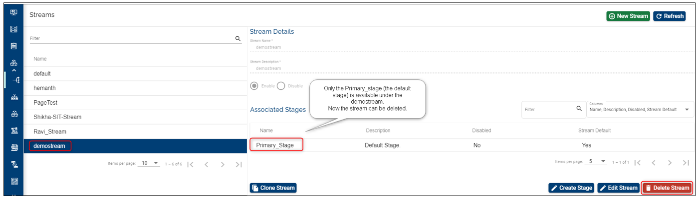

> [!Note]
>  With the 202103 release, the TCD user guide will move to the [Temenos Customer Support Portal (TCSP)](https://tcsp.temenos.com/TCD/Modules/TemenosContinuousDeployment/Overview/Overview.htm). We recommend you to log in to TCSP and check if your credentials are available. Raise a ticket at [CloudPlatformSupport@temenos.com](CloudPlatformSupport@temenos.com) if you encounter any issues.
# Stream UI – Feature Description #

A Stream is a collective name representing all coordinated efforts by an organization (that are registered to use the Assemble module) to make a specific improvement to their deployed product. 

For example a bank that is running T24 can choose to make a new enhancement to the T24 installation. All efforts to develop, test and release this enhancement can be collectively called a **stream**.

It represents a group dedicated to a specific development feature (or other logical grouping to represent a new feature implementation etc.) that may consist of the following resources:

1.	People – Developers, testers, business managers and other people involved in developing new features for the bank.

2.	Code and other digital resources – Code specific to the features, Binaries, VMs, Test Scripts etc.

3.	Processes – Each team works with a different workflow and may have variations in the processes.

Each stream requires an isolated setup of resources to keep their work separate from other streams. For example, each stream will have a **separate folder** (or repository) for all of their digital resources and can possibly implement a customized workflow for their development promotion. Each stream has other inherent components for it to be useful. 
The parts of the stream are listed below:

1.	Stages 
2.	Components
3.	Products 
4.	Factories 
5.	Factory Run 
6.	Environments 

 These components, together, act as an isolated group of elements for each Stream and help an organization create and manage efforts of a group. An organization can create as many streams as needed. 
**Each stream is just a logical name for the grouping and has nothing more than a “Name” and a “Description”.**

# How to Set-up/ Edit/ Delete Streams 

## Set-up/ Create a Stream ##

1. Click on **Settings** button on the left menu > this will expand a menu containing buttons for: **Streams**, Stages, Products, Automated Factories, Workflows, Users, General, Release Notes
 
2. Click on **Stream** button and then on the **New Stream** on the top right

3. Fill the name and description *(mandatory fields)*. Take into account these conditions (also notified on the screen): name can start only with a letter or an underscore and it can contain only letters, digits, underscores or hyphens.

4. Click **Create**

 

5. After the successful creation, your stream will appear on the screen *(in case you already have other streams, the newly created will be the last in chronological order)* and it will automatically have associated the default stage named 'Primary_stage' (as in the current example). Please note that the default stage name is defined in the metadata settings of your organization (On the main menu > General).

6. You can list the associated stages by typing in the **Filter** field keywords related to the respective stage. 

7. You can choose which details of the stream you need to be displayed click on the **Columns** field and select from the drop-down the information you need to see.

 

## Edit a Stream ##

You can edit anytime the name, the description of the stage or choose the enable/ disable option. Click on **Update Stream** and the changes will be visible instantly.

## Clone a Stream ##
You can clone a stream as well. This action will copy the latest version of all components in the default stage to the new stream. When cloning the stream, you can add a stream name, stream description and enable/disable it.

 

## Delete a Stream ##

> [!Note]
> In order to delete a stream, you need to delete first all the subsequent features created. See example and explanations below.

Example 1: 
- Suppose we have created a stream named **demostream** that has just the **Primary_stage** and without adding other stages or configuring further components and products.
- We can just go and delete this stream (even if it has the **Primary Stage**associated to it).

Example 2:
- Suppose we have created a stream named **demostream** that has the default stage (Primary Stage) and also a stage named Secondary_stage, without configuring further components and products.
- In order to be able to delete a stream that has **more than the Primary Stage**, we need first to go and delete the stages attached to it.
- Go first to Stages button on the left menu > Select first your stream (top right) > Select the stage that you want to delete (others then the Primary Stage - *because this stage cannot be deleted*) > And click the **delete** button.

 

- Go back to Streams and you will notice that your stream has only the Primary Stage associated, therefore you are able to delete the stream. Click the Delete button.

If you have added other stages and also components and products, first delete all the products, then the components, then the associated stages and finally you will be able to delete the stream. In case you skip one of these features deletion, the system will notify that is not possible to delete the respective stage.

 To see the details of a stream please select it from the streams' list:
 

# User Permissions Required
To be able to perform the above operations the below permissions need to be enabled for your user:

- MANAGE _ STREAMS
- CREATE _ STREAM
- UPDATE _ STREAM
- DELETE _ STREAM
- CLONE _ STREAM

To have a better understanding of the user permissions, hover the cursor over the variables and a short description will pop up or click [here](http://documentation.temenos.cloud/home/techguides/user-permissions) to read more.

