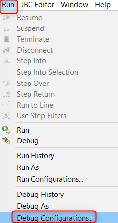

# T24 Remote Debug Using Local Design Studio #

This is an example of how to debug a JBC session from a Cloud T24 environment using a local Design Studio.

In order to do this, you have to deploy in a T24 environment a method that has some logs in it or some breakpoints added. After deployment, you have to trigger the method call so that you can see the logs or go through the added breakpoints → simplest example is to deploy a method that it is called when a T24 screen is opened.

## Steps to follow: ##
**1. Create a R18 T24 env**

**2. Download Design Studio R18 Kit**

**3. Create and deploy the DS package with the debugging code:**

   a. Create New Project in Design Studio

   b. Uncheck XML for Local Fields

   c. Create New T24 Server in Design Studio

   d. Toggle Project to TAFJ project nature

   e. Create a T24 package based on your project

   f. Deploy a T24 package to the Environment

   g. Trigger the deployment

**4. Create/run the JBC Remote Debug Session in Design Studio**

**5. Check the Debugging into T24 and DS**

## 1. Create a R18 T24 env ##

For the environment created it has been used a 'T24 Release 201811' template.

## 2. Download Design Studio R18 Kit ##

- Under the T24 Release environment, check the endpoint with the downloadable Design Studio Kit. 
- Click the download button in order to save the zip locally. After downloading, extract the zip (click right > extract to...)

## 3. Create and deploy the DS package with the debugging code ##

  a. Create New Project in Design Studio

  b. Uncheck XML for Local Fields

  c. Create New T24 Server in Design Studio

  d. Toggle Project to TAFJ project nature

  e. Create a T24 package based on your project

  f. Deploy a T24 package to the Environment

  g. Trigger the deployment

As main action, you need to take the source code (E.NOFILE.PP.INQ.MAIN) provided by Temenos team, create a Design Studio package with it and deploy it to the R18 T24 env.

 
After downloading DS and extracting it in your local machine to any location, the bellow folders should be available:

- DS
- t24Lib
- TAFJ

To be able to interrogate the environment database, following update must be applied to **tafj.properties** file from Your_DEV_Path\TAFJ\conf:  

temn.tafj.jdbc.url=jdbc:h2:tcp://**ENV_DNS**:9092/TAFJDB;MODE=Oracle;TRACE_LEVEL_FILE=0;
TRACE_LEVEL_SYSTEM_OUT=0;DB_CLOSE_ON_EXIT=FALSE;
FILE_LOCK=NO;IFEXISTS=TRUE;CACHE_SIZE=131072;
MVCC=TRUE;LOCK_TIMEOUT=30000   
 Replace **ENV_DNS** with **your environment DNS**.
To find out which is your environment DNS, go on the portal, click on your environment, click the endpoint 'GO TO APPLICATION' and the ENV_DNS that you need to copy should look similar to this example: t24-1dv8s1ppct07f.dev.temenos.cloud

 
#### a. Create New Project in Design Studio ####
In order to accomplish the development actions presented at the beginning of the guide, you need to create a new project in Design Studio.

* Start Design Studio from _DesignStudio_ folder using **StartDesignStudio.bat** file and choose the default workspace (Your_DEV_Path\DesignStudio\workspace) or any other workspace from your local machine.
* After Design Studio starts, go to **File** > **New** > **Project**.  
* Select **Design Studio Template Project** from **Design Studio** item and click **Next**.  

 
* In the next screen, select **t24-packager-tafj** template from the drop down list and set **tafjHome**, **insertDir** and **libDir** parameters according to Your_DEV_Path.  

> [!Note]
> **VERY IMPORTANT!**
> 
> Make sure you set the following values as per below instructions, otherwise the package installation will fail:
> 
>  - project-name - always use small letters as per this standard: xx-name (in current example we used: **ft-sample**)
> 
>  - release - use the T24 release (example R17, R18, R19 etc.)
> 
>  - product-name: use ony two capital letters. **Note** that it must correspond to your project name: 
>   - Example: if project-name is xx-name, the product-name must be XX 
>   - Example: if project-name is ft-sample, the product-name must be FT 

> - component name - must be the same as in project name, after the "-". Must start with capital letter.
>   - Example: if project-name is xx-name, the component-name must be Name 
>   - Example: if project-name is ft-sample, the component-name must be Sample 

> - version: make sure you input the correct version (example 18.11)
>
> - host - login to the portal, go to your Environment > Go to Application > Select the address of your T24 environment (example: https://t24-1abbbbbccc900.temenos.cloud)

 

* Click **Finish** to create the project and 4 modules will be created, as per bellow picture.  
  -> ft-sample-**data-code**: holding basic routines and data files.  
  -> ft-sample-**models**: holding Design Studio models(applications, enquiries, versions) that can be imported/exported from/to your environment.  
  -> ft-sample-**models-gen**: holding files generated by Design Studio from the ft-sample-**models** project.   
  -> ft-sample-**packager**: holding the launcher for creating a T24 package that can be deployed to your environment.

* Make sure you check the **secured box** as in below picture:

 

#### b. Uncheck XML for Local Fields ####

Go to ft-sample-models > click right and select Properties > expand Design Studio > click Code Generation > expand All Categories > Uncheck XML for Local Fields (LT/RTL)

#### c. Create New T24 Server in Design Studio ####

A T24 Server is required in Design Studio to be able to import/export applications/enquiries/versions from/to your machine. Follow next steps to create and configure a T24 server:
* On servers tab, click right and select **Add New T24 Server**.  

 

* A new screen is open. Type a **name** for the server(make sure it includes '-server' string) and click **Next**.  
  
 

* Choose connection type as **T24 Server-Web Service** and click **Finish**.  
  
 

* After the server is created, the _server.properties_ must be updated according to your sandox details:  
-> In _T24 User (deployment only)_ section, **2 users** that you use to connect to your T24 environment must be introduced.  
-> In _WebService (TAFJ) Connection_ section, **Secured box** must be checked, **Protocol** must be set to _ws_ value, **Hostname** must be set according to the hostname of your environment, **Port** must be set to _443_ value and **Context** to _axis2_ value.  
  

 
-> To get the hostname of your environment, log-in to your organisation in TCD Portal (Temenos Continuous Deployment), go to your enviroment page and click on the **GO TO Application** Endpoint for the T24 application. The BrowserWeb page of your environment is opened and from the URL of this page, you must select the part between _https://_ and _/BrowserWeb/servlet/BrowserServlet_.

 

> [!Note]
> For future use, in case T24 Server is not visible, go to: **Window > Show View > Other**:
> 
> 
> 
>Type Server in the search bar and select **Design Studio > Servers**:
>
> 

#### d. Toggle Project to TAFJ project nature ####
The **Toggle TAFJ project nature** action must be performed in order to be able to develop, compile and package jBC routines and to interrogate your environment database.  
* Right click on **data-code** module and choose **Toggle TAFJ project nature**.  
  
 
* In the next screen, import _tafj_properties_ from Your_DEV_Path/TAFJ/conf folder, choose TAFJ_HOME as Your_DEV_Path/TAFJ folder and click **Next**. In the bellow picture, DEV_Path is set to C:\TemenosDEV.
  
 
* In the next screens, click **Next** and **Finish**.  
  
 
* In the end, **data-code** module should be toggled.  
  
 
* A .properties file was created for your project in Your_DEV_Path/TAFJ/conf folder.  
  
 

> [!Note]
> If TAFJ properties for your project must be updated, make sure you update the .properties related to your project from Your_DEV_Path/TAFJ/conf folder.

#### e. Create a T24 package based on your project ####

Take the available code (E.NOFILE.PP.INQ.MAIN.b) and copy paste into the following folder location: D:\*Your_Design Studio_kit*\DS\workspace\ft-sample-data-code\src\Source\FT_Sample\Source\Private

In order to deploy this code into your environment, a T24 package must be created:
 - Go to **packager** module in Design Studio workspace, right click on **Launch T24 Packager (TAFJ).launch** and choose **Run As** > **Launch T24 Packager (TAFJ)**.

 

 - Check where the **package** was generated.

 

It should be located into the generated target folder: D:\*Your_Design Studio_kit*\DS\workspace\ft-sample-packager\target

#### f. Deploy a T24 package to Environment ####

> [!Note]
> Make sure you cloned in your local machine the GitLab repository of your environment. You can check <a href="./use-gitlab-repository.md" target="_blank">**this user guide**</a> to see how to clone an environment repository locally.  

* Copy the generated package into the **packages** folder of the cloned GitLab repository from your local machine:  
  
 
* If the package is a new file in the repository, the package must be first added to the repository:  
  
 
* A screen will appear saying that the file was added. Press **Commit**:  
  
 
* A new screen will appear. Insert a comment in the upper window and then choose **Commit**.  
  
 
* A new screen will appear and choose **Push**.  
  
 
* A new screen will appear and choose **OK**.  
  
 
* A success message should be displayed. Press **Close**.
 
  

#### g. Trigger the deployment ####

 - After commiting and pushing to Environment Repository all the features, you have to deploy them in your Environment. 
 - Login to your organisation, select your environment, locate the Repository Application and click the Deploy button. 

For more details about the deployment, check the following [<ins>**steps**</ins>](use-gitlab-repository.md#trigger-deployment).

## 4. Create/run the JBC Remote Debug Session in Design Studio ##

Go to Design Studio > RUN > Debug Configurations 

 

- Then click on JBC Remote > New Configuration

- Make sure you have:

   - Container Project: your project name

   - Host: the DNS of your environment *(you can take it if you click on your environment, then Go to Application)*

   - Port: leave the default value

- Click **Apply** and then **Debug**

 

You will be able to see the debug data into the Console

## 5. Check the Debugging into T24 ##

 - Log-in to T24 and go to User Menu > Payment Hub > Payment Inquiries > Pending and Processed Payments > Pending Process Payments - Party Wise > click on **Find** button and the logs/breakpoints put in the previous method (E.NOFILE.PP.INQ.MAIN) should appear in debug session console.
