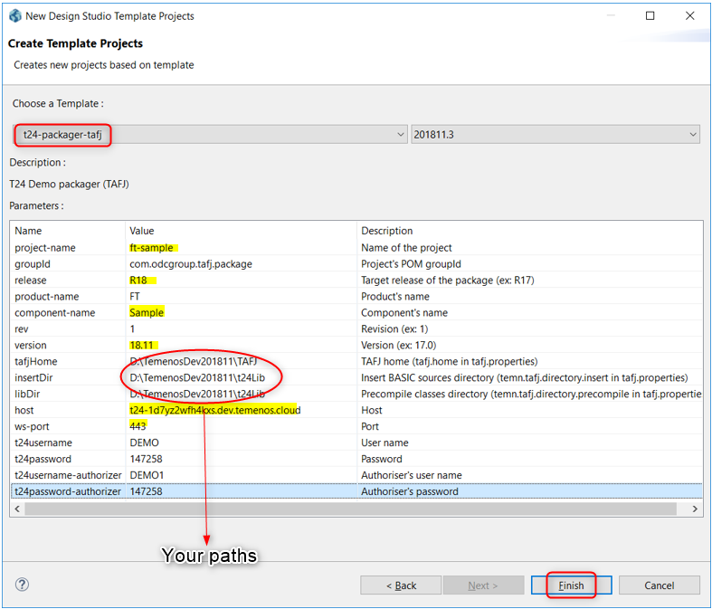
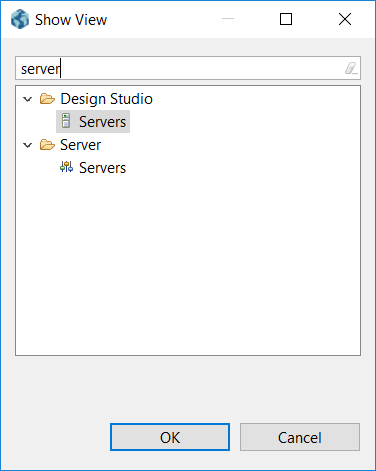

# Develop T24 Packages, Plugins and Code

## Introduction & Prerequisites

This developer guide presents the required configurations and the main steps for the following actions:
 - develop new/existent jBC routines and deploy them to your sandbox
 - import/export applications/enquiries/versions from/to your sandbox to/from your local machine
 - extract from the database/load in the database data (.d) files from/to your sandbox to/from your local machine.
 
For this purpose, you need to have access to:
 - Design Studio (locally)
 - T24 libraries (locally)
 - TAFJ (locally)
 - Temenos Sandbox (cloud)
 - Tortoise Git (locally)  - download from <a href="https://tortoisegit.org/download/ "Tortoise"" target="_blank">**here**</a>.

 
A development package (containing Design Studio, T24 libraries and TAFJ) is provided by Temenos  and it is pre-configured in order to be able to introspect T24 application hosted in Temenos Could Development Platform.

This package is adapted according to the T24 version of your sandbox and it is provided as a **.zip** file. 

After extracting it in your local machine to any location, the bellow folders should be available:

- DS
- t24Lib
- TAFJ

To be able to interrogate the sandbox database, following update must be applied to **tafj.properties** file from Your_DEV_Path\TAFJ\conf:  

temn.tafj.jdbc.url=jdbc:h2:tcp://**ENV_DNS**:9092/TAFJDB;MODE=Oracle;TRACE_LEVEL_FILE=0;
TRACE_LEVEL_SYSTEM_OUT=0;DB_CLOSE_ON_EXIT=FALSE;
FILE_LOCK=NO;IFEXISTS=TRUE;CACHE_SIZE=131072;
MVCC=TRUE;LOCK_TIMEOUT=30000   
 Replace **ENV_DNS** with **your environment DNS**. See below example:

 
## Create New Project in Design Studio 
In order to accomplish the development actions presented at the beginning of the guide, you need to create a new project in Design Studio.

* Start Design Studio from _DesignStudio_ folder using **StartDesignStudio.bat** file and choose the default workspace (Your_DEV_Path\DesignStudio\workspace) or any other workspace from your local machine.
* After Design Studio starts, go to **File** > **New** > **Project**.  
* Select **Design Studio Template Project** from **Design Studio** item and click **Next**.  

 
* In the next screen, select **t24-packager-tafj** template from the drop down list and set **tafjHome**, **insertDir** and **libDir** parameters according to Your_DEV_Path.  

> [!Note]
> **VERY IMPORTANT!**
> 
> Make sure you set the following values as per below instructions, otherwise the package installation will fail:
> 
>  - project-name - always use small letters as per this standard: xx-name (in current example we used: **ft-sample**)
> 
>  - release - use the T24 release (example R17, R18, R19 etc.)
> 
>  - product-name: use ony two capital letters. **Note** that it must correspond to your project name: 
>   - Example: if project-name is xx-name, the product-name must be XX 
>   - Example: if project-name is ft-sample, the product-name must be FT 

> - component name - must be the same as in project name, after the "-". Must start with capital letter.
>   - Example: if project-name is xx-name, the component-name must be Name 
>   - Example: if project-name is ft-sample, the component-name must be Sample 

> - version: make sure you input the correct version (example 18.11)
>
> - host - login to the portal, go to your Environment > Go to Application > Select the address of your T24 environment (example: https://t24-1abbbbbccc900.temenos.cloud)

 

* Click **Finish** to create the project and 4 modules will be created, as per bellow picture.  
  -> ft-sample-**data-code**: holding basic routines and data files.  
  -> ft-sample-**models**: holding Design Studio models(applications, enquiries, versions) that can be imported/exported from/to your sandbox.  
  -> ft-sample-**models-gen**: holding files generated by Design Studio from the ft-sample-**models** project.   
  -> ft-sample-**packager**: holding the launcher for creating a T24 package that can be deployed to your sandbox.

* Make sure you check the **secured box** as in below picture:

Make sure you save the change CTRL+S.

 

## Uncheck XML for Local Fields

Go to ft-sample-models > click right and select Properties > expand Design Studio > click Code Generation > expand All Categories > Uncheck XML for Local Fields (LT/RTL)

Click Apply and OK.

## Create New T24 Server in Design Studio 

> [!Note]
> Check first if you already have available the **Servers** tab. If not, follow below steps.

A T24 Server is required in Design Studio to be able to import/export applications/enquiries/versions from/to your sandbox. Follow next steps to create and configure a T24 server:
* On servers tab, click right and select **Add New T24 Server**.  

 

* A new screen is open. Type a **name** for the server(make sure it includes '-server' string) and click **Next**.  
  
 

* Choose connection type as **T24 Server-Web Service** and click **Finish**.  
  
 

* After the server is created, the _server.properties_ must be updated according to your sandox details:  
-> In _T24 User (deployment only)_ section, **2 users** that you use to connect to your T24 sandbox must be introduced.  
-> In _WebService (TAFJ) Connection_ section, **Secured box** must be checked, **Protocol** must be set to _ws_ value, **Hostname** must be set according to the hostname of your sandbox, **Port** must be set to _443_ value and **Context** to _axis2_ value.  
  

 
-> To get the hostname of your sandbox, log-in to your organisation in TCD Portal (Temenos Continuous Deployment), go to your enviroment page and click on the **GO TO Application** Endpoint for the T24 application. The BrowserWeb page of your sandbox is opened and from the URL of this page, you must select the part between _https://_ and _/BrowserWeb/servlet/BrowserServlet_.

 

> [!Note]
> For future use, in case T24 Server is not visible, go to: **Window > Show View > Other**:
> 
> 
> 
>Type Server in the search bar and select **Design Studio > Servers**:
>
> 

## Toggle Project to TAFJ project nature 
The **Toggle TAFJ project nature** action must be performed in order to be able to develop, compile and package jBC routines and to interrogate your sandbox database.  
* Right click on **data-code** module and choose **Toggle TAFJ project nature**.  
  
 
* In the next screen, import _tafj_properties_ from Your_DEV_Path/TAFJ/conf folder, choose TAFJ_HOME as Your_DEV_Path/TAFJ folder and click **Next**. In the bellow picture, DEV_Path is set to C:\TemenosDEV.
  
 
* In the next screens, click **Next** and **Finish**.  
  
 
* In the end, **data-code** module should be toggled.  
  
 
* A .properties file was created for your project in Your_DEV_Path/TAFJ/conf folder.  
  
 

> [!Note]
> If TAFJ properties for your project must be updated, make sure you update the .properties related to your project from Your_DEV_Path/TAFJ/conf folder.

## jBC Routines Development 

> [!Note]
> In order to make sure your routine will be successfully created, it is important to have set correctly all the parameters when creating a new project. If necessary, check again <a href=./t24-development.md#create-new-project-in-design-studio target="_blank">**this section**</a>.

 
jBC routines are developed in the **data-code** module which must be toggled to TAFJ project nature by following next steps.  
* In order to create a new jBC routine, expand **data-code** module, go to src->Source->Private, right click on project name (FT_Sample in the above picture), select **New** and then **New T24 routine / component / testcase**.
 
  
* On next screen, type the name of the routine and click **Finish**.  

 
* The new routine is created.  

 

## Create a T24 package based on your project 
In order to deploy your developed routines in the sandbox, a T24 package must be created.
 - Go to **packager** module in Design Studio workspace, right click on **Launch T24 Packager (TAFJ).launch** and choose **Run As** > **Launch T24 Packager (TAFJ)**.

 
 - **Wait** for successfull build for the project.

 
 - Check where the **package** was generated.

 

## Deploy a T24 package to Sandbox 

> [!Note]
> Make sure you cloned in your local machine the GitLab repository of your sandbox.

* Copy the generated package into the **packages** folder of the cloned GitLab repository from your local machine:  
  
 
* If the package is a new file in the repository, the package must be first added to the repository:  
  
 
* A screen will appear saying that the file was added. Press **Commit**:  
  
 
* A new screen will appear. Insert a comment in the upper window and then choose **Commit**.  
  
 
* A new screen will appear and choose **Push**.  
  
 
* A new screen will appear and choose **OK**.  
  
 
* A success message should be displayed. Press **Close**.
 
  

## Trigger the deployment

 - After commiting and pushing to Environment Repository all the features, you have to deploy them in your Environment. 
 - Login to your organisation, select your environment, locate the Repository Application and click the Deploy button. 

For more details about the deployment, check the following [<ins>**steps**</ins>](use-gitlab-repository.md#trigger-deployment).

## Check jBC routines deployment to Sandbox 

* Log-in to your organisation into the Temenos Continuos Deployment Platform, go to your enviroment page and click on the **Monitor Application** Endpoint for the T24 application.  
  
 
* The TAFJEE page is opened. Click **tShow** to check if your developed routines were deployed in your sandbox. Details like the compilation date or the jar that contains the class of those routines can be checked.  
  
 
* In the next screen, input your routine name and click **Submit**.  
  
 
* In the next screen, the details of your routine can be seen.  
  
 

## Import T24 Applications, Enquiries and Versions 

> [!Note]
> In order to import Applications/Enquiries/Versions from your sandbox to your local machine, make sure you have a T24-server created and configured in Design Studio.

* Go to Servers tab, right click on your server state and change state to **active**.
  
 
* State should become active:  
  
 

> [!Note]
> The following example is about importing Enquiries from your sandbox to your local machine. The same steps can be aplied for Applications and Versions.  

* After the T24-server is active, right click on the **models** module and choose **Import**:  

 
* Expand **Design Studio** item, choose **Import T24 Enquiries** and click on **Next** button. (you have to wait until the list of enquiries is fetched from the sandbox database).  

 
* Select from this list which enquiry you want to import from the sandbox to your local machine and click **Next**.  

 
* Choose where to import the enquiry(**Models** folder from **models** module) and click **Finish**(wait until the operation is completed).  

 
* A successful message will be displayed at the end and the enquiry will be saved in your local machine.  

 

## Export T24 Applications, Enquiries and Versions

> [!Note]
> The following example is about exporting Enquiries from your local machine to your sandbox. The same steps can be aplied for Applications and Versions.   

> [!Note]
> Make sure your T24 server is set to **active**.

* Right click on the **models** module and choose **Design Studio** -> **Generate Code**:  
  
 
* A message should be displayed saying that the enquiry was successfully modified.
  
 

## Data (.d) files 

A data(.d) file represents a details viewer of a record from the database. A data file has 2 columns:  
-> first column contains the unique number of all table fields of the record;  
-> second column contains the values for all table fields of the record.  

 

> [!Note]
> Assuming that your **date-code** module is toggled to TAFJ project nature, make sure you update the .properties file related to your project from Your_DEV_Path/TAFJ/conf folder with the private database IP of your sandbox.

Before starting to extract/load data files from/to your sandbox database, you must login to TAFJ-DBTools.  
-> Right click on your **data-code** module and select **DBTools login**.
  
 
-> A wizard will appear in which you must type the DBTools credentials(which can be found in Add_DBTools_User.bat file from Your_DEV_Path) and click **Finish**.
  
 

### Extract data files from the database 
* Expand **data-code** module, go to src, right click on **Data** and select **Extract from the database**.  
  
 
* The bellow wizard will appear. Make sure the URL of the Database contains the correct database IP of your sandbox. Otherwise, you have update your .properties file related to your project from Your_DEV_Path/TAFJ/conf folder.
  
 
* Type the Table Name and Record ID and click **Finish**.  
  
 
* Check the console log to see if the data files was extracted.
  
 

### Load data files in the database
* Right click on your data file and select **Load in the database**.  
  
 
* The bellow wizard will appear and click **Finish**. Make sure the URL of the Database contains the correct database IP of your sandbox. Otherwise, you have update your .properties file related to your project from Your_DEV_Path/TAFJ/conf folder.
  
 
* A success message should be displayed in the console.  
  

For more tutorials on how Design Studio works, please check <a href="http://documentation.temenos.cloud/home/design-studio-tutorials" target="_blank"><u>**here.**</u></a> 