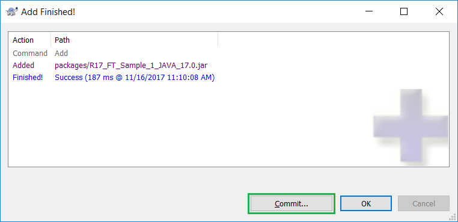
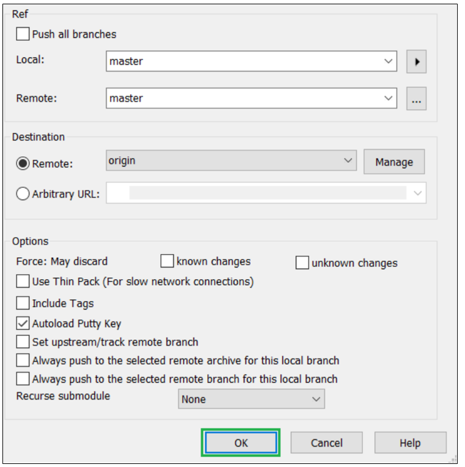
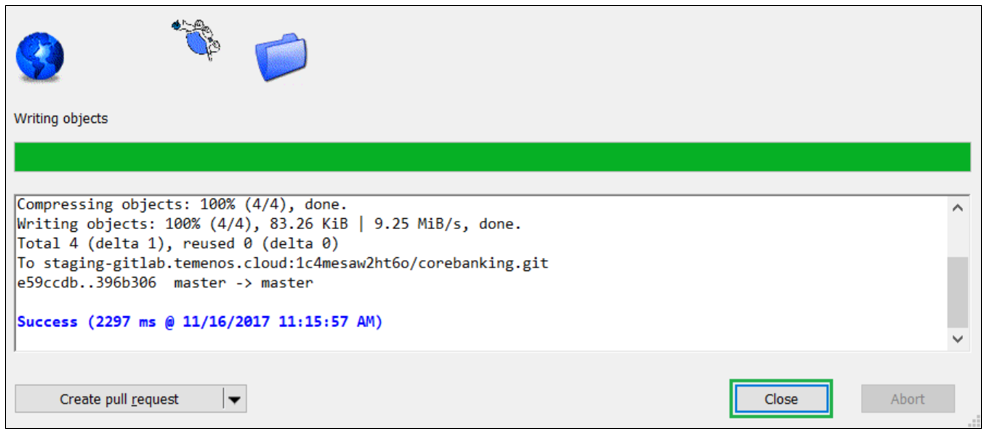
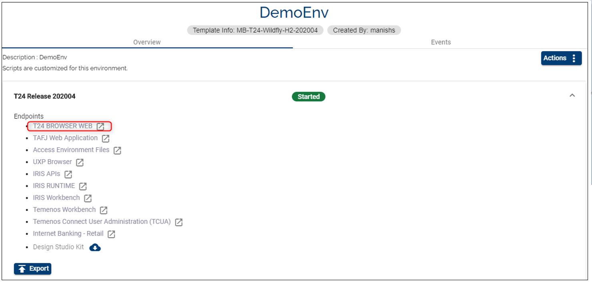
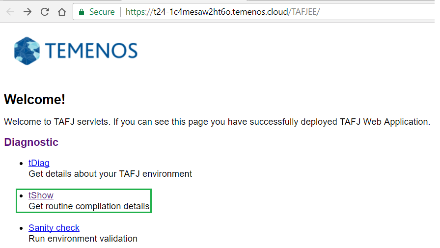
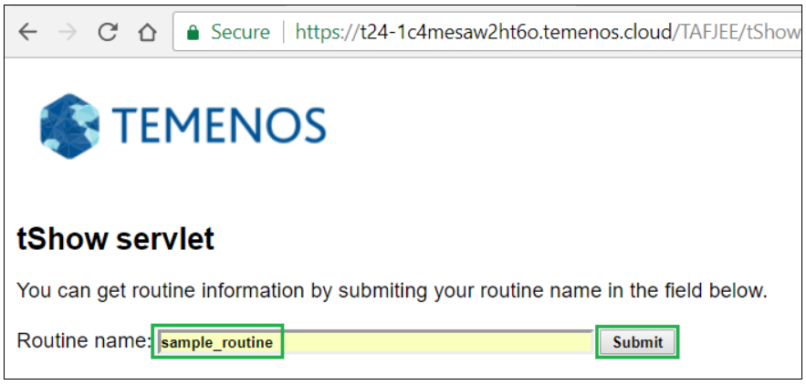
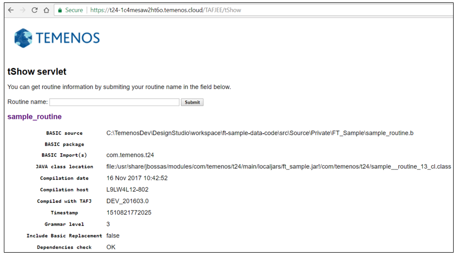

# Develop T24 Packages, Plugins and Code

## Deploy a T24 package to Sandbox 

> [!Note]
> Make sure you cloned in your local machine the GitLab repository of your sandbox.

* Copy the generated package into the **packages** folder of the cloned GitLab repository from your local machine:  
  
 
* If the package is a new file in the repository, the package must be first added to the repository:  
  
 
* A screen will appear saying that the file was added. Press **Commit**:  
  
 
* A new screen will appear. Insert a comment in the upper window and then choose **Commit**.  
  
 
* A new screen will appear and choose **Push**.  
  
 
* A new screen will appear and choose **OK**.  
  
 
* A success message should be displayed. Press **Close**.
 
  

## Trigger the deployment

 - After commiting and pushing to Environment Repository all the features, you have to deploy them in your Environment. 
 - Login to your organisation, select your environment, locate the Repository Application and click the Deploy button. 

For more details about the deployment, check the following [<ins>**steps**</ins>](http://documentation.temenos.cloud/home/techguides/deploy-an-update-to-an-existing-environment.html).

## Check jBC routines deployment to Sandbox 

* Log-in to your organisation into the Temenos Continuos Deployment Platform, go to your enviroment page and click on the **Monitor Application** Endpoint for the T24 application.  
  
 
* The TAFJEE page is opened. Click **tShow** to check if your developed routines were deployed in your sandbox. Details like the compilation date or the jar that contains the class of those routines can be checked.  
  
 
* In the next screen, input your routine name and click **Submit**.  
  
 
* In the next screen, the details of your routine can be seen.  
  
 

More about the pre-requisites, import / export T24 applications can be found  <a href="http://documentation.temenos.cloud/home/pdf/develop-T24-packages.pdf " target="_blank"><u>**here**</u></a>.

 

# User Permissions Required
To be able to perform the above operations the below permissions need to be enabled for your user:

- CREATE _ ENVIRONMENT
- UPDATE _ ENVIRONMENT
- REDEPLOY _ ENVIRONMENT
- MANAGE _ ENVIRONMENTS 

To have a better understanding of the user permissions, hover the cursor over the variables and a short description will pop up or click [here](http://documentation.temenos.cloud/home/techguides/user-permissions) to read more.
