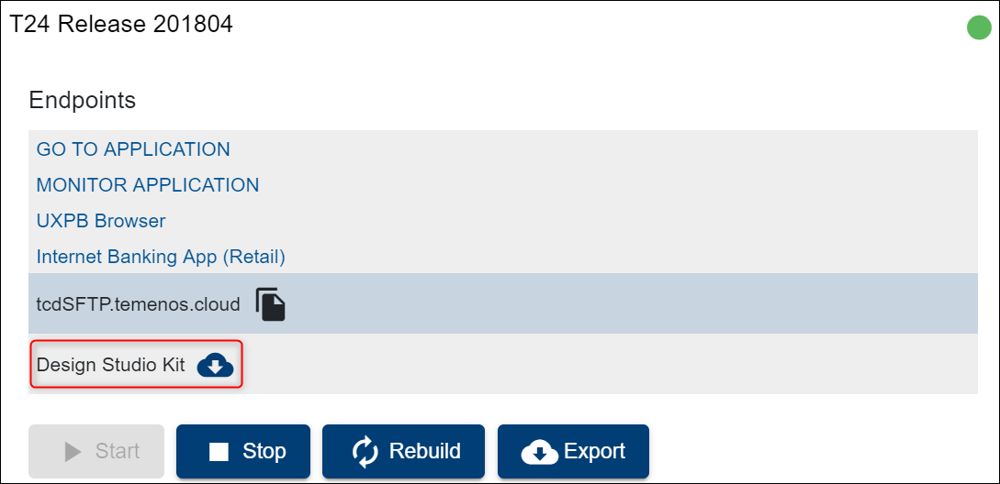

## DB Conversion Instructions

To access the TAFJ folder you have to go to your environment and download on your local machine the Design Kit Studio.

 
Once the download has finished, open the .zip folder. You will find 3 main folders, where you will be able to see TAFJ as well: 

To see different DB import scenarios and special considerations, please check <a href="http://documentation.temenos.cloud/home/pdf/tcib-guide.pdf " target="_blank"><u>**here**</u></a>.

 

 
> 
> [!Note]
The file changes with each monthly build Temenos runs. To get the latest version, contact our support team at CloudPlatformSupport@temenos.com.                
