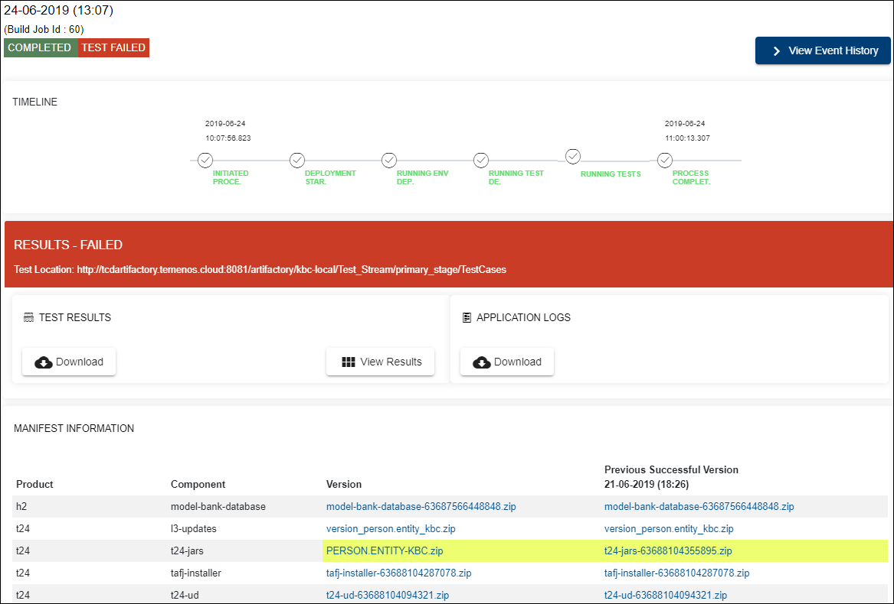

# Triage Workflow - Check Errors when Test Fails #

In case the factory test fails, see below how to check the errors.

See an example of what are the messages displayed on the screen after the factory run (process) has been completed, but the tests failed:

**View Event History** - You can see the phases during the factory run including the failed test run.

On the timeline you will see:

- the process completed
- a red warning message "RESULTS - FAILED" with the test location in your artifactory.

**Check Test Results**

By clicking the **Download** button, you can have locally a zip file which contains an index.html file having the same information as **View Results**. View results displays an HTML report with the list of all errors encountered during the test run.

**Check Application Logs**

By clicking the **Download** button, you can have locally a zip file which contains the following folders:

- jboss
- t24home
- TAFJ

> [!Note]
> Into **t24home** you can find T24.log referring to the T24 BrowserWeb processes, where you can identify the exact errors during the test run.

Also please check <a href="./access-ud-directories.md" target="blank">**this user guide**</a> in order to see how you can access the UD directories. 
